# 1. 리액트 시작


 리액트는 페이스북 개발팀에서 만든 자바스크립트 라이브러리이다. **오직 뷰만을 고려하여 사용자 인터페이스를 만든다**.

<br>


## 1.1. 왜 리액트인가?


 자바스크립트만으로 규모가 큰 애플리케이션을 만들 수 있는 시대가 왔다. 그러나 애플리케이션을 순수하게 자바스크립트 기반으로 관리하려면 어려움이 많고, 이 문제를 해결하기 위해 Angular, Backbone.js, Ext.js 등 다양한 자바스크립트 기반의 프레임워크들이 개발되었다.

 해당 프레임워크들은 주로 **MVC**(*Model-View-Controller*), **MVVM**(*Model-View-View Model*), **MVVM**(*Model-View-Whatever*) 등의 아키텍쳐로 애플리케이션을 구조화한다. 이 아키텍쳐들은 모두 모델(Model)과 뷰(View)를 가지고 있다는 공통점이 있다. 

<br>

 먼저 모델과 뷰가 무엇인지 알아보자.

* 모델: 애플리케이션에서 사용하는 데이터를 관리하는 영역.
* 뷰: 애플리케이션 사용자에게 보이는 부분.

  즉, 사용자가 어떠한 작업(*예: 버튼 클릭, 텍스트 입력 등*)을 하고, 그 작업은 모델에 반영된다. 이 과정에서 컨트롤러가 모델에 저장된 데이터를 조회하거나 수정하게 되고, 그 결과로 변경된 사항이 뷰에 반영되어 사용자에게 보여지는 것이다.

<br>

 문제는, **애플리케이션 규모가 커질수록** 사용자의 작업에 따라 어떤 요소를 찾아, 어떤 데이터를 변경해야 할지 **관리하기가 어려워진다**는 것이다. 페이스북 개발 팀에서는 이 문제를 해결하기 위해 데이터가 변할 때마다 처음부터 새로 렌더링하는 방식을 택했다. (*기존 뷰에서 어떤 부분의 변화를 보여줄지 고민하지 않고, 정해진 규칙에 따라 새로 렌더링하는 것이다.*)

<br>

### 1.1.1. 리액트 이해


 **컴포넌트**(*component*)란, 리액트 프로젝트에서 특정 부분이 어떻게 생길지 정하는 선언체를 의미한다. 재사용이 가능한 API로 수많은 기능이 내장되어 있다. 데이터셋이 주어졌을 때, HTML  태그 형식을 문자열로 반환하는 **템플릿**과는 다른 개념이다.

 **렌더링**(*rendering*)이란, 사용자 화면에 뷰를 보여주는 것이다. 데이터가 변할 때마다 새롭게 렌더링하면서도 성능을 아끼고, 최적의 사용자 경험을 제공하는 것이 리액트 프레임워크의 힘이다.

<br>

#### 초기 렌더링


 리액트 컴포넌트가 *최초*로 실행하는 렌더링을 의미한다. 리액트에서 초기 렌더링은 `render` 함수가 담당한다.

```javascript
render() {
    ...
}
```

 이 함수는 **컴포넌트를 정의**하는 역할을 한다. 뷰가 어떻게 생겼고, 어떻게 동작하는지에 대한 정보를 지닌 객체를 반환한다. 실행 시, 내부 모든 컴포넌트들이 재귀적으로 렌더링된다. 즉, 컴포넌트 내부에 또 다른 컴포넌트가 들어갈 수 있고, 그 모든 컴포넌트들이 렌더링된다는 의미이다.

 최상위 컴포넌트의 렌더링이 완료되면, HTML 마크업을 만들고, 페이지의 DOM 요소 안에 주입한다. 이벤트 적용은 다음의 두 가지 절차로 구성된다.

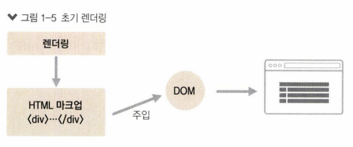

<center><sup>출처: 리액트를 다루는 기술 37p</sup></center>

* 문자열 형태의 HTML 코드를 생성한다.
* 특정 DOM에 해당 내용을 주입한다.

<br>


#### 리렌더링

<br>

 리액트 컴포넌트의 데이터 변경 시 다시 렌더링이 실행되는 것을 의미한다. **조화 과정**(*reconciliation*)을 거친다고 하는 게 더 정확한 표현이다. 컴포넌트에서 데이터가 변경될 때, 뷰가 변화되는 것처럼 보이더라도, 새로운 요소로 갈아 끼우기 때문이다.

 초기 렌더링과 마찬가지로 `render` 함수가 이 역할을 담당한다. 데이터 업데이트 시, 새로운 데이터로 `render` 함수를 또 호출하는 것이다. `render` 함수의 역할에 따라 뷰가 새롭게 생성된다.

 그러나 `render` 함수가 반환한 새로운 뷰가 곧바로 DOM에 반영되는 것은 아니다. **최적의 자원**을 사용하여 새롭게 렌더링하기 위해, 리액트는 자바스크립트를 사용해 그 이전 `render` 함수가 만들었던 컴포넌트 정보와, 새로운 `render` 함수가 만든 컴포넌트 정보를 **최소한의 연산**으로 비교하고, 둘의 차이를 알아내 DOM 트리를 업데이트한다.

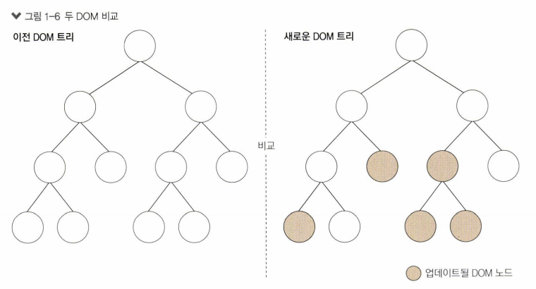

<center><sup>출처: 리액트를 다루는 기술 38p</sup></center>

<br>

## 1.2. 리액트의 특징

<br>

### 1.2.1. Virtual DOM


 리액트의 주요 특징 중 하나는 Virtual DOM을 사용한다는 것이다.

<br>

#### DOM


 **DOM**(*Document Object Model*)은 객체로 문서의 구조를 표현하는 방법으로, XML, HTML로 작성한다. 트리 구조로 되어 있고, 특정 노드를 찾아서 수정, 제거하거나, 원하는 곳에 삽입하는 것이 가능하다.

<br>

 웹 브라우저를 기준으로 이해해 보자.

* Document Object: 문서 객체. HTML 문서의 태그들을 자바스크립트가 이용할 수 있는 객체로 만든 것.
* Model: 문서 객체를 인식하는 방식. 웹 브라우저가 HTML 페이지를 인식하는 방식 그 자체. 

 웹 브라우저는 DOM 트리를 활용해 객체에 자바스크립트와 CSS를 적용하고, 이것이 뷰로 나타난다.

<br>

#### Virtual DOM


 실제 DOM이 아니라, 이를 추상화한 자바스크립트 객체이다. (*DOM의 사본이라고 **가벼운** 사본이라고 생각하자*.)

 데이터가 변경될 때, 리액트는 다음 세 가지 절차에 따라 웹 브라우저에 실제 DOM을 업데이트한다.

1. 데이터 업데이트 시, 전체 UI를 Virtual DOM에 리렌더링한다.
2. 이전 Virtual DOM과 현재 Virtual DOM을 비교한다.
3. 바뀐 부분만 실제 DOM에 적용한다.


<br>

 Virtual DOM을 사용한다고 해서, 사용하지 않을 때와 비교해 무조건 빠른 것은 아니다. 다만, 매뉴얼에서 밝히는 것처럼 **지속적으로 데이터가 변화할 때** 업데이트 처리를 간결하게 할 수 있다.

<br>

### 1.2.2. 기타 특징


 리액트는 **뷰**만 신경쓰는 **라이브러리**(*리액트는 프레임워크가 아니라 라이브러리이다*)이므로, Ajax, 데이터 모델링, 라우팅 등의 기타 기능은 직접 구현하여 사용해야 한다.  혹은, 다른 웹 프레임워크나 라이브러리를 혼용해서 구현할 수도 있다!

<br>

## 1.3. 개발환경 설정


 Windows 운영체제를 기준으로 개발환경을 설정한다.

<br>

### 1.3.1. Node.js, npm


 `Node.js`는 크롬 V8 자바스크립트 엔진으로 빌드한 자바스크립트 런타임이다. 웹 브라우저 환경이 아닌 곳에서도 자바스크립트를 사용할 수 있게 해 준다. 리액트 애플리케이션 자체는 웹 브라우저에서 실행되는 코드이나, 프로젝트를 개발하는 데 필요한 주요 도구들이 `Node.js`를 사용하기 때문에 설치해야 한다.

> *참고* : 사용하게 될 개발 도구
>
> * 바벨: ES6 호환.
> * 웹팩: 모듈화된 코드의 번들링, 코드 수정 시 웹 브라우저 리로딩.

 `npm`은 `Node.js`의 패키지 매니저 도구이다. `Node.js`와 함께 설치하여 패키지 버전을 관리한다.

<br>

 안정적인 지원을 제공하는 LTS 버전을 다운로드한다.

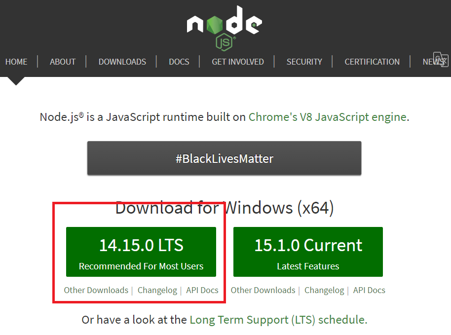

 설치가 완료되면 cmd 창에서 `node -v` 명령어를 활용해 설치가 잘 되었는지 확인한다.

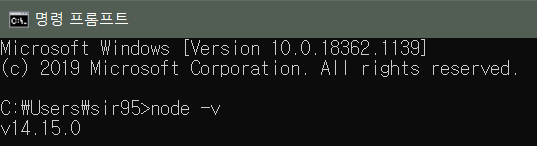

<br>

### 1.3.2. yarn


 `npm` 대신 더 빠르고 효율적인 `yarn`이라는 패키지 관리자 도구([설치 링크](https://classic.yarnpkg.com/en/docs/install#windows-stable))를 사용한다. (*npm을 사용해도 무방하다.*)

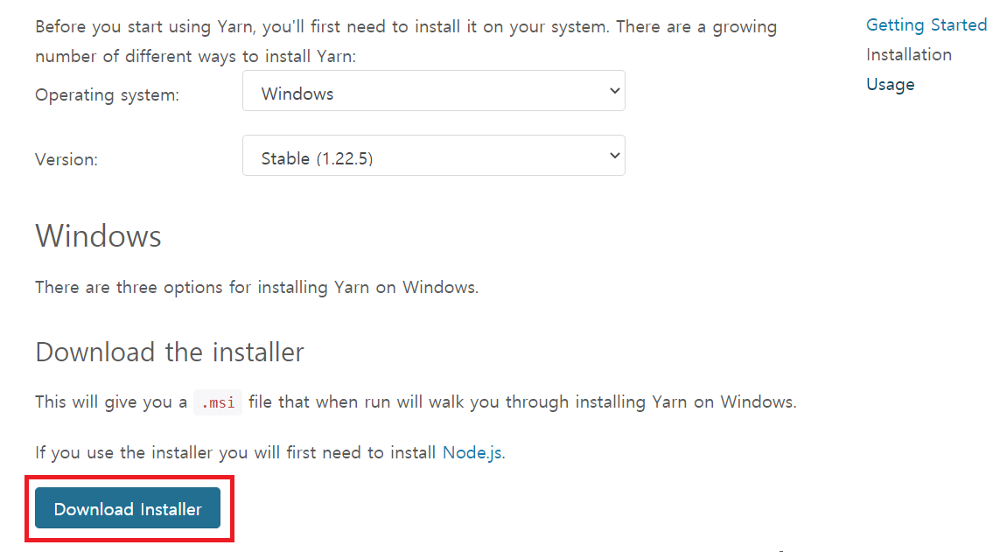


> *오류*
>
>  다운로드받은 파일만 설치하면 cmd 창에서 다음과 같이 설치 오류가 난다.
>
> 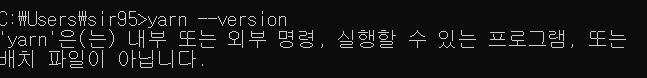
>
>  cmd 창에서 global로 yarn을 설치하자. 

<br>

 설치되었는지 확인하자.

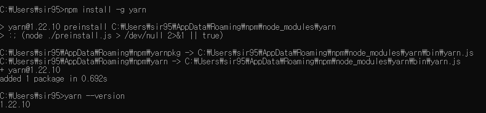

<br>

### 1.3.3. create-react-app

 리액트 프로젝트 생성 시 간편하게 프로젝트 작업 환경을 구축해 주는 도구이다. cmd 창에서 프로젝트를 만들고 싶은 디렉터리로 이동하여 다음과 같은 명령어를 입력한다.

#### npm

* `create-react-app`을 글로벌로 설치한다.

```bash
npm install -g create-react-app
```

* 리액트 프로젝트를 시작할 경로로 이동한 후, 리액트 프로젝트를 설치한다.

```bash
cd C:\Users\sir0123\Desktop\react-app
create-react-app [프로젝트명]
```

<br>


#### yarn

```bash
$ yarn create react-app [프로젝트 이름]
```

 바탕화면에서 `react-app` 폴더를 만들고 `hello-react`라는 프로젝트를 생성한다. 

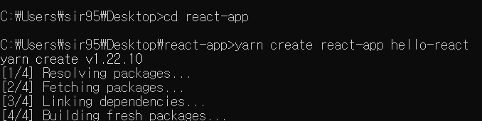

터미널 화면이 다음과 같이 나오면 성공적으로 프로젝트 생성 작업이 완료된 것이다.

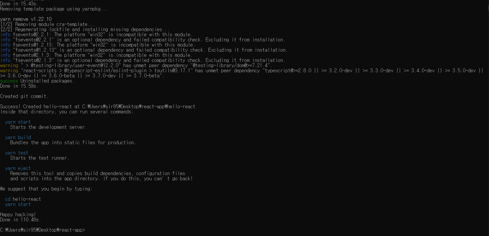

<br>


  `npm`이나 `yarn`을 이용해 위와 같이 프로젝트를 설치한 후 확인해 보자. `react-app`의 `hello-react` 폴더로 들어가 프로젝트를 확인하면 다음과 같은 파일들이 생성되어 있다.

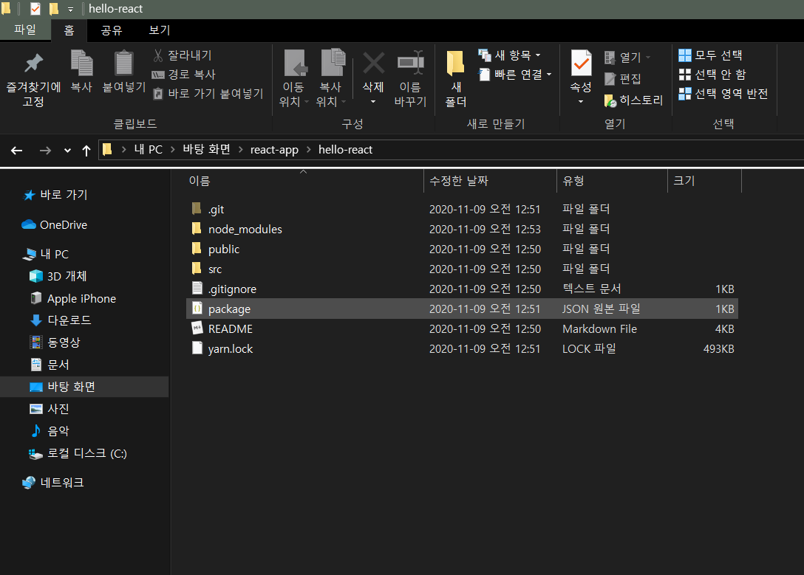

<br>


 생성 후 다음 명령어를 입력해 리액트 개발 전용 서버를 구동해 보자.

```bash
$ cd hello-react
$ yarn start # npm을 사용하는 경우 npm start
```

 브라우저에서 자동으로 웹 페이지가 나온다. 성공!

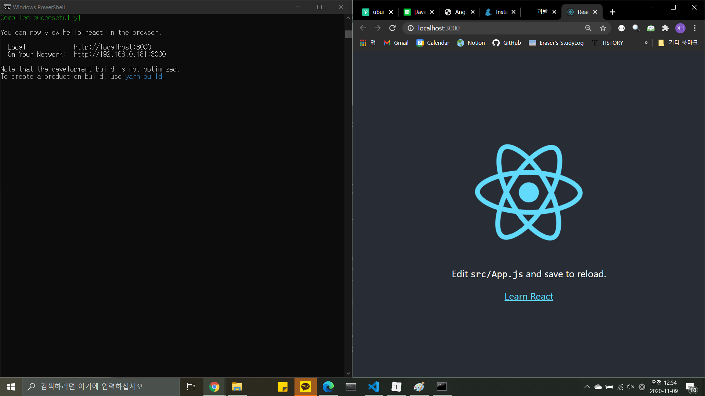

<br>

> *추가*
>
>  처음에 `yarn`으로 설치할 때 `node_modules`에 react 모듈이 설치되지 않았었다. 해결을 위해 [다음의 링크](https://stackoverflow.com/questions/41462729/typescript-react-could-not-find-a-declaration-file-for-module-react-material)를 참고했다. 혹은 [생활코딩 강좌](https://www.youtube.com/watch?v=C9l-dQTeW7k&list=PLuHgQVnccGMCRv6f8H9K5Xwsdyg4sFSdi&index=5)를 참고하여 `npm`으로 설치하는 것도 방법이다.

