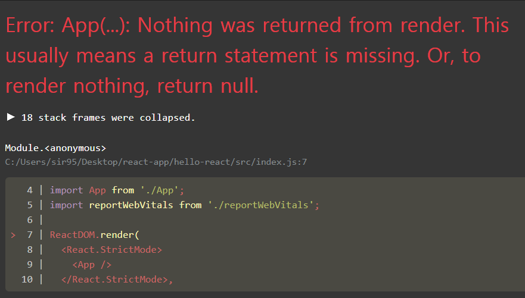

# 2. JSX


## 2.1. 코드 이해하기

 

 우선 리액트로 만든 프로젝트의 구조를 이해하기 위해 `hello-react` 폴더로 이동해 `src/App.js`를 열어 보자.


<br>

* 번들러

    브라우저가 아닌 환경에서도 자바스크립트를 실행할 수 있게 해주는 `Node.js`에서는 모듈을 불러와서 사용할 수 있도록 하는 기능을 지원한다. 반면, 원래 브라우저에서는 모듈을 불러와서 사용할 수 없다. 이러한 기능을 브라우저에서도 사용하기 위해, 즉, 불러온 모듈 혹은 파일들을 하나로 연결하기 위해 **번들러**(*bundler*)라는 기능을 사용한다.

  

  * 리액트 모듈 불러오기

    ```JSX
    import React from 'react';
    ```

     리액트를 불러와서 사용할 수 있게 한다. 리액트 프로젝트를 만들 때 `node_modules`라는 폴더도 함께 생성되는데, 함께 설치된 react 모듈을 불러올 수 있게 해준다.

    

    > *참고*
    >
    >  책에서와 달리 원래 해당 구문이 `App.js` 파일에 존재하지 않았다. 노트북(yarn으로 설치), 데스크탑(npm으로 설치) 모두에서 `node_modules` 안에 `react` 모듈이 설치되어 있지 않았다. ~~원래 `@types` 안에 있어야 한다고 했는데!~~
    >
    > * 노트북: `Could not find a declaration file for module 'react'` 오류 → [해당 페이지](https://hpoption.tistory.com/m/1129?category=0) 참고.
    > * 데스크탑: 오류는 안 나는데, 파일이 다르긴 하다.

  * SVG, CSS 등 파일 불러오기

    ```JSX
    import logo from './logo.svg';
    import './App.css';
    ```

     웹팩의 **로더**(*loader*)라는 기능이 파일을 불러오는 역할을 담당한다. 직접 각 설주요 로더로는 다음과 같은 것들이 있다.

    * css-loader: CSS 파일을 불러 온다.
    * file-loader: 웹 폰트, 미디어 파일 등을 불러 온다.
    * babel-loader: 최신 자바스크립트 문법으로 작성된 코드를 이전 버전으로 변환한다.


<br>

* 함수형 컴포넌트

  아래와 같이 `function` 키워드를 사용해 `App`이라는 컴포넌트를 만들었다. 이를 **함수형 컴포넌트**라고 한다. 렌더링되는 컴포넌트는 함수가 반환하는 것이다.

```jsx
function() App {
    return (
    ... // 렌더링되는 컴포넌트
    )
}
```

<br>

## 2.2. ~ 2.3. JSX와 그 특징


 `src/App.js`에서 반환되는 컴포넌트를 보면, HTML과 비슷하지만 HTML이 아니고 문자열 템플릿도 아니다. 리액트에서 사용하는 자바스크립트 확장 문법인 **JSX**이다. 리액트는 JSX 형식의 코드로 작성되며, 브라우저에서 실행되기 전 번들링되는 과정에서 바벨을 사용해 일반 자바스크립트 형태의 코드로 변환된다. JSX 문법이 어떻게 자바스크립트 코드로 변환되는지 살펴 보자.

* JSX

```jsx
funttion App() {
    return (
    <div>
      Hello <b>react</b>
    </div>
    );
}
```

* 자바스크립트

```javascript
function App() {
    return React.createElement("div", null, "Hello ", React.createElement("b", null, "react"));
}
```

<br>

 JSX의 장점은 다음과 같다.

* 편리하다. 예컨대 컴포넌트를 렌더링할 때마다 `React.createElement` 함수를 사용하지 않아도 된다.

* 가독성이 높고 작성하기 쉽다. HTML 코드를 작성하는 것과 같이 작성하면 된다.

* 활용도가 높다. 만들어진 컴포넌트를 HTML 태그를 쓰듯 사용할 수 있다.

  * 예: `src/index.js`에서는 `src/App.js`에서 만든 `App` 컴포넌트를 HTML 태그를 사용하듯 작성한다.

    

  * `ReactDOM.render`: 컴포넌트를 페이지에 렌더링하는 함수. `react-dom` 모듈을 불러와 사용한다.

    * 첫 번째 파라미터: 페이지에 렌더링할 JSX 내용.
    * 두 번째 파라미터: 해당 JSX 내용을 렌더링할 document 내부 요소.

<br>

## 2.4. JSX 문법


 JSX는 HTML과 비슷하지만 완전히 같지는 않다. 코드로 보면 XML 형식이지만, 실제로는 자바스크립트 객체이며, 용도와 문법에 조금씩 차이가 있다. 다음과 같은 간단한 문법을 숙지해 두자.

> *참고* : 괄호 사용
>
>  JSX를 괄호로 감싸는 것은 필수가 아니다. 여러 줄로 작성할 때 주로 괄호를 감싸고, 한 줄로 표현할 수 있는 경우 감싸지 않는다.

<br>


### 2.4.1. 태그로 감싸인 요소


 컴포넌트에 여러 요소가 있다면 반드시 부모 요소 하나로 감싸야 한다. Virtual DOM에서 컴포넌트 변화를 감지할 때, 효율적으로 비교할 수 있도록 컴포넌트 내부가 하나의 DOM 트리 구조로 이루어져야 하기 때문이다.

* 잘못된 예

| 코드                                                         | 결과                                                         |
| ------------------------------------------------------------ | ------------------------------------------------------------ |
|  |  |

* 올바른 예

| 코드                                                         | 결과                                                         |
| ------------------------------------------------------------ | ------------------------------------------------------------ |
|  |  |

<br>

 `<div>` 요소를 사용하여 감싸고 싶다면, `Fragment` 요소를 이용해도 된다. 다음의 두 가지 방식 모두 사용할 수 있다.

```jsx
import React, {Fragment} from 'react';

function App() {
  return (
    <Fragment>
      <h1>리액트 안녕!</h1>
      <h2>잘 작동하니?</h2>
    </Fragment>
  );
}

export default App;
```

```jsx
import React from 'react';

function App() {
  return (
    <> 
      {/* Fragment*/}
      <h1>리액트 안녕!</h1>
      <h2>잘 작동하니?</h2>
    </> // Fragment
  );
}

export default App;
```

<br>

### 2.4.2. 자바스크립트 요소

 JSX 안에서 자바스크립트 표현식을 쓰려면 JSX 내부에서 코드를 `{}`로 감싼다.

```jsx
import React from 'react';

function App() {
  const name = '리액트';
  return (
    <> 
      <h1>{name} 안녕!</h1>
      <h2>잘 작동하니?</h2>
    </> // Fragment
  );
}

export default App;
```

<br>

### 2.4.3. ~ 2.4.4. 조건부 렌더링


 조건에 따라 다른 내용을 렌더링하고 싶을 경우에는 JSX 밖에서 if문을 사용하여 사전에 값을 설정해야 한다. JSX 내부의 자바스크립트 표현식 `{}` 안에서 if문을 사용할 수 없기 때문이다. 그러나 JSX 내부에서 조건부 렌더링을 하고 싶다면, 다음과 같은 방법을 사용하면 된다.

<br>

#### 삼항 연산자(조건부 연산자)

 삼항 연산자를 `{}` 안에 사용하면 된다.

```jsx
import React from 'react';

function App() {
  const name = '리액트';
  return (
    <> 
      {name === '리액트' ? (
        <h1>리액트입니다.</h1>
      ) : (
        <h2>리액트가 아닙니다.</h2>
      )}
    </> // Fragment
  );
}

export default App;
```

| const name = '리액트'                                        | const name = '뤼왝투'                                        |
| ------------------------------------------------------------ | ------------------------------------------------------------ |
|  |  |

 <br>

#### AND 연산자 사용


 **AND 연산자**(`&&`)를 사용하여 조건부 렌더링을 할 수도 있다. 특정 조건을 만족할 때 내용을 보여 주고, 만족하지 않을 때 아무 것도 렌더링하지 않는 상황이다. 리액트에서 `false`는 `null`과 마찬가지로 아무 것도 화면에 나타나지 않도록 되어 있기 때문에, 다음과 같은 `&&` 연산자 사용이 가능하다.

```jsx
import React from 'react';

function App() {
  const name = '리액트ㅇㅇㅇ';
return <>{name === '리액트' && <h1>리액트입니다.</h1>}</>
}

export default App;
```

 위의 코드를 삼항 연산자를 사용해 나타내면 다음과 같다.

```jsx
import React from 'react';

function App() {
  const name = '리액트ㅇㅇㅇ';
return <>{name === '리액트' ? <h1>리액트입니다.</h1> : null}</>
}

export default App;
```

<br>

 다만 false인 값인 `0`의 경우는 예외적으로 화면에 나타난다.

```jsx
import React from 'react';

function App() {
  const name = 0;
return <>{name && <h1>나타났습니까?</h1>}</>
}

export default App;
```


<br>


### 2.4.5. undefined를 렌더링하지 않기


 리액트 컴포넌트에서는 함수에서 `undefined`만 반환하여 렌더링할 수 없다. 이 경우 OR(`||`) 연산자를 활용하여 오류를 방지하도록 한다.

* 잘못된 예

|                             코드                             |                             결과                             |
| :----------------------------------------------------------: | :----------------------------------------------------------: |
|  |  |


* 올바른 예

|                             코드                             | 결과                                                         |
| :----------------------------------------------------------: | ------------------------------------------------------------ |
|  |  |

<br>

 그러나 JSX **내부**에서 `undefined`를 렌더링하는 것은 괜찮다.

```jsx
import React from 'react';
import './App.css';

function App() {
  const name = undefined;
  return <div>{name}</div>;
}

export default App;
```

 다만, 이 경우 아래와 같이 아무 것도 보이지 않을 것이다.


 만약 `undefined`일 때 보여주고 싶은 문구가 있다면, 다음과 같이 코드를 작성하자.

```jsx
import React from 'react';
import './App.css';

function App() {
  const name = undefined;
  return <div>{name || '리액트'}</div>;
}

export default App;
```

<br>

### 2.4.6. 인라인 스타일링


 리액트에서 DOM 요소에 스타일을 적용할 때는 문자열이 아니라 **객체** 형태로 넣어 준다. 이 때, `-`이 포함되는 스타일 이름은 camelCase 표기법으로 작성한다.

 아래와 같이 `style` 객체를 선언하고, `div`에 적용해 보자.

```jsx
import React from 'react';

function App() {
  const name = '리액트';
  const style = {
    backgroundColor: 'black', // background-color
    color: 'aqua',
    fontSize: '48px', // font-size
    fontWeight: 'bold', // font-seight
    padding: 16 // 단위 생략 시 px
  };
  return <div style={style}>{name}</div>
}

export default App;
```


<br>

 `style` 객체를 미리 선언하지 않고도 바로 값으로 지정할 수 있다.

```jsx
import React from 'react';

function App() {
  const name = '리액트';
  return (
    <div
      style={{
        backgroundColor: 'red', // background-color
        color: 'aqua',
        fontSize: '48px', // font-size
        fontWeight: 'bold', // font-seight
        padding: 16 // 단위 생략 시 px
      }}
    >
      {name}
    </div>
  );
}

export default App;
```


<br>

### 2.4.7. className


 일반 HTML에서 CSS 클래스를 사용할 때와 달리, JSX에서는 `class`가 아니라 `classNAme` 속성을 설정한다.

<br>

* `src/App.css`

```css
.react {
  background: aqua;
  color: black;
  font-size: 48px;
  font-weight: bold;
  padding: 16px;
}
```

* `src/App.js` : `div` 요소에 `className` 값을 지정한다.

```jsx
import React from 'react';
import './App.css';

function App() {
  const name = '리액트';
  return <div className='react'>{name}</div>;
}

export default App;
```

<br>

 `className`이 아니라 `class` 값을 설정해도 스타일이 적용되기는 하지만, 개발자도구 Console에 경고가 나타난다. 

<br>

### 2.4.8. 반드시 닫아야 하는 태그

 JSX에서는 `<input>`, `<br>`과 같이 태그를 열기만 하고 닫지 않으면 오류가 발생한다. 다음과 같이 태그를 반드시 닫아 주어야 한다.

```jsx
import React from 'react';
import './App.css';

function App() {
  const name = '리액트';
  return (
    <>
      <div className='react'>{name}</div>
      <input></input>
    </>
  );
}

export default App;
```

 

 그러나, 태그 사이에 별도의 내용이 들어가지 않는 경우는 선언과 동시에 닫을 수 있다. **self-closing 태그**라고 한다. 다음과 같이 작성한다. 

```jsx
import React from 'react';
import './App.css';

function App() {
  const name = '리액트';
  return (
    <>
      <div className='react'>{name}</div>
      <input />
    </>
  );
}

export default App;
```

<br>

### 2.4.9. 주석

 JSX 내부에서 주석을 작성할 때에는 `{/* … */}`와 같은 형식으로 작성한다. 여러 줄로 작성할 수도 있다. 만약 시작 태그가 여러 줄일 때는, 그 내부에서 `// …` 와 같은 형태의 주석도 작성할 수 있다.

```jsx
import React from 'react';
import './App.css';

function App() {
  const name = '리액트';
  return (
    <>
      {/* 주석은 이렇게 작성합니다 */}
      <div className='react' // 시작 태그가 여러 줄이라면, 이런 주석도 가능합니다.
      >{name}
      </div>
      // 그러나 이런 주석이나
      /* 이런 주석은 페이지에 보이게 됩니다. */
      <input />
    </>
  );
}

export default App;
```


## 2.5. 기타


* `ESLint`: 문법 검사 도구.
* `Prettier`:  자동 코드 정리(들여쓰기, 세미콜론 등).
  * `.prettierrc`: 협업 과정에서 코딩 방식 커스터마이징 가능.
  * 저장 시 자동 코드 정렬 가능.

