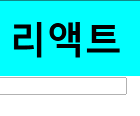

# 2. JSX


 HTML과 비슷하지만 완전히 같지는 않다. 코드로 보면 XML 형식이지만, 실제로는 자바스크립트 객체이며, 용도와 문법에 조금씩 차이가 있다. 


## 2.4. JSX 문법


### 2.4.5. undefined를 렌더링하지 않기


 리액트 컴포넌트에서는 함수에서 `undefined`만 반환하여 렌더링할 수 없다. 이 경우 OR(`||`) 연산자를 활용하여 오류를 방지하도록 한다.

* 잘못된 예

|                             코드                             |                             결과                             |
| :----------------------------------------------------------: | :----------------------------------------------------------: |
|  |  |


* 올바른 예

|                             코드                             | 결과                                                         |
| :----------------------------------------------------------: | ------------------------------------------------------------ |
|  |  |

<br>

 그러나 JSX **내부**에서 `undefined`를 렌더링하는 것은 괜찮다.

```jsx
import React from 'react';
import './App.css';

function App() {
  const name = undefined;
  return <div>{name}</div>;
}

export default App;
```

 다만, 이 경우 아래와 같이 아무 것도 보이지 않을 것이다.


 만약 `undefined`일 때 보여주고 싶은 문구가 있다면, 다음과 같이 코드를 작성하자.

```jsx
import React from 'react';
import './App.css';

function App() {
  const name = undefined;
  return <div>{name || '리액트'}</div>;
}

export default App;
```

<br>

### 2.4.6. 인라인 스타일링


 리액트에서 DOM 요소에 스타일을 적용할 때는 문자열이 아니라 **객체** 형태로 넣어 준다. 이 때, `-`이 포함되는 스타일 이름은 camelCase 표기법으로 작성한다.

 아래와 같이 `style` 객체를 선언하고, `div`에 적용해 보자.

```jsx
import React from 'react';

function App() {
  const name = '리액트';
  const style = {
    backgroundColor: 'black', // background-color
    color: 'aqua',
    fontSize: '48px', // font-size
    fontWeight: 'bold', // font-seight
    padding: 16 // 단위 생략 시 px
  };
  return <div style={style}>{name}</div>
}

export default App;
```


<br>

 `style` 객체를 미리 선언하지 않고도 바로 값으로 지정할 수 있다.

```jsx
import React from 'react';

function App() {
  const name = '리액트';
  return (
    <div
      style={{
        backgroundColor: 'red', // background-color
        color: 'aqua',
        fontSize: '48px', // font-size
        fontWeight: 'bold', // font-seight
        padding: 16 // 단위 생략 시 px
      }}
    >
      {name}
    </div>
  );
}

export default App;
```


<br>

### 2.4.7. className


 일반 HTML에서 CSS 클래스를 사용할 때와 달리, JSX에서는 `class`가 아니라 `classNAme` 속성을 설정한다.

<br>

* `src/App.css`

```css
.react {
  background: aqua;
  color: black;
  font-size: 48px;
  font-weight: bold;
  padding: 16px;
}
```

* `src/App.js` : `div` 요소에 `className` 값을 지정한다.

```jsx
import React from 'react';
import './App.css';

function App() {
  const name = '리액트';
  return <div className='react'>{name}</div>;
}

export default App;
```

<br>

 `className`이 아니라 `class` 값을 설정해도 스타일이 적용되기는 하지만, 개발자도구 Console에 경고가 나타난다. 

<br>

### 2.4.8. 반드시 닫아야 하는 태그

 JSX에서는 `<input>`, `<br>`과 같이 태그를 열기만 하고 닫지 않으면 오류가 발생한다. 다음과 같이 태그를 반드시 닫아 주어야 한다.

```jsx
import React from 'react';
import './App.css';

function App() {
  const name = '리액트';
  return (
    <>
      <div className='react'>{name}</div>
      <input></input>
    </>
  );
}

export default App;
```

 

 그러나, 태그 사이에 별도의 내용이 들어가지 않는 경우는 선언과 동시에 닫을 수 있다. **self-closing 태그**라고 한다. 다음과 같이 작성한다. 

```jsx
import React from 'react';
import './App.css';

function App() {
  const name = '리액트';
  return (
    <>
      <div className='react'>{name}</div>
      <input />
    </>
  );
}

export default App;
```

<br>

### 2.4.9. 주석

 JSX 내부에서 주석을 작성할 때에는 `{/* … */}`와 같은 형식으로 작성한다. 여러 줄로 작성할 수도 있다. 만약 시작 태그가 여러 줄일 때는, 그 내부에서 `// …` 와 같은 형태의 주석도 작성할 수 있다.

```jsx
import React from 'react';
import './App.css';

function App() {
  const name = '리액트';
  return (
    <>
      {/* 주석은 이렇게 작성합니다 */}
      <div className='react' // 시작 태그가 여러 줄이라면, 이런 주석도 가능합니다.
      >{name}
      </div>
      // 그러나 이런 주석이나
      /* 이런 주석은 페이지에 보이게 됩니다. */
      <input />
    </>
  );
}

export default App;
```


## 2.5. 기타


* `ESLint`: 문법 검사 도구.
* `Prettier`:  자동 코드 정리(들여쓰기, 세미콜론 등).
  * `.prettierrc`: 협업 과정에서 코딩 방식 커스터마이징 가능.
  * 저장 시 자동 코드 정렬 가능.

