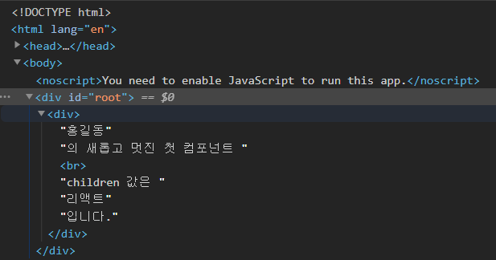
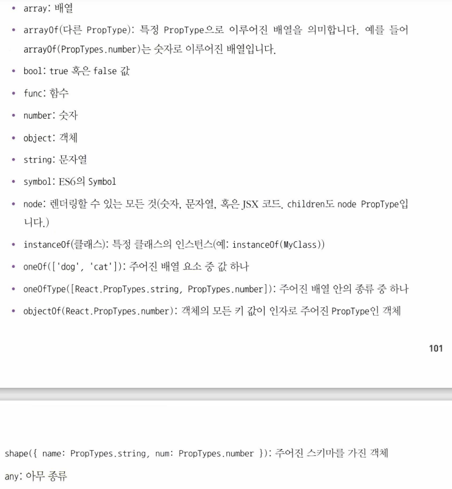

# 3. 컴포넌트

 **컴포넌트**(*component*)란, 애플리케이션 인터페이스에서 사용자가 볼 수 있는 모든 요소들을 말한다. 예컨대, 아래 화면에서 컴포넌트는 다음과 같다.


* TodoTemplate: 화면 전체 틀.
* TodoInput: 입력값 받는 검정색 영역.
* TodoList: 할 일 항목을 보여주는 영역.
* TodoItem: TodoList에서 각 항목을 보여 주기 위해 사용하는 영역.

<br>

 단순히 템플릿 이상의 기능을 갖고 있다.

* 주어진 데이터로 UI를 만든다.
* 라이프사이클 API를 이용하여 컴포넌트가 화면에서 나타날 때, 사라질 때, 변화가 일어날 때 주어진 작업을 처리한다.
* 그 외에 임의 메서드를 만들어 특별한 기능을 처리한다.

<br>


## 3.1. 클래스형 컴포넌트


 컴포넌트를 선언하는 방식에 두 가지가 있다. 2장에서까지 본 것은 함수형 컴포넌트였다. 아래 두 코드는 모두 동일한 `App` 컴포넌트를 만든다.


* 함수형 컴포넌트

```jsx
import React from 'react';
import './App.css';

function App() {
    const name='리액트';
    return <div className='react'>{name}</div>;
}

export default App;
```

* 클래스형 컴포넌트

```jsx
import React, {Component} from 'react';

class App extends Component {
    render() {
        const name = 'react';
        return <div className='react'>{name}</div>;
    }
}

export default App;
```

<br>

> *참고* : ES6 클래스 문법
>
> ```javascript
> class Dog {
>     constructor(name) {
>         this.name = name;
>     }
>     say() {
>         console.log(this.name + ': 멍멍');
>     }
> }
> 
> const dog = new Dog('바둑이');
> dog.say(); // '바둑이: 멍멍'
> ```


<br>

 두 컴포넌트 모두 성능과 파일 크기 면에서 사실상 별 차이는 없다. 다만 두 컴포넌트의 차이를 간략히 비교하면 다음과 같다. 

| 함수형                                                       | 클래스형                                                     |
| ------------------------------------------------------------ | ------------------------------------------------------------ |
| 1. 선언하기 쉽다. <br>2. 메모리 자원을 덜 사용한다. <br>3. 클래스형 컴포넌트에 비헤 결과물 파일 크기가 더 작다. | 1. 반드시 `render` 함수가 필요하다.<br>2. 그 안에서 보여주어야 할 JSX를 반환해야 한다.<br>3. `state` 기능 및 라이프사이클 기능을 사용할 수 있다.<br>4. 임의 메서드를 정의할 수 있다. |

<br>

 두 컴포넌트의 가장 중요한 차이점은 `state`, 라이프사이클 API의 사용이 가능한지 여부이다. 다만 리액트 v16.8 업데이트 이후 `Hooks`라는 기능이 도입되며 함수형 컴포넌트에서도 클래스형 컴포넌트와 조금 다른 방식으로 비슷한 작업을 할 수 있다. **공식 매뉴얼**에서는 컴포넌트를 새로 작성할 때 **함수형 및 Hooks를 사용하도록 권장**하고 있다.

<br>

## 3.2. 첫 컴포넌트 생성

 

 컴포넌트를 만들기 위해서는 다음의 과정을 거쳐야 한다.


<br>

### 3.2.1. ~ 3.2.2 컴포넌트 코드 선언


 `src/MyComponent.js` 파일을 만들어 컴포넌트 코드를 선언한다. Code Snippet 확장 프로그램을 설치했다면, 에디터에서 `rsc`를 입력하면 함수형 컴포넌트 생성 코드가, `rcc`를 입력하면 클래스형 컴포넌트 생성 코드가 나온다.

<br>

* 함수형 컴포넌트

 주로 화살표 함수 문법을 사용한다. (*팀장님께서도 거의 화살표 함수만 사용한다고 피드백*.)

```jsx
import React from "react";

const MyComponent = () => {
  return <div>나의 새롭고 멋진 첫 컴포넌트</div>;
};

export default MyComponent;
```

> *참고* : 화살표 함수
>
>  ES6 문법에서 함수를 표현하는 새로운 방식으로, 함수를 파라미터로 전달할 때 주로 사용한다. **일반 함수**는 자신이 종속된 **객체**를 `this`로 가리키고, **화살표 함수**는 자신이 종속된 **인스턴스**를 `this`로 가리킨다.
>
> * 일반 함수
>
> ```javascript
> function BlackDog() {
>     this.name = '흰둥이'; // 만들어질 인스턴스의 name 속성.
>     return { 
>         name: '검둥이',
>         bark: function() { 
>             console.log(this.name + ': 멍멍!'); // this: 종속된 객체
>         }
>     }
> }
> 
> const blackDog = new BlackDog();
> blackDog.bark(); // '검둥이: 멍멍!'
> ```
>
> * 화살표 함수
>
> ```javascript
> function WhiteDog() {
>     this.name = '흰둥이'; // 만들어질 인스턴스의 name 속성.
>     return {
>         name: '검둥이',
>         bark: () => { 
>             console.log(this.name + ': 멍멍!'); // this: 종속된 인스턴스
>         }
>     }
> }
> 
> const whiteDog = new WhiteDog();
> whiteDog.bark(); // '흰둥이: 멍멍!'
> ```
>
> <br>
>
>  화살표 함수는 값을 연산하여 바로 반환해야 할 때 가독성을 높이기 위해 사용한다.
>
> ```javascript
> /* 아래와 같이 {}를 따로 열지 않고 화살표형 함수를 사용하면 연산한 값을 그대로 반환한다는 의미이다. 
> 함수 자체(value * 3의 기능을 수행하는 함수)가 그 값을 그대로 반환한 후 triple이라는 변수에 그대로 전달되어 값을 할당한다.*/
> const triple = (value) => value * 3; 
> ```

<br>

### 3.2.3. 모듈 내보내기 및 불러오기


#### export

 파일을 내보낸다.

```jsx
export default MyComponent;
```

 위의 코드에서 선언한 `MyComponent` 클래스를 불러오도록 설정한다.

<br>

#### import

 `App` 컴포넌트에서 선언한 `MyComponent` 컴포넌트를 불러와서 사용할 수 있다.

* `src/App.js`

```jsx
import React from "react";
import MyComponent from "./MyComponent";

const App = () => {
  return <MyComponent />;
};

export default App;
```

 두 번째 줄에서 `MyComponent` 파일에서 `MyComponent`를 불러와 사용한다.


<br>

 결과를 확인하면 다음과 같다.


<br>

## 3.3. props


 `props`는 *properties*의 준말로, 컴포넌트 속성을 설정할 때 사용한다. 해당 컴포넌트를 불러와서 사용하게 될 **부모 컴포넌트에서 설정**한다.

> *참고*
>
>  `defaultProps`와 `propTypes`는 필수 사항이 아니지만, 설정하면 협업 시 해당 컴포넌트에 어떤 `props`가 필요한지 알 수 있어 능률이 좋아진다.

<br>

### 3.3.1. ~ 3.3.2. props 사용


#### JSX 내부에서 props 렌더링

 컴포넌트 자체에서 `props`를 렌더링하도록 컴포넌트를 설계하고, 사용하는 부모 컴포넌트에서 그 값을 지정하면 된다.

* `src/MyComponent.js`
  * 컴포넌트 함수의 파라미터로 `props`를 넘긴다.
  * 렌더링 시 JSX 표현식 문법을 따라 `{}`로 감싼다.

```jsx
import React from "react";

const MyComponent = (props) => {
  return <div>{props.name}의 새롭고 멋진 첫 컴포넌트</div>;
};

export default MyComponent;
```

* `src/App.js`

```jsx
import React from "react";
import MyComponent from "./MyComponent";

const App = () => {
  return <MyComponent name="Eraser" />;
};

export default App;
```

<br>

  `MyComponent` 컴포넌트를 사용하는 부모 컴포넌트가 `App`이고, `App`을 렌더링할 때 컴포넌트에서 `name` 인자로 사용할 값을 전달해야 한다. 다음과 같이 결과가 나타난다.


<br>

### 3.3.3. defaultProps

 `props`의 기본값을 지정하는 부분이다. 예컨대 위의 코드에서 `App` 컴포넌트를 만들 때 `name` 인자로 값을 넘기지 않으면 다음과 같은 결과가 나타난다.

| 코드                                                         | 결과                                                         |
| ------------------------------------------------------------ | ------------------------------------------------------------ |
|  |  |

 <br>

  위처럼 `props` 값을 지정하지 않았을 때 보여줄 기본 값을 설정하는 속성이 `defaultProps`이다. 

* `src/MyComponent.js`

```jsx
import React from "react";

const MyComponent = (props) => {
  return <div>{props.name}의 새롭고 멋진 첫 컴포넌트</div>;
};

// default 값 지정
MyComponent.defaultProps = {
    name: '홍길동'
}

export default MyComponent;
```

<

<br>

### 3.3.4. children

 컴포넌트 태그 사이의 내용을 보여주는 `props`이다.

* `src/App.js`

```jsx
import React from "react";
import MyComponent from "./MyComponent";

const App = () => {
  return <MyComponent>리액트</MyComponent>;
};

export default App;
```

 컴포넌트 태그 사이에 '리액트'라는 문자열이 들어갔다. 그러나 아까와 같은 결과만 나오고, 별 다른 변화가 없다.


<br>

 만약 새로운 문자열을 컴포넌트 `MyComponent` 내부에서 보여주고 싶다면, `props.children` 값을 보여주어야 한다.

* `src/MyComponent.js`

```jsx
import React from "react";

const MyComponent = (props) => {
  return (
    <div>
      {props.name}의 새롭고 멋진 첫 컴포넌트 <br /> {/* self-closing */}
      children 값은 {props.children}입니다.
    </div>
  );
};

MyComponent.defaultProps = {
  name: "홍길동",
};

export default MyComponent;
```


<br>

 document 요소를 확인하면 다음과 같다. ~~(`div` 태그로 감싸진 컴포넌트가 있고, 그 컴포넌트 내의 문자열은 해당 컴포넌트의 자식으로 들어가는 것 같은데?)~~



<br>

### 3.3.5.  props 내부 값 추출


 **비구조화 할당**이란, 객체에서 값을 추출하는 문법으로, *구조 분해 문법*이라고도 한다.

* `src/MyComponent.js`

```jsx
import React from "react";

const MyComponent = (props) => {
  const { name, children } = props; // props 속성 비구조화 할당.
  return (
    <div>
      {name}의 새롭고 멋진 첫 컴포넌트 <br />
      children 값은 {children}입니다.
    </div>
  );
};

MyComponent.defaultProps = {
    name: '홍길동'
};

export default MyComponent;
```


<br>

 함수 파라미터 부분에서도 사용할 수 있다. 함수 파라미터가 객체일 경우(여기서는 `props` 자체), 그 값을 바로 분해해서 파라미터로 사용한다.

* `src/MyComponent.js`

```jsx
import React from "react";

const MyComponent = ({ name, children }) => {
  // 바로 파라미터로 전달.
  return (
    <div>
      {name}의 새롭고 멋진 첫 컴포넌트 <br />
      children 값은 {children}입니다.
    </div>
  );
};

MyComponent.defaultProps = {
  name: "홍길동",
};

export default MyComponent;
```


<br>

### 3.3.6. props 검증

 컴포넌트의 필수 `props`를 지정하거나, `props`의 타입(type)을 지정할 때 `propTypes`를 사용한다. `import` 구문을 통해 `propTypes`를 불러온 뒤, `defaultProps`를 설정할 때와 마찬가지로 코드 하단에 입력한다.

<br>


#### 자료형 설정

* `src/MyComponent.js`

 `name` 값이 무조건 문자열(string) 형태로 전달되도록 `props` 타입을 지정해 보자.

```jsx
import React from "react";
import PropTypes from "prop-types";

const MyComponent = ({ name, children }) => {
  return (
    <div>
      {name}의 새롭고 멋진 첫 컴포넌트 <br />
      children 값은 {children}입니다.
    </div>
  );
};

MyComponent.defaultProps = {
  name: "홍길동",
};

// PropTypes 지정
MyComponent.propTypes = {
  name: PropTypes.string,
};

export default MyComponent;
```

<br>

 만약 타입을 어긴 인자를 전달한다면 **렌더링 되기는 하지만, 콘솔에 경고 메시지가 출력**되어 `propTypes`가 잘못되었음을 알려 준다.

* `src/App.js`

```jsx
import React from "react";
import MyComponent from "./MyComponent";

const App = () => {
  return <MyComponent name={3}>리액트</MyComponent>; // 인자값 전달. type 오류.
};

export default App;
```


<br>


#### 필수 propTypes 설정

 `propTypes`를 지정할 때, `isRequired`를 붙여 주면 propTypes`를 지정하지 않았을 때 경고메시지를 띄워 준다.

* `src/MyComponent.js`

```jsx
import React from "react";
import PropTypes from "prop-types";

const MyComponent = ({ name, favoriteNumber, children }) => {
  return (
    <div>
      {name}의 새롭고 멋진 첫 컴포넌트 <br />
      children 값은 {children}입니다. <br />
      {name}이 좋아하는 숫자는 {favoriteNumber}입니다.
    </div>
  );
};

MyComponent.defaultProps = {
  name: "홍길동",
};

// PropTypes 지정
MyComponent.propTypes = {
  name: PropTypes.string,
  favoriteNumber: PropTypes.number.isRequired, // 필수
};

export default MyComponent;
```


<br>

* `src/App.js`

 `favoriteNumber` 인자를 전달하지 않으면, 경고 메시지가 출력된다.

```jsx
import React from "react";
import MyComponent from "./MyComponent";

const App = () => {
  return <MyComponent name="Eraser">리액트</MyComponent>; // 인자값 전달. 경고메시지 출력.
};

export default App;
```


<br>

#### 그 외 설정할 수 있는 propTypes

 전부 다 외우는 것은 의미가 없다. [여기](https://github.com/facebook/prop-types)서 확인하자.




<br>

### 3.3.7. 클래스형 컴포넌트에서 props 사용


 지금까지 함수형 컴포넌트에서 `props`를 사용하는 방법을 알아 봤다면, 이제 클래스형 컴포넌트를 보자.

<br>

 `render` 함수에서 `this.props`를 조회하면 된다. 다음과 같이 클래스형 컴포넌트로 변환해 보자.

* `src/MyComponent.js`

```jsx
import React, { Component } from "react";
import PropTypes from "prop-types";

class MyComponent extends Component {
  render() {
    const { name, favoriteNumber, children } = this.props; // 비구조화 할당
    return (
      <div>
        {name}의 새롭고 멋진 첫 컴포넌트 <br />
        children 값은 {children}입니다. <br />
        {name}이 좋아하는 숫자는 {favoriteNumber}입니다.
      </div>
    );
  }
}

MyComponent.defaultProps = {
    name: '홍길동'
};

MyComponent.propTypes = {
    name: PropTypes.string,
    favoriteNumber: PropTypes.number.isRequired
}

export default MyComponent;
```

<br>

 class 내부에서 지정해도 된다.

* `src/MyComponent.js`

```jsx
import React, { Component } from "react";
import PropTypes from "prop-types";

class MyComponent extends Component {
  static defaultProps = {
    name: "홍길동",
  };
  static propTypes = {
    name: PropTypes.string,
    favoriteNumber: PropTypes.number.isRequired,
  };
  render() {
    const { name, favoriteNumber, children } = this.props; // 비구조화 할당
    return (
      <div>
        {name}의 새롭고 멋진 첫 컴포넌트 <br />
        children 값은 {children}입니다. <br />
        {name}이 좋아하는 숫자는 {favoriteNumber}입니다.
      </div>
    );
  }
}

export default MyComponent;
```

<br>

## 3.4. state 


 리액트에서 `state`란 컴포넌트 내부에서 바뀔 수 있는 값을 의미한다. 

<br>

 `props`는 컴포넌트 내부에서 바뀔 수 없다. 컴포넌트가 사용되는 과정에서 부모 컴포넌트가 설정하며, 컴포넌트 자신은 해당 `props`를 읽기 전용으로만 사용할 수 있다.


<br>

 이와 달리 `state`는 컴포넌트 자신이 바꿀 수 있는 값이라는 의미다. `state`에는 다음과 같은 두 가지 종류가 있다.

* 클래스형 컴포넌트의 `state`
* 함수형 컴포넌트의 `state`: `useState`라는 함수로 사용.

<br>

### 3.4.1. 클래스형 컴포넌트


 우선 `src/Counter.js`라는 파일을 생성하자. 여기서는 `Counter`라는 새로운 컴포넌트를 클래스형으로 생성할 것이다.

```jsx
import React, { Component } from "react";

class Counter extends Component {
  constructor(props) {
    super(props);
    // state의 초기값 설정
    this.state = {
      number: 0,
    };
  }
  render() {
    const { number } = this.state; // state 조회
    return (
      <div>
        <h1>{number}</h1>
        <button
          // onClick시 호출될 함수 지정.
          // 화살표형 함수: 바로 전달.
          onclick={() => {
            // state에 새로운 값을 설정.
            this.setState({ number: number + 1 });
          }}
        >
          +1 {/* 보여질 것*/}
        </button>
      </div>
    );
  }
}

export default Counter;
```


#### state 생성


 `constructor` 메서드를 사용해 컴포넌트에 `state`를 설정한다.

```jsx
  constructor(props) {
    super(props);
    // state의 초기값 설정
    this.state = {
      number: 0,
    };
  }
```

* `super(props)`를 반드시 호출해야 한다. 
  * 현재 클래스형 컴포넌트는 리액트의 `Component` 클래스를 상속받고 있다. 
  * `super(props)` 호출 시 리액트의 `Component` 클래스가 지닌 생성자 함수를 호출한다.
  * 그래야 `constructor` 메서드를 사용할 수 있다.
* `state`의 초기값을 설정한다. 
  * 해당 객체의 초기 `state`를 설정한다.
  * `state` 자체도 객체 형태여야 한다.

<br>

`render` 함수를 확인해 보자.

```jsx
render() {
    const { number } = this.state; // state 조회
    return (
      <div>
        <h1>{number}</h1>
        <button
          // 이벤트 핸들: onClick시 호출될 함수 지정.
          // 화살표형 함수: 바로 전달.
          onclick={() => {
            // state에 새로운 값을 설정.
            this.setState({ number: number + 1 });
          }}
        >
          +1 {/* 버튼에 보여질 것*/}
        </button>
      </div>
    );
  }
```

* `this.state`: 현재 `state`를 조회한다. 비구조화 문법으로 `number` props를 할당한다.
* `button`
  * `onClick` props: 버튼 클릭 이벤트를 설정하는 props. 즉, 버튼이 클릭될 때 호출할 수 있는 함수를 설정하는 props.
  * `onClick` 이벤트 핸들 함수
    * 화살표 함수: 바로 인자로 전달.
    * `state` 값을 바꾼다.
  * `+1`: 버튼에 보여질 텍스트.

<br>

#### 렌더링 후 state 확인

* `src/App.js`: 이전에 만든 `MyComponent`는 필요 없으니 코드에서 삭제한다.

```jsx
import React from "react";
import Counter from "./Counter";

const App = () => {
  return <Counter />; // Counter 컴포넌트 렌더링.
};

export default App;
```

<br> 

브라우저에 렌더링된 화면을 확인하자. 버튼에 클릭 이벤트를 발생시킬 때마다 숫자가 올라간다.


<br>

#### 3.4.1.1. state 객체 안에 여러 값 넣기

<br>

```jsx
import React, { Component } from "react";

class Counter extends Component {
  constructor(props) {
    super(props);
    // state 객체 안에 2개의 값 설정.
    this.state = {
      number: 0,
      fixedNumber: 0 
    };
  }
  render() {
    const { number, fixedNumber } = this.state; // 비구조화 할당으로 state 조회
    return (
      <div>
        <h1>{number}</h1>
        <h2>바뀌지 않는 값: {fixedNumber}</h2>
        <button
          onClick={() => {
            this.setState({ number: number + 1 });
          }}
        >
          +1 
        </button>
      </div>
    );
  }
}

export default Counter;
```


<br>

 `state`에 두 가지 값이 있다. `this.setState` 함수는 인자로 전달된 객체 안에 들어 있는 값만 바꾼다. 따라서 `state`의 변화는 다음과 같다.

* `number`: 버튼 클릭 시마다 바뀐다.
* `fixedNumber`: 클릭 이벤트 발생해도 바뀌지 않고 `0`으로 고정된다.


<br>

#### 3.4.1.2. state를 constructor에서 꺼내기

 `constructor` 메서드를 선언하는 것 말고 다른 방식(객체)으로 `state`의 초깃값을 지정할 수 있다. 이 방법이 더 쉽다!

<br>

* `src/Clock.js`

```jsx
import React, { Component } from "react";

class Counter extends Component {
  state = {
    number: 0,
    fixedNumber: 0,
  };
  render() {
    const { number, fixedNumber } = this.state; // 비구조화 할당으로 state 조회
    return (
      <div>
        <h1>{number}</h1>
        <h2>바뀌지 않는 값: {fixedNumber}</h2>
        <button
          onClick={() => {
            this.setState({ number: number + 1 });
          }}
        >
          +1
        </button>
      </div>
    );
  }
}

export default Counter;
```

<br>

#### 3.4.1.3. this.setState에 객체 대신 함수 인자 전달


 `setState`는 비동기([참고](https://velog.io/@aerirang647/32setState-%EB%B9%84%EB%8F%99%EA%B8%B0)) 함수이다. 예컨대, 다음과 같이 `onClick` 이벤트 함수에 `this.setState`를 두 번 호출해도, 버튼을 클릭할 때마다 숫자는 2가 아니라 1씩 더해진다.

```jsx
        <button
          onClick={() => {
            this.setState({ number: number + 1 });
            this.setState({ number: this.state.number + 1});
          }}
        >
          +1
        </button>
```

<br>

 따라서 `setState` 함수 사용 시 동기적으로 상태를 업데이트하고 싶을 경우에는 객체 대신 함수를 인자로 넣어야 한다. 다음과 같이 화살표 함수 문법으로 작성한다.

```jsx
this.setState((prevState, props)) => {
    return {
        // 업데이트할 내용
    }
}
```

* `prevState`: 기존 상태.
* `props`: 현재 `state`에서 가지고 있는 `props`.  만약 업데이트 과정에서 `props`가 필요하지 않다면 생략해도 된다.

<br>

* `src/Counter.js`

```jsx
import React, { Component } from "react";

class Counter extends Component {
  state = {
    number: 0,
    fixedNumber: 0,
  };
  render() {
    const { number, fixedNumber } = this.state; // 비구조화 할당으로 state 조회
    return (
      <div>
        <h1>{number}</h1>
        <h2>바뀌지 않는 값: {fixedNumber}</h2>
        <button
          onClick={() => {
            this.setState((prevState) => {
              return {
                number: prevState.number + 1,
              };
            });
            // 위와 동일하지만, 함수에서 바로 객체를 반환한다는 표현.
            this.setState(prevState => ({
                number: prevState.number + 1
            }))
          }}
        >
          +1
        </button>
      </div>
    );
  }
}

export default Counter;
```

 `this.setState` 함수에 함수를 두 번 전달한다. 위와 아래의 함수 표현식은 동일한 기능을 하나, 아래 함수는 `return` 키워드 없이 화살표 함수에서 바로 값을 반환하고 싶을 때 `{}`를 생략하고 나타내는 식이다.

<br>

 브라우저에 렌더링된 것을 확인하면, 버튼 클릭 이벤트 발생 시 동기적으로 `state`가 업데이트된다. 숫자가 2씩 커진다는 의미다.


<br>

#### 3.4.1.4. state 업데이트 후 특정 작업 실행

 `setState` 함수에 두 번째 인자로 `callback`을 사용하면 `setState`를 사용해 값을 업데이트한 뒤 특정 작업을 처리할 수 있다.

* `src/Counter.js`

```jsx
import React, { Component } from "react";

class Counter extends Component {
  state = {
    number: 0,
    fixedNumber: 0,
  };
  render() {
    const { number, fixedNumber } = this.state; // 비구조화 할당으로 state 조회
    return (
      <div>
        <h1>{number}</h1>
        <h2>바뀌지 않는 값: {fixedNumber}</h2>
        <button
          onClick={() => {
            this.setState(
              // state 인자
              {
                number: number + 1,
              },
              // callback 인자
              () => {
                console.log("방금 setState 함수가 호출되었습니다.");
                console.log(this.state);
              }
            );
          }}
        >
          +1
        </button>
      </div>
    );
  }
}

export default Counter;
```


 브라우저에서 렌더링하고 콘솔을 확인하면, 클릭 이벤트가 발생할 때마다 숫자가 1씩 올라간다. 그 이후 callback인자로 지정된 부분을 보면,

* 콘솔에 `"방금 setState 함수가 호출되었습니다."` 문구가 출력되는 동작이 실행된다.
* 콘솔에 현재 `state`도 출력된다. 객체이다.

<br>


### 3.4.2. 함수형 컴포넌트


 리액트 `v16.8` 업데이트 이후 함수형 컴포넌트에서도 `state`를 사용할 수 있게 되었다. 이 과정에서 `Hooks`라는 것을 사용하는데, 그 종류 중 `useState`를 먼저 다뤄 본다.

<br>

#### 3.4.2.1. 배열 비구조화 할당

 객체 비구조화 할당과 비슷하게, 배열 안에 들어 있는 값을 쉽게 추출할 수 있도록 하는 문법이다. 배열을 이용해서 비구조화 할당을 수행한다.

* 비구조화 할당 사용하지 않을 때

```javascript
const array = [1, 2];
const one = array[0];
const two = array[1];
```

* 비구조화 할당 사용할 때

```javascript
const array = [1, 2];
const [one, two] = array;
```

<br>

#### 3.4.2.2. useState 함수 사용

  `src/Say.js`라는 파일을 생성하자. 여기서는 `Say`라는 새로운 컴포넌트를 함수형으로 생성할 것이다.

```jsx
import React, { useState } from "react";

const Say = () => {
  const [message, setMessage] = useState(""); // 초깃값 형태: 자유
  const onClickEnter = () => setMessage("안녕하세요!");
  const onClickLeave = () => setMessage("안녕히 가세요!");

  return (
    <div>
      <button onClick={onClickEnter}>입장</button>
      <button onClick={onClickLeave}>퇴장</button>
      <h1>{message}</h1>
    </div>
  );
};

export default Say;

```

<br>

#### state 생성

* `useState` 함수
  * `{useState}` 요소를 불러와서 사용.
  * 인자: `state` 초깃값. 객체 형태의 초깃값이 아니어도 상관 없음.
  * 반환: 배열
    * 첫 번째 원소: 현재 `state`.
    * 두 번째 원소: 상태를 바꿀 함수. ~~이벤트 핸들러?~~

<br>

#### 렌더링 후 state 확인

* `src/App.js`

```jsx
import React from "react";
import Say from "./Say";

const App = () => {
  return <Say />; // Say 컴포넌트 렌더링.
};

export default App;
```

<br> 

브라우저에 렌더링된 화면을 확인하자. 


* 입장 버튼 클릭 시


* 퇴장 버튼 클릭 시


<br>

#### 3.4.2.3. 한 컴포넌트에서 useState 여러 번 사용하기

 한 컴포넌트에서 `useState` 함수를 여러 번 사용해도 상관 없다.


* `src/Say.js`

```jsx
import React, { useState } from "react";

const Say = () => {
  const [message, setMessage] = useState(""); // 초깃값 형태: 자유
  const onClickEnter = () => setMessage("안녕하세요!");
  const onClickLeave = () => setMessage("안녕히 가세요!");

  const [color, setColor] = useState("black"); // 두 번째 초깃갑ㅎ.
  return (
    <div>
      <button onClick={onClickEnter}>입장</button>
      <button onClick={onClickLeave}>퇴장</button>
      <h1 style={{ color }}>{message}</h1> {/*인라인 스타일링*/}
      <button style={{ color: "red" }} onClick={() => setColor("red")}>
        빨간색
      </button>
      <button style={{ color: "green" }} onClick={() => setColor("green")}>
        초록색
      </button>
      <button style={{ color: "blue" }} onClick={() => setColor("blue")}>
        파란색
      </button>
    </div>
  );
};

export default Say;
```

<br>

 브라우저에 렌더링된 화면을 확인하자. 입장 버튼을 누르고 색깔 버튼을 누를 때마다 `state`로 문구와 버튼의 색깔이 바뀐다.


<br>

## 3.5. state 사용 시 주의 사항


 컴포넌트에서 `state`값은 바뀔 수 있는 것이라 했다. 이 때 값을 바꿀 때, `setState` 혹은 `useState`를 통해 전달 받은 세터 함수를 사용해야 한다.

<br>

 즉, 아래와 같이 직접 바꾸려고 하면 안 된다는 말이다. ~~아래 잘못된 코드들은 shallow인 듯?~~

```javascript
// 클래스형 컴포넌트의 잘못된 예시
this.state.number = this.state.number + 1;
this.state.array = this.array.push(2);
this.state.object.value = 5;

// 함수형 컴포넌트에서의 잘못된 예시
const [object, setObject] = useState({ a:1, b:1});
object.b = 2;
```


<br>

 배열, 혹은 객체를 업데이트하고자 할 경우, 사본을 만들어 그 사본을 업데이트한 뒤, 그 사본의 상태를 `setState` 혹은 세터 함수를 이용해 업데이트한다.

* 객체 사본: `spread` 연산자(`…`) 사용.
* 배열 사본: 배열 내장함수 사용.

```javascript
// 객체
const object = {a:1, b:2, c:3};
const nextObject = {...object, b:2}; // 사본에서 b 값만 덮어 쓴다.

// 배열
const array = [
    {id: 1, value:true},
    {id: 2, value: true},
    {id: 3, value: false}
];
let nextArray = array.concat({id: 4}); // 새 항목 추가
nextArray.filter(item => item.id !==2); // id 2인 항목 제거
nextArray.map(item.id === 1 ? {...item, value:false} : item); // id가 1인 항목의 value를 false로 설정.
```


<br>

## 3.6. 정리


 컴포넌트는 만들어서 내보냄으로써 사용한다. `props`와 `state`에는 컴포넌트에서 사용하거나 렌더링할 데이터가 담겨 있다. `props`는 부모 컴포넌트에서 설정하고, `state`는 컴포넌트가 자체적으로 지닌 값으로, 그 내부에서 값을 업데이트할 수 있다.

 그렇다고 `props`의 값이 무조건 고정적인 것은 아니다. 부모 컴포넌트의 `state`를 자식 컴포넌트의 `props`로 전달하고, 자식 컴포넌트에서 특정 이벤트가 발생했을 때 부모 컴포넌트의 메서드를 활용하면 `props`도 유동적으로 활용할 수 있다.

<br>

 새로운 컴포넌트를 만들 때 `useState`를 사용하여 만들 것을 권장한다. 코드가 간결할 뿐만 아니라, 함수형 컴포넌트와 `Hooks`를 사용하도록 리액트 개발 팀이 공지했기 때문이다.