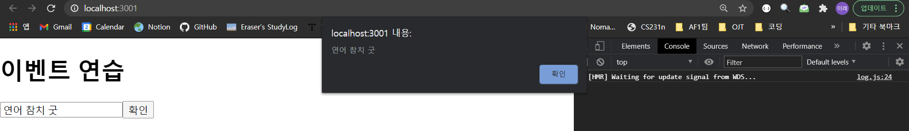

# 4. 이벤트 핸들링


  **이벤트**란, 사용자가 웹 브라우저에서 DOM 요소들과 상호작용하는 것을 의미한다. 예컨대 다음과 같은 것들이 있다.

* `onmouseover`: 버튼에 마우스 커서를 올렸을 때의 동작.
* `onclick`: 클릭했을 때의 동작.
* `onchange`: `Form` 요소의 값이 바뀔 때 실행되는 동작.

<br>

 다음과 같이 HTML 코드에서 바로 DOM 요소에 이벤트를 설정할 수 있다.

```html
<!DOCTYPE html>
<html>
    <head>
        <meta charset='utf-8'>
        <meta name='viewport' content='width=device-width'> 
        <title>JS Bin</title>
    </head>
    <body>
        <button onclick="alert('경고메시지')">
            Click Me
        </button>
    </body>
</html>
```

 위와 같이 HTML 코드를 작성하고, 렌더링한다. `Click Me` 버튼을 누르면 경고메시지가 나타난다.


<br>

## 4.1. 리액트의 이벤트 시스템

  리액트의 이벤트 시스템은 웹 브라우저의 HTML 이벤트와 인터페이스가 동일하다. 그만큼, 사용법도 비슷하다. 3장에서 작성한 `Say.js` 파일에서 `<button>` 의 코드 부분을 다시 살펴 보자.

```jsx
import React, { useState } from "react";

const Say = () => {
  const [message, setMessage] = useState("");
  const onClickEnter = () => setMessage("안녕하세요!");
  const onClickLeave = () => setMessage("안녕히 가세요!");

  const [color, setColor] = useState("black"); 
  return (
    <div>
      <button onClick={onClickEnter}>입장</button> {/*버튼 이벤트*/}
      <button onClick={onClickLeave}>퇴장</button> {/*버튼 이벤트*/}
      <h1 style={{ color }}>{message}</h1> 
      <button style={{ color: "red" }} onClick={() => setColor("red")}> 
        빨간색
      </button>
      <button style={{ color: "green" }} onClick={() => setColor("green")}> 
        초록색
      </button>
      <button style={{ color: "blue" }} onClick={() => setColor("blue")}>
        파란색
      </button>
    </div>
  );
};

export default Say;
```

<br>

 일반 HTML에서와 이벤트 작성법 자체는 비슷하나, 다음의 몇 가지 사항에 주의하자.

1. 이벤트 이름은 카멜 표기법으로 작성한다.

2. 이벤트에 **함수 형태의 값**을 전달한다. 

   * HTML: 이벤트 설정 시 큰따옴표 안에 실행할 자바스크립트 코드를 전달한다.
   * React: 함수 형태의 객체를 전달한다. 
     * 앞의 예제에서처럼 화살표 함수 문법으로 전달한다.
     * 렌더링 부분 외부에 함수를 미리 만들어 전달한다.

3. DOM 요소에만 이벤트를 설정할 수 있다.

   * `div`, `button`, `input`, `form`, `span` 등 DOM 요소에는 이벤트 설정이 가능하다.

   * 직접 만든 컴포넌트에는 이벤트를 설정할 수 없다.

     * 다음과 같은 코드는 이름이 `onClick`인 `props`를 컴포넌트에 전달하는 것 뿐이다.

       ```jsx
       <MyComponent onClick={doSomething}/}
       ```

     * 다음과 같이 전달받은 `props`를 컴포넌트 내부에서 DOM 이벤트로 설정하는 것은 가능하다.

       ```jsx
       <div onClick={this.props.onClick}> 
           { /* props에 onClick 시 설정할 이벤트가 있다. */ }
       	{ /* ... */ }
       </div>
       ```

<br>

 React에서 지원하는 이벤트 종류는 여러 가지가 있다. 대표 예시로 다음과 같은 것이 있다. 언제나 그렇듯, 다 알아둘 필요는 없고 필요할 때마다 [여기](https://facebook.github.io/react/docs/events.html)를 참고하자.


<br>

## 4.2. 예제로 이벤트 핸들링 익히기


 이벤트 핸들링의 단계는 다음과 같다.


<br>

### 4.2.1. 컴포넌트 생성 및 불러오기


 클래스형 컴포넌트로 `EventPractice`라는 컴포넌트를 만든다. 

* `src/EventPractice.js`

```jsx
import React, { Component } from "react";

class EventPractice extends Component {
  render() {
    return (
      <div>
        <h1>이벤트 연습</h1>
      </div>
    );
  }
}

export default EventPractice;
```

<br>

 `App` 컴포넌트에서 `EventPractice` 컴포넌트를 불러온 후, 렌더링한다.

* `App.js`

```jsx
import React from "react";
import EventPractice from "./EventPractice";

const App = () => {
    return <EventPractice />; // EventPractice 컴포넌트 렌더링.
};

export default App;
```

<Br>

 아래와 같이 렌더링된 화면이 보인다.


### 4.2.2. onChange 이벤트 핸들링


 이제 `EventPractice` 컴포넌트에서 `input` 요소를 렌더링하고, 해당 요소에 `onChange` 이벤트를 설정해 보자. (=`input` DOM에 이벤트를 설정하는 과정.)

<br>

#### 이벤트 설정

<br>

* `src/EventPractice.js`
  * `render` : `input` 요소에 값이 입력되는 변화가 나타나면, 콘솔 창에 이벤트 객체가 출력된다.
  * `e` : `SyntheticEvent`
    * 웹 브라우저의 네이티브 이벤트를 감싸는 객체.
    * 자바스크립트에서 HTML 이벤트를 다룰 때와 동일하게 사용한다.
    * 다만, 네이티브 이벤트와 달리 이벤트가 끝나는 **즉시**, *바로* 초기화된다. 따라서 이벤트가 끝난 후 `e` 객체를 참조하고자 할 경우, 불가능하다.
    * 만약 **비동기적**으로 이벤트 객체를 참조하고 싶다면, `e.persist()` 함수를 호출한다.

```jsx
import React, { Component } from "react";

class EventPractice extends Component {
    render() {
        return (
            <div>
                <h1>이벤트 연습</h1>
                <input // input DOM 요소
                    type='text'
                    name='message'
                    placeholder='무엇이든 입력해 보세요.'
                    onChange={
                        (e) => {
                            console.log(e) // 변화가 발생했을 때 이벤트 객체 콘솔에 출력한다.
                        }
                    }> 
                </input>
            </div>
        );
    }
}

export default EventPractice;
```

<br>

 렌더링해보자.


<br>

 입력 칸에 무엇이든 적어 보자. 아래와 같이 콘솔에 이벤트 객체가 기록된다.


<br>

 `e`가 무엇인지 event 객체를 조금 더 자세히 뜯어 보자.


 HTML의 `InputEvent`인 `nativeEvent` 객체가 안에 들어 있다(=감싼다는 의미). 그 외에 여러 가지 속성들을 갖는 object이다.

<br>

  값이 변할 때마다 그 값을 콘솔에 기록하도록 코드를 수정해 보자.

* `src/EventPractice.js`

```jsx
import React, { Component } from "react";

class EventPractice extends Component {
    render() {
        return (
            <div>
                <h1>이벤트 연습</h1>
                <input // input DOM 요소
                    type="text"
                    name="message"
                    placeholder="무엇이든 입력해 보세요."
                    onChange={(e) => {
                        console.log(e.target.value); // 이벤트 발생 시 변해야 하는 target(input 값)의 value를 기록.
                    }}
                ></input>
            </div>
        );
    }
}

export default EventPractice;
```

<br>

 렌더링해보고, 값을 입력하면 다음과 같이 값이 입력될 때마다 콘솔 창에 출력된다.


<br>

#### state에 input 값 담기


`state`에 `input` 값을 담아 보자.

<br>

* `src/EventPractice.js`
  * 생성자 메서드(`constructor`)를 통해 `state` 초깃값을 설정한다.
  * 이벤트 핸들링 함수 내부에서 `this.setState` 메서드를 호출해  `state`를 업데이트한다. 
  * `input` 요소의 `value`를 `state`의 값으로 설정한다.

```jsx
import React, { Component } from "react";

class EventPractice extends Component {

    state = {
        message: '' // 생성자
    }

    render() {
        return (
            <div>
                <h1>이벤트 연습</h1>
                <input
                    type="text"
                    name="message"
                    placeholder="무엇이든 입력해 보세요."
                    value={this.state.message} // 현재 state의 message
                    onChange={(e) => {
                        this.setState({
                            // message를 event의 target value로 설정하도록 state 변화
                            message: e.target.value,
                        });
                    }}
                ></input>
            </div>
        );
    }
}

export default EventPractice;
```


> *참고* : 오류
>
>  생성자에서 `message` 변수를 설정하지 않으면, 오류가 난다. 주의하자.
>
> 

<br>

 아래와 같이 오류 없이 `input` 값을 잘 입력할 수 있다면 성공적이다.


<br>

#### 검증: 버튼 누를 때 comment 값 공백으로 설정


 입력한 값이 `state`에 잘 들어갔는지, `input` 요소에서 그 값을 제대로 반영하는지 검증해 보자. 

* `src/EventPractice.js`
  * `input` element 아래에 `button` element를 만든다.
  * 클릭 이벤트가 발생하면 현재 `comment` 값을 메시지 박스로 띄운 후, `comment` 값을 공백으로 설정한다.

```jsx
import React, { Component } from "react";

class EventPractice extends Component {
    state = {
        message: "",
    };

    render() {
        return (
            <div>
                <h1>이벤트 연습</h1>
                <input
                    type="text"
                    name="message"
                    placeholder="무엇이든 입력해 보세요."
                    value={this.state.message}
                    onChange={(e) => {
                        this.setState({
                            message: e.target.value,
                        });
                    }}
                />
                <button onClick={
                    () => {
                        alert(this.state.message); // 현재 상태의 message를 경고 메시지로 띄운다.
                        this.setState({
                            message: '' // 현재 state의 message를 바꾼다.
                        });
                    }
                }>
                    확인</button>
            </div>
        );
    }
}

export default EventPractice;
```

<br>

 실행해 보면, 아래와 같이 경고 메시지가 표시된다.

<br>

### 4.2.3. 임의 메서드 만들기

 이벤트 처리 시 렌더링과 동시에 함수 형태의 값을 전달해 주었다(화살표 함수 사용해서). 그 대신 함수를 미리 준비해서 전달할 수 있다. 성능 상 차이는 없으나, 가독성이 좋다. 다만, 상황에 따라 렌더링 메서드 내부에서 함수를 만드는 게 더 편할 수도 있다.

<br>

#### 기본 방법

 함수 형태로 메서드를 작성해서 전달한다.

<br>

* `src/EventPractice.js`

  *  우선 `onChange`와 `onClick`에 전달한 함수를 따로 빼내고, 컴포넌트 임의 메서드로 만든다. ~~(질문: 자바스크립트 이벤트 리스너 개념인가?)~~

    > *참고* : 메서드 이름 설정
    >
    >  메서드 이름은 아무렇게나 정해도 되지만, 규칙을 정하는 게 편하므로 `handle(이벤트)`로 정하도록 한다.

  * 메서드와 `this`를 바인딩한다.

    * 함수 호출 시 `this`는 어디서 호출하느냐에 따라 달라진다. 따라서 클래스의 임의 메서드는 특정 HTML DOM element의 이벤트로 등록되는 과정에서 새로 만든 메서드와 `this`의 관계까 끊어진다.
    * 새로 만든 임의의 메서드를 이벤트로 등록하는 과정에서 `this`가 현재 컴포넌트 자신을 제대로 지칭하려면, 그 메서드를 `this`와 바인딩(*binding*)해야 한다.
    * 만약 바인딩이 이루어지지 않으면, `this`는 `undefined`를 가리킨다.

```jsx
import React, { Component } from "react";

class EventPractice extends Component {
    state = {
        message: "",
    };

    constructor(props) {
        super(props);
        this.handleChange = this.handleChange.bind(this); //
        this.handleClick = this.handleClick.bind(this);
    }

    handleChange(e) {
        // change 발생 시 message 변화.
        this.setState({
            message: e.target.value,
        });
    }

    handleClick() {
        // click 시 message를 경고 창에 표시 후 message를 초기화.
        alert(this.state.message);
        this.setState({
            message: "",
        });
    }

    render() {
        return (
            <div>
                <h1>이벤트 연습</h1>
                <input
                    type="text"
                    name="message"
                    placeholder="무엇이든 입력하세요."
                    value={this.state.message}
                    onChange={this.handleChange} // handleChange 메서드
                />
                <button onClick={this.handleClick}>확인</button>
            </div>
        );
    }
}

export default EventPractice;
```

<br>

 렌더링 시, 아까와 똑같은 결과가 나타난다.


<br>

#### Property Initializer Syntax

<br>

 바벨의 `transform-class-properties` 문법을 사용해 화살표 함수 형태로 메서드를 정의한다.

 메서드 바인딩을 생성자에서 하게 되면, 새 메서드를 만들 때마다 `constructor` 내부에서 바인딩을 위한 코드도 계속해서 수정해야 한다. 따라서 작업을 조금 더 간단하게 진행하기 위해 이와 같은 방법을 사용한다.(화살표형 함수를 사용하면, `this`가 종속된 인스턴스 그 자체를 가리키기 때문에 굳이 바인딩해줄 필요가 없다.)

<br>

* `src/EventPractice.js`

```jsx
import React, { Component } from "react";

class EventPractice extends Component {
    state = {
        message: "",
    };

    // constructor가 필요 없다.
    // 화살표 함수로 바로 반환한다.

    handleChange = (e) => {
        this.setState({
            message: e.target.value,
        });
    };

    handleClick = () => {
        alert(this.state.message);
        this.setState({
            message: "",
        });
    };

    render() {
        return (
            <div>
                <h1>이벤트 연습</h1>
                <input
                    type="text"
                    name="message"
                    placeholder="무엇이든 입력하세요."
                    value={this.state.message}
                    onChange={this.handleChange}
                />
                <button onClick={this.handleClick}>확인</button>
            </div>
        );
    }
}

export default EventPractice;
```


<br>

 렌더링해보자.




<br>

### 4.2.4. input 여러 개 다루기

 `input`이 여러 개일 때는 `event` 객체를 활용하면 쉽다. 메서드를 여러 개 만들어 각각 다르게 핸들링할 수도 있지만, 쉽지 않다. `event`의 target이 가리키는 `name`을 이용해 해결해 보자.

<br>


* `src/EventPractice.js`
  * `onChange`

    * `e.target.name`은 해당 `input` element의 `name`을 가리킨다. 여기서는 `message`이다.
    * `render` 함수에서 `name` 값이 `username`인 `input` 값을 렌더링한다. `state`에 `username` 값을 추가한다.
    * `handleChange` 메서드를 변경한다.

  * `handleChange`

    * 객체 안에서 `key`를 `[]`로 감싸면, 그 안의 레퍼런스가 가리키는 실제 값이 key 값으로 사용된다.
    * 다음의 코드에서 `[]`로 감싸진 `name`이 가리키는 실제 값인 `variantKey`가 `object`라는 오브젝트 내에서 key가 된다.

    ```javascript
    const name = 'variantKey';
    const object = {
        [name]: 'value'
    }
    
    console.log(object);
    /*
    {
    	'variantKey': 'value'
    }
    */
    ```

<br>

```jsx
import React, { Component } from "react";

class EventPractice extends Component {
    state = {
        username: "",
        message: ""
    };

    handleChange = (e) => {
        this.setState({
            [e.target.name]: e.target.value // e.target.name의 실제 값이 key로 사용됨.
        });
        console.log(this.state); // 확인용
    };

    handleClick = () => {
        alert(this.state.username + ':' + this.state.message); // e.state.username과 message 표시.
        this.setState({
            message: "",
        });
    };

    render() {
        return (
            <div>
                <h1>이벤트 연습</h1>
                <input
                    type="text"
                    name="username" // username이라는 이름으로 name 추가
                    placeholder="사용자 이름"
                    value={this.state.username} // 현재 상태에서 username 가져 옴.
                    onChange={this.handleChange}
                />
                <input
                    type="text"
                    name="message"
                    placeholder="무엇이든 입력하세요."
                    value={this.state.message}
                    onChange={this.handleChange}
                />
                <button onClick={this.handleClick}>확인</button>
            </div>
        );
    }
}

export default EventPractice;
```


<br>

 렌더링 시 초기 화면은 다음과 같다.


<br>

 교재에서와 달리 확인을 위해 `change` 이벤트가 발생할 때마다 콘솔에 출력하도록 해 보았다.


<br>

 확인용으로 작성한 해당 코드 부분을 제거하면 다음과 같다.


<br>

### 4.2.5. onKeyPress 이벤트 핸들링


 키를 눌렀을 때 발생하는 이벤트는 `KeyPress` 이벤트 핸들링을 통해 처리할 수 있다. `Enter` 키를 눌렀을 때, `handleClick` 메서드를 호출하도록 이벤트 핸들링 부분을 코드에 추가해 보자.


<br>

* `src/EventPractice.js`
  * `handleKeyPress` : 확인을 위해 해당 메서드에서  `key`를 콘솔에 출력하도록 했다. 
  * 교재와 달리, 첫 번째 인풋, 두 번째 인풋 모두에서 엔터를 누를 때`handleKeyPress`를 함수를 통해 핸들링하도록 했다.

```jsx
import React, { Component } from "react";

class EventPractice extends Component {
    state = {
        username: "",
        message: "",
    };

    handleChange = (e) => {
        this.setState({
            [e.target.name]: e.target.value,
        });
    };

    handleClick = () => {
        alert(this.state.username + ":" + this.state.message);
        this.setState({
            message: "",
        });
    };

    handleKeyPress = (e) => {
        console.log(e.key); // 확인용
        if (e.key === "Enter") {
            // Enter키를 누르면 handleClick 이벤트 호출.
            this.handleClick();
        }
    };

    render() {
        return (
            <div>
                <h1>이벤트 연습</h1>
                <input
                    type="text"
                    name="username" // username이라는 이름으로 name 추가
                    placeholder="사용자 이름"
                    value={this.state.username} // 현재 상태에서 username 가져 옴.
                    onChange={this.handleChange}
                    onKeyPress={this.handleKeyPress}
                />
                <input
                    type="text"
                    name="message"
                    placeholder="무엇이든 입력하세요."
                    value={this.state.message}
                    onChange={this.handleChange}
                    onKeyPress={this.handleKeyPress}
                />
                <button onClick={this.handleClick}>확인</button>
            </div>
        );
    }
}

export default EventPractice;
```

<br>

 렌더링 후, 엔터 키를 눌러 보았다.


<br>

 엔터가 아닌 다른 키를 눌러 보자, 경고 메시지가 뜨지 않는다.


<br>


## 4.3. 함수형 컴포넌트로 동일한 기능 구현


 우선 함수형 컴포넌트로 동일한 기능을 구현하기 위해 다음과 같이 코드를 변경해 보자.

* `src/EventPractics.js`

```jsx
import React, { useState } from "react";

const EventPractice = () => {
    const [username, setUsername] = useState("");
    const [message, setMessage] = useState("");
    const onChangeUsername = (e) => setUsername(e.target.value);
    const onChangeMessage = (e) => setMessage(e.target.value);
    const onClick = () => {
        alert(username + ":" + message);
        setUsername("");
        setMessage("");
    };
    const onKeyPress = (e) => {
        if (e.key === "Enter") {
            onClick();
        }
    };
    return (
        <div>
            <h1>이벤트 연습</h1>
            <input
                type="text"
                name="username"
                placeholder="사용자 이름"
                value={username}
                onChange={onChangeUsername}
            />
            <input
                type="text"
                name="message"
                placeholder="무엇이든 입력하세요."
                value={message}
                onChange={onChangeMessage}
                onKeyPress={onKeyPress}
            />
            <button onClick={onClick}>확인</button>
        </div>
    );
};

export default EventPractice;
```

<br>  렌더링하면, 결과가 이전과 같이 잘 나타난다.


<br>


* `useState` 함수 사용
  * 비구조화 할당을 사용해 이전 상태와 이후 상태를 나타낸다. `userName`과 `message` 모두 초깃값은 공백으로 설정한다.
  * 여러 번의 `useState` 함수를 사용해도 상관 없음을 다시금 기억하자.
* 이벤트 관련 함수 함수
  * `onChange` 관련 함수: `username`과 `message`가 바뀔 때, `setUsername`과 `setMessage`의 상태를 바꾼다.
  * `onClick`: 경고 메시지를 띄우고, `setUsername`과 `setMessage`의 상태를 초기화한다.
  * `onKeypress`: `Enter` 키를 눌렀을 때 `onClick` 함수를 호출한다.

<br>

 위와 같이 코드를 작성해도 되지만, `input`의 개수가 많아질수록 어려워 진다. 아래와 같이 `e.target.name`을 사용하면 더 편리해 진다.

* `src/EventPractice.js`	
  * `useState`의 상태에 문자열이 아닌 객체를 넣는다.
  * 이 때, `e.target.name`의 값을 활용하려면, `input`의 값들이 들어 있는 `form` 객체를 사용한다.

```jsx
import React, { useState } from "react";

const EventPractice = () => {
    const [form, setForm] = useState({
        // form 객체 활용.
        username: "",
        message: "",
    });
    const { username, message } = form; // form에 비구조화 할당.
    const onChange = (e) => {
        const nextForm = {
            ...form, // 기존 form 내용 복사
            [e.target.name]: e.target.value, // 원하는 값으로 바꾸기
        };
        setForm(nextForm); // setForm을 nextForm으로 바꾸기
    };
    const onClick = () => {
        alert(username + ":" + message);
        setForm({
            username: "",
            message: "",
        });
    };
    const onKeyPress = (e) => {
        if (e.key === "Enter") {
            onClick();
        }
    };

    return (
        <div>
            <h1>이벤트 연습</h1>
            <input
                type="text"
                name="username"
                placeholder="사용자 이름"
                value={username}
                onChange={onChange}
            />
            <input
                type="text"
                name="message"
                placeholder="무엇이든 입력하세요."
                value={message}
                onChange={onChange}
                onKeyPress={onKeyPress}
            />
            <button onClick={onClick}>확인</button>
        </div>
    );
};

export default EventPractice;
```

<br>

## 4.4. 정리


 React에서 이벤트 핸들링은 자바스크립트 혹은 jQuery를 이용한 이벤트 핸들링과 비슷하다. 클래스형 컴포넌트, 함수형 컴포넌트 모두를 이용해 이벤트 핸들링을 구현해 보았는데, 전자로 할 수 있는 대부분의 작업은 후자로도 가능하다.

 **함수형 컴포넌트**에서 여러 개의 인풋 상태를 관리하기 위해서는 `useState`에서 `form` 객체를 사용하면 편하다. 이후 8장에서 `useReducer`와 커스텀 `Hooks`를 사용하면 이 작업이 훨씬 편해진다.