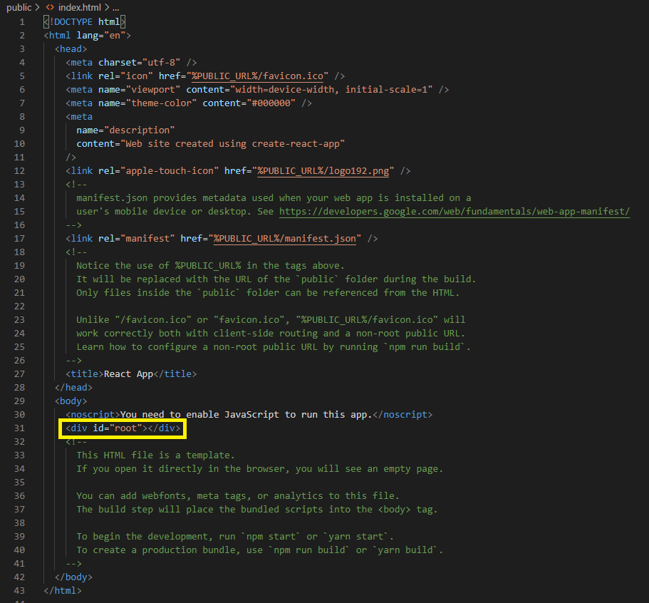

# 5. ref: DOM에 이름 달기


 일반 HTML에서 DOM 요소에 이름을 달 때는 `id`를 사용한다. `public/index.html` 파일을 보면, `id`가 `root`인 `div` element가 있다.




<br>

 `src/index.js` 파일을 보면, `id`가 `root`인 `div` 요소에 리액트 컴포넌트를 렌더링하는 코드가 있다.


<br>

 이처럼 리액트 프로젝트 내부에서 DOM에 이름을 달고자 할 때는, `ref`를 사용한다.

> *참고* : 리액트 컴포넌트에서의 `id` 사용
>
>  리액트 컴포넌트 안에서도 DOM에 `id`를 달면 해당 DOM을 렌더링할 때 그대로 전달되어 문제는 없다. 그러나 특수한 경우가 아니면 그 사용이 권장되지 않는다. HTML에서 DOM의 `id`는 유일해야 하는데, 같은 컴포넌트를 여러 번 사용한다고 가정하면, 중복된 `id`를 갖는 DOM이 여러 개 생겨서 잘못된 사용이 되어 버린다.
>
>  `ref`는 컴포넌트 내부에서만 작동하기 때문에 중복 사용으로 인한 문제가 발생하지 않는다. 또한, `id`를 사용하지 않아도 대부분 원하는 기능을 구현할 수 있지만, 다른 라이브러리나 프레임워크와 함께 `id`를 사용해야 하는 경우, 컴포넌트를 만들 때마다 `id` 뒷 부분에 추가 텍스트를 붙여 중복 `id` 발생을 방지한다.

<br>

## 5.1. ref는 어떤 상황에서 사용해야 할까?


 **DOM을 꼭 직접적으로 건드리고자 할 때** `ref`를 사용한다. 

<br>

 예컨대 HTML 코드에서 `input`을 검증하고자 할 경우, 다음과 같이 특정 `id`를 가진 input에 클래스를 설정한다.

* input 값에 `0000`이 들어올 때는 input 박스가 초록색, 아닐 경우에는 빨간색으로 변한다.


```html
<html>
    <head>
        <meta charset='utf-8'>
        <meta name='viewport' content='width=device-width'>
        <title>Example</title>
        <style>
            .success {
                background-color: green;
            }

            .failure {
                background-color: red;
            }
        </style>
        <script>
            function validate() {
                var input = document.getElementById('password');
                input.className = '';
                if (input.value === '0000') {
                    input.className = 'success'
                } else {
                    input.className = 'failure'
                }
            }
        </script>
    </head>
    <body>
        <input type='password' id='password'></input>
        <button onclick='validate()'>Validate</button>
    </body>
</html>
```

<br>

 위와 같이, 자바스크립트와 jQuery로 위의 기능을 구현하고자 할 경우, input DOM 요소에 직접적으로 접근한다. 그러나 React에서는 굳이 DOM 요소에 직접적으로 접근하지 않아도 `state`를 통해 위의 요소를 구현할 수 있다. 

<br>

 우선 5장에서는 클래스형 컴포넌트에서 `ref`를 사용하는 방법을 알아본다. 함수형 컴포넌트에서 `ref`를 사용하려면 Hooks를 사용해야 하기 때문에, 8장에서 Hooks를 배울 때 자세히 진행한다.

<br>

 먼저 리액트 컴포넌트에서 `state`만으로 위의 기능을 구현해 보자.


<br>

### 5.1.1. 예제 컴포넌트 생성


 먼저, validation에 적용할 css와 리액트 코드를 작성한다.

<br>

* `src/ValidationSample.css`

```css
.success {
    background-color: lightgreen;
}

.failure {
    background-color: lightcoral;
}
```

<br>

* `src/ValidationSample.js`
  * `input`
    *  `onChange` 이벤트 발생 시 `handleChange`를 호출하여 `state`의 `password` 값을 input 값으로 업데이트.
    * `className` 속성: `button` 누르기 전에는 공백, 누른 후에는 검증 결과에 따라 `success` 혹은 `failure` 값을 설정.
    * `className` 속성에 따라 css가 적용되는 것이 달라져 `input` 박스의 색이 초록색 혹은 빨간색으로 나타남.
  * `button`: `onClick` 이벤트 발생 시 `handleButtonClick`을 호출.
    * `state`의  `clicked` 값을 `true`로 설정.
    * `state`의 `validated` 값을 `password`가 `0000`인지 검증하는 boolean 값으로 설정. (*=검증 결과*)

```jsx
import React, { Component } from 'react';
import './ValidationSample.css';

class ValidationSample extends Component {
    state = {
        password: '',
        clicked: false,
        validated: false
    }

    handleChange = (e) => {
        this.setState({
            password: e.target.value
        });
    }

    handleButtonClick = () => {
        this.setState({
            clicked: true,
            validated: this.state.password === '0000'
        })
    }

    render() {
        return (
            <div>
                <input 
                    type='password'
                    value={this.state.password}
                    onChange={this.handleChange}
                    className={this.state.clicked ? (this.state.validated ? 'success' : 'failure') : ''} // 클릭했을 때 유효하면 success, 아니면 failure. 클릭되지 않으면 공백.
                />
                <button onClick={this.handleButtonClick}>검증하기</button>
            </div>
        );
    }
}

export default ValidationSample;
```

<br>

### 5.1.2. App 컴포넌트에서 렌더링


 이전까지 App 컴포넌트는 함수형 컴포넌트로 작성되어 있었다.

```jsx
import React from "react";
import EventPractice from "./EventPractice";

const App = () => {
    return <EventPractice />; // EventPractice 컴포넌트 렌더링.
};

export default App;
```

<br>

 이제 App 컴포넌트에서 `ref`를 사용해야 하기 때문에 클래스형 컴포넌트로 전환한다.

```jsx
import React, { Component } from 'react';
import ValidationSample from './ValidationSample';

class App extends Component {
    render() {
        return (
            <ValidationSample />
        );
    }
}

export default App;
```

<br>

렌더링한 결과는 다음과 같다.


<br>

이제 `input`에 0000을 넣었을 때와 그렇지 않았을 때 변화를 확인하자.

|                             0000                             |                           0000 외                            |
| :----------------------------------------------------------: | :----------------------------------------------------------: |
|  |  |

<br>

### 5.1.3. DOM을 꼭 사용해야 하는 상황

 위와 같은 상황에서는 `state`를 사용하여 필요한 기능을 구현할 수 있었지만, 가끔 `state`만으로 해결할 수 없는 상황이 있다. DOM에 직접적으로 접근해야 하는 상황이다. 이런 상황의 예로는 다음읭 것들이 있으며, 이 때에는 `ref`  기능을 사용한다.


<br>

## 5.2. ref 사용


 `ref` 기능을 사용하는 방법은 다음의 두 가지가 있다.

<br>

### 5.2.1. 콜백 함수

  `ref`를 달고자 하는 요소에 `ref`라는 콜백 함수를 `props`로 전달한다. 이 함수는 `ref` 값을 파라미터로 전달 받고, 함수 내부에서 파라미터로 받은 `ref`를 컴포넌트의 멤버 변수로 설정한다. 예시는 다음과 같다.

```jsx
<input ref={(ref) => {this.input=ref}}/>
```

* `this.input` : `input` element의 DOM을 지칭.
* `ref`의 이름 : 원하는 것으로 자유롭게 지칭. 

<br>

### 5.2.2. createRef

 리액트 내장 함수인 `createRef`를 이용하여 `ref`를 만들 수도 있다. 리액트 16.3 버전부터 도입되었으며, 더 적은 코드로 쉽게 사용할 수 있다.

<br>

* `src/RefSample.js`
  * 컴포넌트 내부에서 멤버 변수로 `React.createRef()`를 담아 준다.
  * 해당 멤버 변수(*여기서는 input*)를 `ref`를 달고자 하는 요소(*여기서는 input DOM*)에 `ref props`로 넣어 준다.
  * `ref` 설정이 완료된다.

```jsx
import React, { Component } from 'react';

class RefSample extends Component {
    input = React.createRef();

    handleFocus = () => {
        this.input.current.focus();
    }

    render() {
        return (
            <div>
                <input ref={this.input}/>
            </div>
        );
    }
}

export default RefSample;
```

<br>

 이렇게 적용할 경우, 콜백 함수를 사용하는 것과 달리 `this.input.current`를 조회하면 된다. `.current`를 넣어준다는 점이 다르다. 


<br>

 둘 중 편한 방법을 사용하면 되나, 교재에서는 주로 콜백 함수를 사용하는 방식으로 `ref`를 다룬다.

<br>

### 5.2.3. 적용


 5.1.에서 만든 `ValidationSample.js` 파일의 렌더링 결과를 보자. 처음 포커스가 `input` 박스에 있다가 버튼을 누르면 포커스가 버튼 쪽으로 넘어가면서 `input` element에 텍스트 커서가 더 이상 보이지 않는다.

|                  초기 및 input에 값 입력 시                  | 검증하기 버튼 클릭 시                                        |
| :----------------------------------------------------------: | ------------------------------------------------------------ |
| <br>~~포커스로 커서가 깜빡이는 게 보여야 하는데 안 보인다..~~ |  |


<br>

#### input에 ref 설정

 콜백 함수를 이용해 `ValidationSample` 컴포넌트에 `ref`를 달아 보자.

* `src/ValidationSample.js`

```jsx
import React, { Component } from 'react';
import './ValidationSample.css';

class ValidationSample extends Component {
    state = {
        password: '',
        clicked: false,
        validated: false
    }

    handleChange = (e) => {
        this.setState({
            password: e.target.value
        });
    }

    handleButtonClick = () => {
        this.setState({
            clicked: true,
            validated: this.state.password === '0000'
        })
    }

    render() {
        return (
            <div>
                <input 
                    ref={(ref) => this.input=ref} // ref 설정
                    type='password'
                    value={this.state.password}
                    onChange={this.handleChange}
                    className={this.state.clicked ? (this.state.validated ? 'success' : 'failure') : ''}
                />
                <button onClick={this.handleButtonClick}>검증하기</button>
            </div>
        );
    }
}

export default ValidationSample;
```

<br>

#### 버튼 onClick 이벤트 수정

* `src/ValidationSample.js`
  * `onClick` 이벤트 발생 시 input에 focus를 준다.
  * `ref`를 설정했으므로, `this.input`이 컴포넌트 내부의 input element를 가리킨다. 일반 DOM을 다루듯 코드를 작성하면 된다.

```jsx
import React, { Component } from 'react';
import './ValidationSample.css';

class ValidationSample extends Component {
    state = {
        password: '',
        clicked: false,
        validated: false
    }

    handleChange = (e) => {
        this.setState({
            password: e.target.value
        });
    }

    handleButtonClick = () => {
        this.setState({
            clicked: true,
            validated: this.state.password === '0000'
        });
        this.input.focus(); // ref 설정 후 this.input이 input DOM 요소를 가리킨다.
    }

    render() {
        return (
            <div>
                <input 
                    ref={(ref) => this.input=ref} // ref 설정
                    type='password'
                    value={this.state.password}
                    onChange={this.handleChange}
                    className={this.state.clicked ? (this.state.validated ? 'success' : 'failure') : ''}
                />
                <button onClick={this.handleButtonClick}>검증하기</button>
            </div>
        );
    }
}

export default ValidationSample;
```

<br>

 이제 렌더링 후 포커스가 넘어가는지 확인해 보자.

|                  초기 및 input에 값 입력 시                  | 검증하기 버튼 클릭 시                                        | 검증하기 버튼 클릭 후                                        |
| :----------------------------------------------------------: | ------------------------------------------------------------ | ------------------------------------------------------------ |
| <br>~~포커스로 커서가 깜빡이는 게 보여야 하는데 안 보인다..~~ |  | <br>~~원래 이렇게 보여야 한다고..~~ |

<br>

## 5.3. 컴포넌트에 ref 달기


 컴포넌트 내부의 DOM을 컴포넌트 외부에서 사용하고자 할 때, 컴포넌트에 `ref`를 달면 된다. DOM에 `ref`를 다는 방법과 동일하다.


<br>

### 5.3.1. 사용법


<br>

 아래와 같이 컴포넌트에 ref를 단다. 그러면 컴포넌트 내부 메서드 및 멤버 변수에도 접근할 수 있다. 즉, 내부의 ref에도 접근할 수 잇다는 의미이다.

```jsx
<MyComponent
    ref={(ref) => {this.myComponent=ref}}
/>
```

 

<br>

 스크롤 박스가 있는 컴포넌트를 하나 만들고, 스크롤바를 아래로 내리는 작업을 부모 컴포넌트에서 실행해 보자.


<br>

### 5.3.2. 컴포넌트 초기 설정


#### 컴포넌트 파일 생성


 `ScrollBox`라는 컴포넌트 파일을 만든다.


<br>

* `src/ScrollBox.js`
  * 스크롤 박스: JSX 인라인 스타일링 문법으로 생성.
  * 최상위 DOM인 `ScrollBox`에 `ref` 생성.

```jsx
import React, { Component } from 'react';

class ScrollBox extends Component {
    render() {
        const style = {
            border: '1px solid black',
            height: '300px',
            width: '300px',
            overflow: 'auto',
            position: 'relative'
        };

        const innerStyle = {
            width: '100%',
            height: '650px',
            background: 'linear-gradient(white, black)'
        }
        
        return (
            <div 
                style={style}
                ref={(ref) => {this.box=ref}}> {/* ref 생성 */}
                <div style={innerStyle}/>
            </div>
        );
    }
}

export default ScrollBox;
```

> *참고* 
>
>  inner의 내용물이 css로 설정한 height보다 크면 스크롤이 생긴다!

<br>

#### 스크롤 박스 컴포넌트 렌더링


 `App.js`에서 스크롤 박스 컴포넌트를 렌더링한다.

* `src/App.js`

```jsx
import React, { Component } from 'react';
import ScrollBox from './ScrollBox';

class App extends Component {
    render() {
        return (
            <div>
                <ScrollBox/>
            </div>
        );
    }
}

export default App;
```

<br>

### 5.3.3. 컴포넌트에 메서드 생성


 컴포넌트에서 **스크롤바를 맨 아래로 내리는 메서드**를 만든다. 자바스크립트로 스크롤바를 내릴 때에는 DOM 노드가 가진 다음의 값들을 사용한다.

* `scrollTop`: 세로 스크롤바 위치(0~350).
* `scrollHeight`: 스크롤이 있는 박스 안 `div` 높이(650).
* `clientHeight`: 스크롤이 있는 박스의 높이(300).

 따라서, 스크롤바를 맨 아래로 내리려면 **`scrollHeight`에서 `clientHeight` 높이를 빼면** 된다.

<br>

* `src/ScrollBox.js`
  * 비구조화 할당으로  `scrollHeight`, `clientHeight` 변수 할당.
  * 부모 컴포넌트인 App 컴포넌트에서 `ScrollBox`에 `ref`를 달아 메서드 사용.

```jsx
import React, { Component } from 'react';

class ScrollBox extends Component {

    // 스크롤바를 아래로 내리는 메서드
    scrollToBottom = () => {
        const {scrollHeight, clientHeight} = this.box;
        /* 비구조화 할당문법 사용.
        const scrollHeight = this.box.scrollHeight;
        const clientHeight = this.box.clientHeight;
        */
       this.box.scrollTop = scrollHeight - clientHeight;
    }

    render() {
        const style = {
            border: '1px solid black',
            height: '300px',
            width: '300px',
            overflow: 'auto',
            position: 'relative'
        };

        const innerStyle = {
            width: '100%',
            height: '650px',
            background: 'linear-gradient(white, black)'
        }
        
        return (
            <div 
                style={style}
                ref={(ref) => {this.box=ref}}> {/* ref 생성 */}
                <div style={innerStyle}/>
            </div>
        );
    }
}

export default ScrollBox;
```

<br>

### 5.3.4. 컴포넌트 ref를 통해 내부 메서드 사용

 App 컴포넌트에서 `ScrollBox`에 `ref`를 달고 버튼을 만들 때, `scrollToBottom` 메서드가 실행되도록 코드를 작성한다.


<br>

* `src/App.js`

```jsx
import React, { Component } from 'react';
import ScrollBox from './ScrollBox';

class App extends Component {
    render() {
        return (
            <div>
                <ScrollBox ref={(ref) => this.scrollBox=ref}/> {/*ref 생성, 이름: scrollBox*/}
                <button onClick={() => this.scrollBox.scrollToBottom()}>
                    scrollToBottom 메서드
                </button>
            </div>
        );
    }
}

export default App;
```

 렌더링해보자.

|                          초기 상태                           |                        스크롤 아래로                         |
| :----------------------------------------------------------: | :----------------------------------------------------------: |
|  |  |

<br>

  `onClick` 이벤트 핸들링 시 주의할 점이 하나 있다. **화살표 함수 문법**을 사용하여 새로운 함수를 만들고, 그 안에서 `this.scrollBox.scrollToBottom` 메서드를 실행해야 한다는 점이다. 문법상으로는 `onclick = {this.scrollBox.scrollToBottom}`과 같이 작성해도 문제가 없다.

 그러나, 컴포넌트가 처음 렌더링될 때 `this.scrollBox.scrollToBottom`이 `undefined`인 상태이므로 오류가 발생할 수 있다. 


<br>

## 5.4. 정리


 `ref`를 언제 사용하는지에 대한 이해가 매우 중요하다. **컴포넌트 내부**에서 **DOM에 직접 접근해야 할 때**에 `ref`를 사용한다. 그러나, 이에 앞서, `ref`를 사용하지 않고도 원하는 기능을 먼저 구현할 수 있는지 반드시 고려하자.

 **서로 다른 컴포넌트끼리 데이터를 교류할 때**는 `ref`를 사용하지 않도록 한다. 잘못된 것이다. 물론, 사용할 수는 있다. 컴포넌트에 `ref`를 달고, 다른 컴포넌트로 `ref`를 전달해서, 다른 컴포넌트에서 `ref`로 전달받은 컴포넌트의 메서드를 실행할 수는 있다. 그러나 이것은 React의 사상에 어긋난 설계이다. 앱 규모가 커질수록 **구조가 꼬여 버린다**. 컴포넌트끼리 데이터를 교류할 때는 언제나 데이터를 부모, 자식 흐름으로 교류해야 하고, 이는 나중에 Redux나 Context API를 사용하는 방법을 통해 배울 것이다.

 **함수형 컴포넌트**에서 `ref`를 사용하는 것은 `useRef`라는 Hooks 함수를 사용하면 된다. 이번 장에서의  `React.createRef`와 유사하다. 8장에서 자세히 보자.