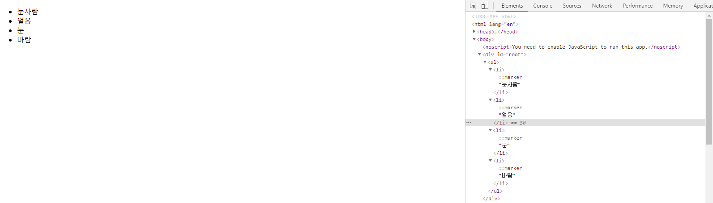

# 6. 컴포넌트 반복


 다음과 같이 코드에서 반복되는 형태가 있을 수 있다.

```jsx
import React from 'react';

const IterationSample = () => {
    return (
        <ul>
            <li>눈사람</li>
            <li>얼음</li>
            <li>눈</li>
            <li>바람</li>
        </ul>
    );
};

export default IterationSample;
```

 <br>

 리액트 프로젝트에서 반복되는 내용을 효율적으로 렌더링하고 관리하는 방법을 알아 보자.

<br>

## 6.1. 자바스크립트 배열의 map 함수


 자바스크립트 배열의 내장 함수인 **map** 함수를 이용해 반복되는 컴포넌트를 렌더링할 수 있다. 

<br>

### 6.1.1. 문법

 **map** 함수는 파라미터로 전달된 함수를 사용해서 배열 내 각 요소를 원하는 규칙에 따라 변환한 후, 그 결과로 새로운 배열을 생성한다.

```javascript
arr.map(callback, [thisArg])
```

 해당 함수의 파라미터는 다음과 같다.

* `callback` : 새로운 배열의 요소를 생성하는 함수.
  * `currentValue` : 현재 처리하고 있는 요소.
  * `index` : `currentValue`의 index 값.
  * `array` : 현재 처리하고 있는 원본 배열.
* `thisArg`(*optional*) : `callback` 함수 내부에서 사용할 `this` 레퍼런스.


<br>

### 6.1.2. 예제

```javascript
var numbers = [1, 2, 3, 4, 5];
var processed = numbers.map(function(num){
    return num*num;
});
console.log(processed);
```


<br>

 ES6 문법으로 새로 작성해 보자.

```javascript
const numbers = [1, 2, 3, 4, 5];
const result = numbers.map(num => num*num);
console.log(result); // [1, 4, 9, 16, 25]
```

<br>


## 6.2. 데이터 배열을 컴포넌트 배열로 변환하기

<br>

### 6.2.1. 컴포넌트로 구성된 배열 생성하기


* `src/IterationSample.js`
  * `names` : 문자열로 구성된 배열.
  * `nameList` : `<li>...</li>` 형태의 JSX 코드로 된 배열.

```jsx
import React from 'react';

const IterationSample = () => {
    const names = ['눈사람', '얼음', '눈', '바람'];
    const nameList = names.map(name => <li>{name}</li>) // <li>눈사람</li> ... <li>바람</li>
    return <ul>{nameList}</ul>;
};

export default IterationSample;
```

<br>

### 6.2.2. 렌더링

* `src/App.js`

```jsx
import React, { Component } from 'react';
import IterationSample from './IterationSample';

class App extends Component {
    render() {
        return (
            <IterationSample />
        );
    }
}

export default App;
```



<br>

## 6.3. key


 위의 예에서 콘솔을 열어 보면, 다음과 같이 `key` prop이 없다는 경고 메시지가 표시된다.


<br>

 리액트에서 `key`는 컴포넌트 배열을 렌더링할 때 어떤 원소에 변동이 있었는지 알아내기 위해 사용하는 `props`이다. 유동적인 데이터를 다룰 때에는 그 원소를 새로 생성할 수도, 제거할 수도, 수정할 수도 있다. (*예: 이벤트 리스트에서 변동이 있을 때*)

 `key`가 없을 때는 virtual DOM에서 유동적인 데이터 리스트를 순차적으로 비교하면서 변화를 감지하지만, `key`가 있을 때에는 `key`를 이용하여 어떤 변화가 있었는지 더욱 빠르게 비교할 수 있다.(~~해쉬 개념인가~~)

<br>

### 6.3.1. key 설정

 `key`를 설정할 때에는 **map** 함수의 인자로 전달되는 콜백 함수 내부에서 컴포넌트 props를 설정하듯 설정한다. 다만, 이 때 `key` 값은 언제나 유일해야 한다. 즉, **데이터의 고윳값**을 `key`값으로 설정해야 한다는 의미이다.

 예컨대, 다음과 같이 게시판의 게시물을 렌더링하면, 각각의 게시물에 고유하게 부여되는 **게시물 번호**를 `key` 값으로 설정해야 한다.

```jsx
const articleList = articles.map(article => (
	<Article 
        title={article.title}
        writer={article.writer}
        key={article.id} // 고유한 게시물 번호 = id
    />
);
                                 ...
```

<br>

 그러나 예제에서 살펴 본 `names`에는 이러한 고유 번호가 없다. 이러한 경우에는 **map** 함수에 전달되는 콜백 함수의 인수인 **index** 값을 사용한다.

* `src/IterationSample.js`

```jsx
import React from 'react';

const IterationSample = () => {
    const names = ['눈사람', '얼음', '눈', '바람'];
    const nameList = names.map((name, index) => <li key={index}>{name}</li>); // <li>눈사람</li> ... <li>바람</li>
    return <ul>{nameList}</ul>;
};

export default IterationSample;
```

<br>

 렌더링 시 더 이상 경고가 표시되지 않는다. 


<br>

 다만, **고유한 값이 없을 때에만** index 값을 `key`로 사용한다는 것을 기억해 두자. index 값을 `key`로 사용할 경우, 배열이 변경될 때 효율적으로 리렌더링되지 못한다.

<br>

## 6.4. 응용


 이제 **동적인 배열**(*=데이터가 변할 때*)을 렌더링하는 방법을 구현해 보자. 또한, 고유한 값이 없을 때 어떻게 효율적인 고윳값을 만들 수 있을지(*→index 값을 `key`로 사용하면 리렌더링이 비효율적이라고 바로 앞에서 말했다!*) 알아 보자.


<br>

### 6.4.1. 초기 상태 설정


`useState`를 사용해 상태를 설정하자. 다음의 세 가지 상태를 설정한다.

* 데이터 배열.
* `input` 상태: 텍스트를 입력할 수 있는 `input` 값.
* 고유 `id` 상태: 데이터 배열에서 새로운 항목을 추가할 때 사용.

<br>

 객체 형태로 이루어진 배열을 만든다. 해당 객체별로 문자열과 고유 `id` 값이 존재한다.

* `src/IterationSample.js`
  * `map` 함수 사용 시: `key`를 `name.id`로 지정한다.

```jsx
import React, {useState} from 'react';

const IterationSample = () => {
    // 데이터 배열로 사용할 상태
    const [names, setNames] = useState([ 
        {id:1, text:'눈사람'},
        {id:2, text:'얼음'},
        {id:3, text:'눈'},
        {id:4, text:'바람'}
    ]);
    const [inputText, setInputText] = useState(''); // input 값으로 사용할 상태
    const [nextId, setNextId] = useState(5); // 새로운 항목을 추가할 때 사용할 id

    const namesList = names.map(name => <li key={name.id}>{name.text}</li>);
    return <ul>{namesList}</ul>;
};

export default IterationSample;
```


<br>

### 6.4.2. 데이터 추가 기능 구현하기

 새로운 이름을 등록할 수 있는 기능을 구현한다.

<br>

#### input과 button 렌더링

```jsx
import React, {useState} from 'react';

const IterationSample = () => {
    // 데이터 배열로 사용할 상태
    const [names, setNames] = useState([ 
        {id:1, text:'눈사람'},
        {id:2, text:'얼음'},
        {id:3, text:'눈'},
        {id:4, text:'바람'}
    ]);
    const [inputText, setInputText] = useState(''); // input 값으로 사용할 상태
    const [nextId, setNextId] = useState(5); // 새로운 항목을 추가할 때 사용할 id

    const onChange = e => setInputText(e.target.value); // 변화 시 input 값의 상태를 value로 바꿈.

    const namesList = names.map(name => <li key={name.id}>{name.text}</li>);

    return (    
    <>
        <input value={inputText} onChange={onChange}/>
        <button>데이터 추가</button>
        <ul>{namesList}</ul>
    </>
    );
};

export default IterationSample;
```


<br>

#### onClick 이벤트 설정


* `src/IterationSample.js`
  * `onClick` : 클릭 시 새로운 항목을 추가한다.
    * `id` : `nextId` 값 사용. 클릭 될 때마다 1씩 증가.
    * 기존의 `input` value 초기화.

```jsx
import React, {useState} from 'react';

const IterationSample = () => {
    // 데이터 배열로 사용할 상태
    const [names, setNames] = useState([ 
        {id:1, text:'눈사람'},
        {id:2, text:'얼음'},
        {id:3, text:'눈'},
        {id:4, text:'바람'}
    ]);
    const [inputText, setInputText] = useState(''); // input 값으로 사용할 상태
    const [nextId, setNextId] = useState(5); // 새로운 항목을 추가할 때 사용할 id

    const onChange = e => setInputText(e.target.value); // 변화 시 input 값의 상태를 value로 바꿈.
    const onClick = () => {
        const nextNames = names.concat({
            id: nextId, // nextId 값을 id로 설정
            text: inputText // inputText 값을 text로 설정
        });
        setNextId(nextId + 1); // nextId 값 1 더하기
        setNames(nextNames); // names 값 업데이트
        console.log(nextNames); // 확인용
        setInputText(''); // inputText 초기화
    }

    const namesList = names.map(name => <li key={name.id}>{name.text}</li>);

    return (    
    <>
        <input value={inputText} onChange={onChange}/>
        <button onClick={onClick}>데이터 추가</button> {/*버튼 클릭 시 이벤트 추가*/}
        <ul>{namesList}</ul>
    </>
    );
};

export default IterationSample;
```

 렌더링해보자.

|                input에 새로운 값을 넣었을 때                 |                 데이터 추가 버튼을 눌렀을 때                 |
| :----------------------------------------------------------: | :----------------------------------------------------------: |
| <br>input에서 value 값이 새로 입력한 값으로 바뀐다. | <br>input value값이 초기화되고,<br>확인용으로 콘솔에 출력한 값이 나오고,<br>화면에 새로운 리스트가 렌더링된다. |

<br>

 위의 함수에서 배열에 새 항목을 추가할 때 `concat` 함수를 사용했다. `push` 함수를 사용하지 않는 ㅣ이유는 **불변성 유지**를 위함이다.

* `concat`: 새로운 배열을 만들어 준다.
* `push`: 기존 배열 자체를 변경한다.

 리액트에서는 **불변성 유지**가 보장되어야 이후 컴포넌트의 성능을 최적화할 수 있다.

<br>

 ### 6.4.3. 데이터 제거 기능 구현하기

 데이터 배열에서 각 항목을 더블클릭하면 해당 항목이 화면에서 사라지도록 구현해 보자. **불변성**을 유지하며 데이터 배열을 업데이트하기 위해, 배열의 내장 함수 **filter**를 이용한다.


#### filter 함수

 배열에서 특정 조건을 만족하는 원소들만 쉽게 분류해 낸다. `filter` 함수의 인자로 **분류하고 싶은 조건을 반환하는 함수**를 넣어 주면 된다.

```javascript
const numbers = [1, 2, 3, 4, 5, 6];
const biggerThanThree = numbers.filter(number => number > 3);
console.log(biggerThanThree); 
```


<br>

 위의 경우와 달리, 배열에서 특정 원소만 제외할 수도 있다.

```javascript
const numbers = [1, 2, 3, 4, 5, 6];
const withoutThree = numbers.filter(number => number !== 3);
console.log(biggerThanThree); // [1, 2, 4, 5, 6]
```

<br>

#### onRemove 메서드 구현

 `<li>` 요소가 더블클릭되었을 때 삭제되도록 하는 메서드를 구현한다. `<li>` 요소에 이벤트가 설정되어야 함에 유의하자.


```jsx
import React, {useState} from 'react';

const IterationSample = () => {
    // 데이터 배열로 사용할 상태
    const [names, setNames] = useState([ 
        {id:1, text:'눈사람'},
        {id:2, text:'얼음'},
        {id:3, text:'눈'},
        {id:4, text:'바람'}
    ]);
    const [inputText, setInputText] = useState(''); // input 값으로 사용할 상태
    const [nextId, setNextId] = useState(5); // 새로운 항목을 추가할 때 사용할 id

    const onChange = e => setInputText(e.target.value); // 변화 시 input 값의 상태를 value로 바꿈.
    const onClick = () => {
        const nextNames = names.concat({
            id: nextId, // nextId 값을 id로 설정
            text: inputText // inputText 값을 text로 설정
        });
        setNextId(nextId + 1); // nextId 값 1 더하기
        setNames(nextNames); // names 값 업데이트
        console.log(nextNames); // 확인용
        setInputText(''); // inputText 초기화
    }
    const onRemove = id => {
        const nextNames = names.filter(name => name.id !== id); // id가 현재 id인 것을 제외하고 배열 반환
        setNames(nextNames); // names 상태 업데이트
    }

    const namesList = names.map(name => (
        <li key={name.id} onDoubleClick={() => onRemove(name.id)}>
            {name.text}
        </li>
    ));

    return (    
    <>
        <input value={inputText} onChange={onChange}/>
        <button onClick={onClick}>데이터 추가</button> {/*버튼 클릭 시 onClick 이벤트 추가*/}
        <ul>{namesList}</ul>
    </>
    );
};

export default IterationSample;
```

<br>

 렌더링해보자.

|                input에 새로운 값을 넣었을 때                 |                 데이터 추가 버튼을 눌렀을 때                 | 눈 li 요소를 더블클릭할 때                                   |
| :----------------------------------------------------------: | :----------------------------------------------------------: | ------------------------------------------------------------ |
|  |  |  |

<br>

## 6.5. 정리


 컴포넌트 배열 렌더링 시에는 `key` 값 설정에 항상 주의해야 한다. `key`값은 언제나 고유해야 한다. `key` 값이 중복되면 렌더링 시 오류가 발생한다.

 상태 안에서 배열을 변형할 때는 배열에 직접 접근하여 수정하는 것이 아니라, **불변성을 유지할 수 있는** 배열 내장 함수인 `concat`, `filter` 등의 함수를 사용하여 새로운 배열을 만든 후, 이를 새로운 상태로 설정해 주어야 한다.