# 7. 컴포넌트의 라이프사이클 메서드


 모든 리액트 컴포넌트에는 **라이프 사이클**(*수명 주기*)이 존재한다. 컴포넌트의 수명은 페이지에 렌더링되기 전인 준비 과정에서부터 시작해서, 페이지에서 사라질 때 끝난다.

 프로젝트를 진행하다 보면, 처음 렌더링할 때 특정 작업을 처리하거나, 업데이트 전후로 특정 작업을 처리하거나, 불필요한 업데이트를 방지해야 할 수도 있다.

 이 때 컴포넌트의 라이프사이클 메서드를 이용한다. 라이프사이클 메서드는 **클래스형 컴포넌트**에서만 사용할 수 있다. **함수형 컴포넌트**에서는 Hooks를 이용해 비슷한 작업을 처리한다.

<br>

 라이프사이클 메서드 흐름을 먼저 훑어 보자.

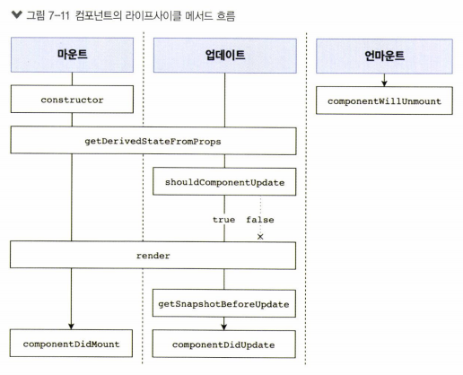

<br>

## 7.1. 라이프사이클 메서드의 이해


 라이프사이클 메서드에는 총 **9가지**가 있다. 

<br>

 이름에 어떤 것이 들어가느냐에 따라 작업 시점이 달라진다.

* **Will**: 작업을 작동하기 **전**에 실행되는 메서드
* **Did**: 작업을 작동한 **후**에 실행되는 메서드

 <br>

 메서드들은 컴포넌트 클래스에서 덮어 써(=*override*)서 선언함으로써 사용할 수 있다. 각 단계별로 다음과 같이 나눈다.

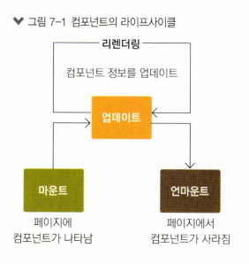


<br>

### 마운트

 DOM이 생성되고 웹 브라우저상에 나타나는 것을 **마운트**(*mount*)라고 한다. 다음과 같은 메서드를 호출한다.

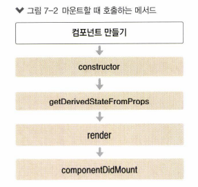

* `constructor`: 컴포넌트를 새로 만들 때 호출하는 클래스 생성자 메서드.
* `getDerivedStateFromProps`: props에 있는 값을 `state`에 넣을 때 사용하는 메서드
* `render`: 준비한 UI를 렌더링하는 메서드
* `componentDidMount`: 컴포넌트가 웹 브라우저상에 나타난 후 호출하는 메서드

<br>

### 업데이트

 컴포넌트를 업데이트할 때 호출하는 메서드이다. 컴포넌트는 다음과 같은 네 가지 경우에 업데이트된다.

* props가 바뀔 때: 부모 컴포넌트에서 넘겨주는 props 자체가 바뀐다.
* state가 바뀔 때: 컴포넌트 자신이 들고 있는 state가 `setState` 함수를 통해 바뀐다.
* 부모 컴포넌트가 리렌더링될 때: 자신에게 할당된 props, 혹은 자신이 들고 있는 state가 변하지 않더라도 부모 컴포넌트가 리렌더링되면 자식 컴포넌트도 리렌더링된다.
* 강제로 렌더링을 트리거할 때: `this.forceUpdate`

<br>

 업데이트할 때는 다음과 같은 메서드를 호출한다.

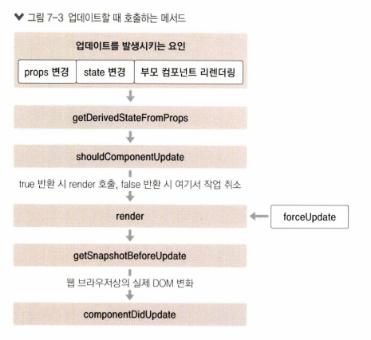

* `getDerivedStateFromProps` : 마운트 과정에서와 마찬가지로, **업데이트가 시작되기 전**에도 호출하는 메서드. props의 변화에 따라 state에 변화를 주고 싶을 때 사용한다.
* `shouldComponentUpdate` : 컴포넌트가 리렌더링을 해야 할지 말아야 할지를 결정하는 메서드. `true` 혹은 `false`의 boolean 값을 반환한다.
  *  `true`를 반환했을 때에만 다음 라이프사이클 메서드를 계속 실행한다. 아니라면 작업을 **중지**한다(=즉, 컴포넌트를 *리렌더링하지 않는다*). 
  * 특정 함수에서 `this.forceUpdate`함수를 호출하면, 이 과정이 생략된 채 바로 `render` 함수가 호출된다.
* `render` : 컴포넌트를 리렌더링하는 메서드.
* `getSnapshotBeforeUpdate` : 컴포넌트 변화를 DOM에 반영하기 직전에 호출하는 메서드.
* `componentDidUpdate` : 컴포넌트의 업데이트 작업이 끝난 후 호출하는 메서드.


<br>

### 언마운트

 컴포넌트를 DOM에서 제거하는 것을 **언마운트**(*unmount*)라고 한다. 마운트의 반대 과정이다.

<br>

 언마운트 시에는 다음의 메서드를 호출한다.


* `componentWillUnmount` : 컴포넌트가 웹 브라우저상에서 사라지기 전에 호출하는 메서드.

<br>

## 7.2. 라이프사이클 메서드 살펴보기


### 7.2.1. render()

```jsx
render() {...}
```


 컴포넌트에서 가장 중요한 메서드이다. 컴포넌트의 모양새를 정의한다. 라이프사이클 메서드 중 유일한 **필수** 메서드이다. 

 `this.props`와 `this.state`에 접근할 수 있으며, 리액트의 element를 반환한다. 이 때 요소(element)는 `div` 같은 태그가 될 수도 있고, `MyComponent`와 같이 따로 정의한 컴포넌트가 될 수도 있다. 만약 아무 것도 보여주고 싶지 않다면, `null`이나 `false` 값을 반환하면 된다.

 `render` 메서드 내에서는 **이벤트 설정이 아닌 곳**에서는 `setState`를 사용하면 **안 되고**, 브라우저의 DOM에 접근해서도 **안 된다**. DOM 정보를 가져오거나 `state`에 변화를 주고 싶다면, `componentDidMount`에서 처리해야 한다.

<br>

### 7.2.2. constructor

```jsx
constructor(props) {...}
```


 컴포넌트의 생성자 메서드로, 클래스형 컴포넌트를 만들 때 처음 실행된다. 초기 `state`를 설정할 수 있다.

<br>

### 7.2.3. getDerivedStateFromProps


 props로 받아 온 값을 state에 동기화한다. 리액트 v16.3 이후 새로 만들어진 라이프사이클 메서드이다. 컴포넌트가 마운트될 때, 업데이트될 때 호출된다.

```jsx
static getDerivedStateFromProps(nextProps, prevState) {
    if(nextProps.value !== prevState.value) {
        return { value: nextProps.value } // 조건에 따라 특정 값 동기화
    }
    return null; // state를 변경할 필요가 없으면 null 반환
}
```


<br>

### 7.2.4. componentDidMount

```jsx
componentDidMount() {...}
```

  컴포넌트를 만들고, 첫 렌더링을 다 마친 후 실행한다. 이 메서드 안에서 다른 자바스크립트 라이브러리 혹은 프레임워크의 함수를 호출하거나, 이벤트 등록, `setTimeout`, `setInterval`, 네트워크 요청 등 비동기 작업을 처리하면 된다.

> *참고* : 자바스크립트 비동기 처리
>
>  특정 코드의 연산이 끝날 때까지 코드의 실행을 멈추지 않고, 다음 코드를 먼저 실행하는 자바스크립트의 특성.

<br>

### 7.2.5. shouldComponentUpdate

```jsx
shouldComponentUpdate(nextProps, nextState) {...}
```

 props 혹은 state를 변경했을 때, **리렌더링을 시작할지 여부**를 지정하는 메서드이다. 이 메서드 안에서는 반드시 `true` 혹은 `false`의 값을 반환해야만 한다. 컴포넌트 생성 시, 따로 이 메서드를 생성하지 않으면, 기본적으로 `true` 값을 반환한다(=그 다음 과정으로 넘어가 리렌더링이 된다는 의미인 듯?). 이 메서드가 `false` 값을 반환한다면, 업데이트 과정이 중지된다.

 이 메서드 안에서 props와  state에 접근할 수 있다. 

* 현재: `this.props`, `this.state`
* 새로 설정될 것: `nextProps`, `nextState`

 프로젝트 성능 **최적화** 시, **상황에 맞는** 알고리즘을 작성하여 **리렌더링을 방지**해야 할 때 `false` 값을 반환하도록 한다. 

<br>

### 7.2.6. getSnapshotBeforeUpdate

 `render`에서 만들어진 결과물이 웹 브라우저에 렌더링으로 실제로 반영되기 직전에 호출된다. 이 메서드가 반환하는 값은 `componentDidUpdate`에서 세 번째 파라미터인 `snapshot` 값으로 전달받는다. 업데이트 직전의 값을 참고할 일이 있을 때 주로 사용한다(*예: 스크롤바 위치 유지*).

```jsx
getSnapShotBeforeUpdate(prevProps, prevState) {
    if(prevState.array !== this.state.array) {
        const { scrollTop, scrollHeight } = this.list
        return { scrollTop, scrollHeight };
    }
}
```


<br>

### 7.2.7. componentDidUpdate

```jsx
componentDidUpdate(prevProps, prevState, snapshot) {...}
```

 **리렌더링 완료 후** 실행한다. 이제 업데이트가 끝난 직후이므로, DOM 관련 처리를 해도 무방하다. `prevProps`, `prevState` 등을 사용해 컴포넌트가 이전에 가졌던 데이터에 접근할 수 있다. 또한 `getSnapshaotBeforeUpdate`에서 반환한 값이 있다면, 여기서 `snapshot` 값을 전달받을 수도 있다.


<br>

### 7.2.8. componentWillUnmount

```jsx
componentWillUnmount() {...}
```

 컴포넌트를 DOM에서 제거할 때 실행한다. `componentDidMount`에서 등록한 이벤트, 타이머, 직접 생성한 DOM 등이 있다면, 여기서 제거해 주어야 한다.

<br>

### 7.2.9. componentDidCatch

  컴포넌트 렌더링 도중 에러가 발생했을 때, 오류 UI를 보여줄 수 있도록 한다. 리액트 v16에서 새롭게 도입되었다. 

```jsx
componentDidCatch(error, info) {
    this.setState({
        error:true
    });
    console.log({ error, info }); // 핸들링 가능
}
```

* `error`: 파라미터에 어떤 에러가 발생했는지 알려준다.
* `info`: 어디에 있는 코드에서 오류가 발생했는지 정보를 준다.

` console.log` 라인을 수정하여, 나중에 실제로 사용할 때 오류가 발생하면 서버 API를 수집하는 등 작업을 할 수 있다.

 **다만**, 이 메서드를 사용할 때에는 **컴포넌트 자신**에게 발생하는 에러를 잡아낼 수 없고, 자신의 `this.props.children`으로 전달되는 컴포넌트에서 발생하는 에러만 잡아낼 수 있다.

<br>

## 7.3. 라이프사이클 메서드 사용하기


 

<br>

### 7.3.1. 예제 컴포넌트 생성

<br>

* `src/LifeCycleSample.js`
  * 각 라이프사이클 메서드를 실행할 때마다 콘솔 디버거에 기록한다.
  * 부모 컴포넌트에서 `props`로 색상을 받는다.
  * `button` element를 누르면 `state.number` 값을 1씩 더한다.
  * `getDerivedStateFromProps` : 부모 컴포넌트에서 받은 `color` 값을 `state`에 동기화.
  * `getSnapshotBeforeUpdate` : DOM에 변화가 일어나기 직전 `color` 속성을 `snapshot` 값으로 반환.
  * `componentDidUpdate` : snapshot 조회할 수 있음.
  * `shouldComponentUpdate` : `state.number`의 마지막 자리 수가 4이면(4, 14번째 등), 리렌더링하지 않는다.

```jsx
import React, { Component } from 'react';

class LifeCycleSample extends Component {
    state = { // 초기 state
        number: 0, 
        color: null
    }

    myRef = null; // ref 설정할 부분

    constructor(props) {
        super(props);
        console.log('constructor 메서드 실행');
    }

    static getDerivedStateFromProps(nextProps, prevState) {
        console.log('getDerivedStateFromProps 메서드 실행');
        if(nextProps.color !== prevState.color) { // 부모 컴포넌트에서 받은 color와 다르다면 state의 color값에 동기화.
            return { color: nextProps.color };
        }
        return null;
    }

    componentDidMount() {
        console.log('componentDidMount 메서드 실행');
    }

    shouldComponentUpdate(nextProps, nextState) {
        console.log('shouldComponentUpdate 메서드 실행');
        console.log('========= nextProps: ', nextProps, 'nextState: ', nextState); // 확인용
        return nextState.number % 10 !== 4 // 숫자 마지막 자리가 4이면 렌더링하지 않도록 설정(4가 아닐 때 true 반환)
    }

    componentWillUnmount() {
        console.log('componentWillUnmount 메서드 실행');
    }

    handleClick = () => {
        this.setState({
            number: this.state.number + 1
        });
    }

    getSnapshotBeforeUpdate(prevProps, prevState) {
        console.log('getSnapshotBeforeUpdate 메서드 실행');
        if(prevProps.color !== this.props.color) { // 변화가 일어나기 직전에 color 속성을 snapshot으로 반환해서 ref에 준다.
            return this.myRef.style.color;
        }
        return null;
    }

    componentDidUpdate(prevProps, prevState, snapshot) {
        console.log('componentDidUpdate 메서드 실행');
        if(snapshot) {
            console.log('업데이트 전 색상: ', snapshot)
        }
    }

    render() {
        console.log('render 메서드 실행');
        const style = {
            color: this.props.color
        };

        return (
            <div>
                <h1 style={style} ref = {ref => this.myRef=ref}>
                    {this.state.number}
                </h1>
                <p>color: {this.state.color}</p>
                <button onClick={this.handleClick}>
                    더하기
                </button>
            </div>
        );
    }
}

export default LifeCycleSample;
```

<br>

### 7.3.2. 렌더링

<br>

* `src/App.js`
  * `getRandomColor` : 랜덤 색상 코드를 얻는 함수
    * RGB: 16진수(`0`~`F`)를 이용해 0~255의 값(256단계)을 처리한다.
      * 16진수 `FF` = 10진수 255.
      * 각 R, G, B 자리에 `00`~`FF` 값을 넣어서 만들면 `#``__`(R)`__`(G)`__`(B) 형태의 색상 코드가 된다.
    * 10진수 `16777215` = 16진수 `FFFFFF`
      * 그 사이의 10진수 아무 거나 얻으면, 조합할 수 있는 색상 중 하나가 10진수 값으로 나온다.
      * `floor`: 소숫점 자리 내림.
    * `toString` : 10진수를 16진수로 나타낸다.
    * 얻은 랜덤 색상 값 `#`를 붙여 색상 코드 값을 얻는다.
  * `handleClick`: `button` element의 이벤트로 설정되어 있는 메서드.
    * `button` 이 클릭될 때마다 호출된다.
    * 불러온 `LifeCycleSample` 컴포넌트에서 `color` state 값을 props로 설정해 준다.

```jsx
import React, { Component } from 'react';
import LifeCycleSample from './LifeCycleSample';

// 랜덤 색상 생성
function  getRandomColor() {
    return '#' + Math.floor(Math.random() * 16777215).toString(16);
}

class App extends Component {
    state = {
        color: '#000000'
    }

    handleClick = () => {
        this.setState({
            color: getRandomColor()
        });
    }

    render() {
        return (
            <div>
                <button onClick={this.handleClick}>랜덤 색상</button>
                <LifeCycleSample color={this.state.color}/>
            </div>
        );
    }
}

export default App;
```

<br>

 코드를 저장하고 렌더링하면 다음과 같은 화면이 나타난다.

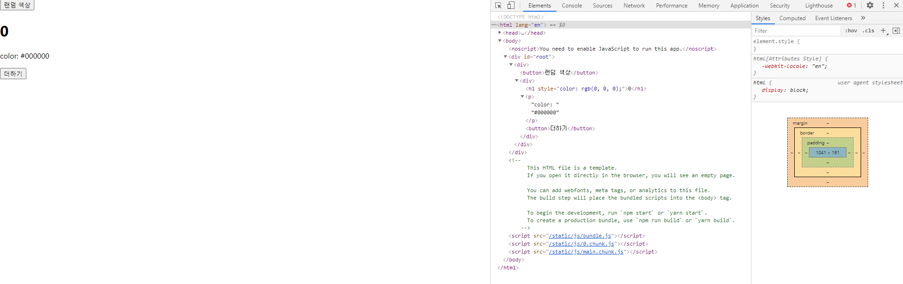

 초기 상태에서 실행되는 메서드를 보자.

* `constructor` 메서드가 실행되고, 
* `getDerivedStateFromProps`에 의해 state의 color 값은 `App.js`에서 설정한 color `state`의 초깃값인 `#000000`로 설정되며,
* `render` 메서드가 실행되어 보여졌고,
* `componentDidMount` 메서드가 실행되어 첫 렌더링이 완료되었음을 알 수 있다.

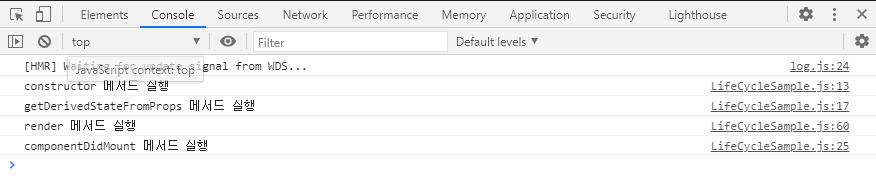

 

<br>


더하기 버튼을 클릭하면서 라이프사이클 메서드들이 어떻게 실행되는지 알아보자.

* 1번 클릭 시

  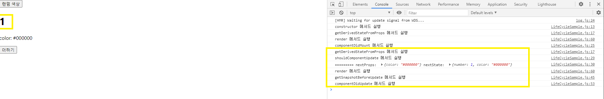

  - `getDerivedStateFromProps` : 랜덤색상 버튼을 클릭하지 않았으므로 색상은 이전과 동일하다.
  - `shouldComponentUpdate` : `number`가 1이므로 업데이트한다.
    - `nextState`의 color: 그대로.
    - `nextProps`의 color: 그대로.
  - `render` : 업데이트되므로 리렌더링한다.
  - `getSnapshotBeforeUpdate` : snapshot 기록할 게 없다.
  - `componentDidUpdate`: 업데이트가 완료되었다.

* 2번~3번 클릭 시

  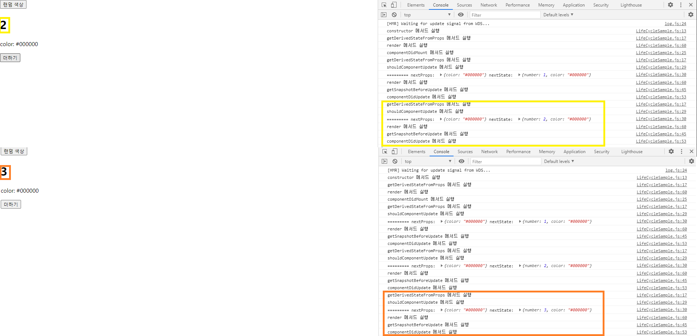

* 4번 클릭 시

  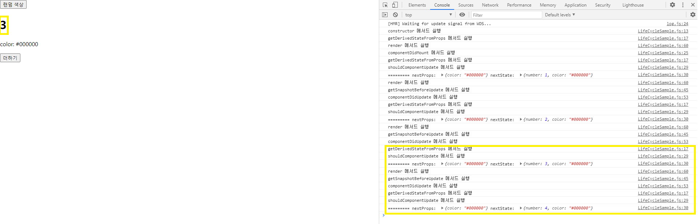

  * 위와 과정은 동일하다.
  * 그러나 `number`가 4이므로, 렌더링되는 숫자는 3에서 멈췄다.

* 5번 클릭 시: 이제부터는 숫자 더하기 버튼을 누를 때 렌더링된다.

  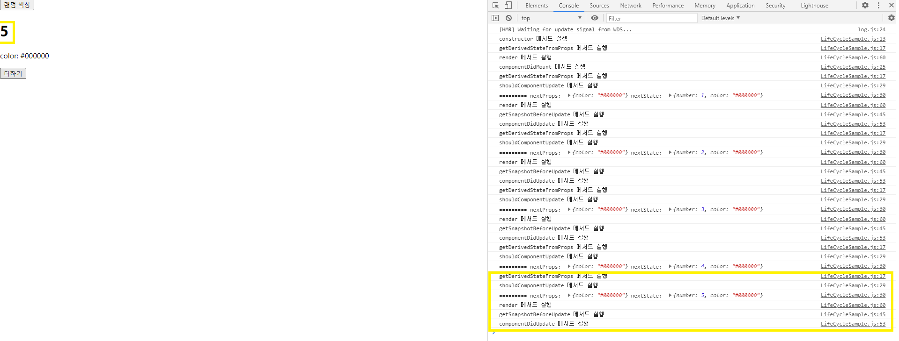

<br>

 이 상태에서 랜덤 색상 버튼을 눌러서 변화를 확인해 보자.

* 랜덤 색상 버튼 1번 클릭

  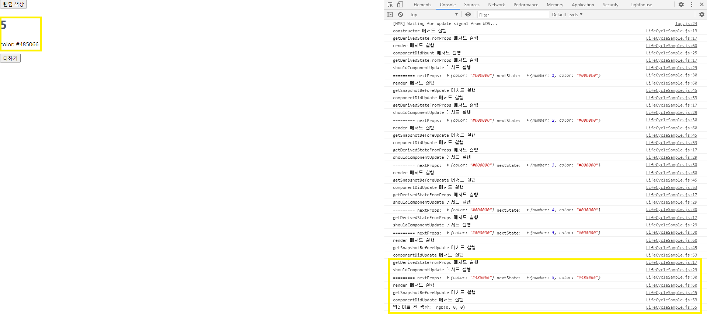

  * number는 그대로이고, 숫자의 색상만 바뀐다.
  * `getSnapshotBeforeUpdate` 메서드가 실행되어 snapshot이 기록되고,
  * `componentDidUpdate` 메서드가 실행될 때 해당 snapshot이 콘솔에 출력된다.

* 랜덤 색상 버튼 1번 더 클릭: 위와 동일한 과정이다.

  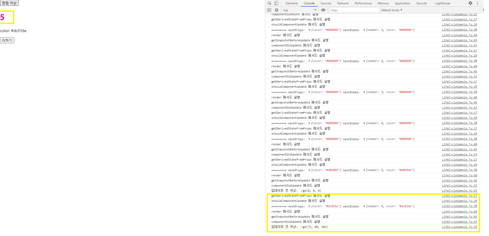


<br>

### 7.3.3. 에러 잡아내기


 직전에 만든 컴포넌트에서 의도적으로 에러를 발생시켜 본다. `render()` 함수에서는 **존재하지 않는 함수**를 사용하거나, **존재하지 않는 객체**의 값을 조회할 때 주로 에러가 발생한다.

<br>

* `src/LifeCycleSample.js`

 존재하지 않는 props인 `missing` 객체의 `value`를 조회해서 렌더링해 본다.

```jsx
import React, { Component } from 'react';

class LifeCycleSample extends Component {
    state = { // 초기 state
        number: 0, 
        color: null
    }

    myRef = null; // ref 설정할 부분

    constructor(props) {
        super(props);
        console.log('constructor 메서드 실행');
    }

    static getDerivedStateFromProps(nextProps, prevState) {
        console.log('getDerivedStateFromProps 메서드 실행');
        if(nextProps.color !== prevState.color) { 
            return { color: nextProps.color };
        }
        return null;
    }

    componentDidMount() {
        console.log('componentDidMount 메서드 실행');
    }

    shouldComponentUpdate(nextProps, nextState) {
        console.log('shouldComponentUpdate 메서드 실행');
        console.log('========= nextProps: ', nextProps, 'nextState: ', nextState); // 확인용
        return nextState.number % 10 !== 4 
    }

    componentWillUnmount() {
        console.log('componentWillUnmount 메서드 실행');
    }

    handleClick = () => {
        this.setState({
            number: this.state.number + 1
        });
    }

    getSnapshotBeforeUpdate(prevProps, prevState) {
        console.log('getSnapshotBeforeUpdate 메서드 실행');
        if(prevProps.color !== this.props.color) { 
            return this.myRef.style.color;
        }
        return null;
    }

    componentDidUpdate(prevProps, prevState, snapshot) {
        console.log('componentDidUpdate 메서드 실행');
        if(snapshot) {
            console.log('업데이트 전 색상: ', snapshot)
        }
    }

    render() {
        console.log('render 메서드 실행');
        const style = {
            color: this.props.color
        };

        return (
            <div>
                {this.props.missing.value} {/*존재하지 않는 객체*/}
                <h1 style={style} ref = {ref => this.myRef=ref}>
                    {this.state.number}
                </h1>
                <p>color: {this.state.color}</p>
                <button onClick={this.handleClick}>
                    더하기
                </button>
            </div>
        );
    }
}

export default LifeCycleSample;
```

<br>

 렌더링해본다.

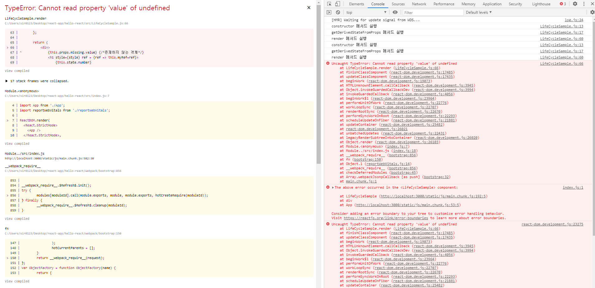

 에러가 발생한다.

<br>

 현재 에러가 발생한 것을 알 수 있는 이유는 개발 서버를 실행하고 있기 때문이다. 