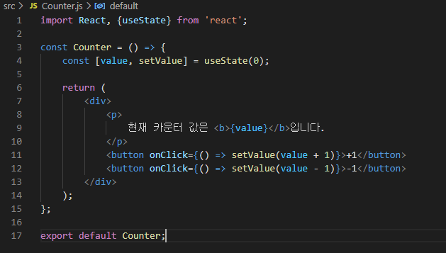
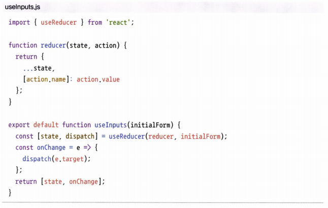

# 8. Hooks


 **함수형 컴포넌트**에서 다양한 작업을 할 수 있게 해 주는 기능이다. 리액트 v16.8 이후부터 새로 도입되었다. 

  이번 장의 실습을 위해 새로운 프로젝트 `hooks-tutorial`을 생성한다.


<br>

## 8.1. useState


 함수형 컴포넌트에서 가변적인 상태를 지니게 해 준다. 함수형 컴포넌트에서 상태를 관리해야 한다면, Hook을 사용한다.

<br>

 숫자 카운터를 구현해 보자.

* `src/Counter.js`
  * `import` 구문을 통해 상단에서 `useState` 함수를 불러 온다.
  * `useState` 함수
    * 파라미터: 기본값(현재는 `0`).
    * 반환값: 배열
      * 배열의 첫 번째 원소: 상태 값.
      * 배열의 두 번째 원소: 상태 설정 함수.
    * 파라미터를 넣어서 호출하면, 전달받은 파라미터로 기본값이 바뀌고, 컴포넌트가 렌더링된다.

```jsx
import React, {useState} from 'react';

const Counter = () => {
    const [value, setValue] = useState(0);
    
    return (
        <div>
            <p>
                현재 카운터 값은 <b>{value}입니다.</b>
            </p>
            <button onClick={() => setValue(value + 1)}>+1</button>
            <button onClick={() => setValue(value - 1)}>-1</button>
        </div>
    );
};

export default Counter;
```



<br>

 렌더링해보자.

* `src/App.js`

```jsx
import React, {useState} from 'react';

const Counter = () => {
    const [value, setValue] = useState(0);
    
    return (
        <div>
            <p>
                현재 카운터 값은 <b>{value}</b>입니다.
            </p>
            <button onClick={() => setValue(value + 1)}>+1</button>
            <button onClick={() => setValue(value - 1)}>-1</button>
        </div>
    );
};

export default Counter;
```

| 초기 상태                                                    | +1                                                           | -1                                                           |
| ------------------------------------------------------------ | ------------------------------------------------------------ | ------------------------------------------------------------ |
|  |  |  |


<br>

### 8.1.1. useState 여러 번 사용


 컴포넌트에서 관리해야 할 상태가 여러 개라면, `useState`를 여러 번 사용한다.

<br>

* `src/Info.js`
  * name, nickname을 관리하는 두 개의 `useState` 함수
  * name, nickname이 바뀌었을 때 이벤트 설정하는 함수

```jsx
import React, {useState} from 'react';

const Info = () => {
    const [name, setName] = useState('');
    const [nickname, setNickname] = useState('');
    
    const onChangeName = e => {
        setName(e.target.value);
    };

    const onChangeNickname = e => {
        setNickname(e.target.value);
    };

    return (
        <div>
            <div>
                <input value={name} onChange={onChangeName} /> {/*onChange 이벤트 설정*/}
                <input value={nickname} onChange={onChangeNickname}/> {/*onChange 이벤트 설정*/}
            </div>
            <div>
                <div>
                    <b>이름:</b> {name}
                </div>
                <div>
                    <b>닉네임:</b> {nickname}
                </div>
            </div>
        </div>
    );
};

export default Info;
```


<br>

 렌더링해보자.

* `src/App.js`

```jsx
import React from 'react';
import Info from './Info';

const App = () => {
  return <Info />;
};

export default App;
```

| 초기 상태                                                    | name                                                         | name, nickname                                               |
| ------------------------------------------------------------ | ------------------------------------------------------------ | ------------------------------------------------------------ |
| <br>name, nickname 모두 value가 공백으로 설정되어 있다. | <br>name의 value가 바뀐다. | <br>name, nickname의 value가 모두 바뀐다. |

<br>

## 8.2. useEffect

 리액트 컴포넌트가 렌더링될 때마다 특정 작업을 수행하도록 설정한다. 클래스형 컴포넌트에서 `componentDidMount`(마운트 후 호출)와 `componentDidUpdate`(업데이트 후 호출)를 합친 형태로 보아도 무방하다.

<br>

 `Info` 컴포넌트에 useEffect를 적용해 보자. 마운트 되었을 때, 리렌더링 되었을 때 모두 실행된다.

* `src/Info.js`

```jsx
import React, {useState, useEffect } from 'react';

const Info = () => {
    const [name, setName] = useState('');
    const [nickname, setNickname] = useState('');
    useEffect(() => {
        console.log('렌더링이 완료되었습니다.'); // 렌더링 시 콘솔창에 문구 출력.
        console.log({
            name,
            nickname
        });
    });
    
    const onChangeName = e => {
        setName(e.target.value);
    };

    const onChangeNickname = e => {
        setNickname(e.target.value);
    };

    return (
        <div>
            <div>
                <input value={name} onChange={onChangeName} /> {/*onChange 이벤트 설정*/}
                <input value={nickname} onChange={onChangeNickname}/> {/*onChange 이벤트 설정*/}
            </div>
            <div>
                <div>
                    <b>이름:</b> {name}
                </div>
                <div>
                    <b>닉네임:</b> {nickname}
                </div>
            </div>
        </div>
    );
};

export default Info;
```


<br>

 렌더링 후 이름의 input 값을 변경해 보자.

| 초기 상태                                                    | input 변경                                                   |
| ------------------------------------------------------------ | ------------------------------------------------------------ |
|  |  |

<br>

### 8.2.1. 마운트될 때만 실행하고 싶을 때

 맨 처음 렌더링될 때만 실행되고, 업데이트 시에는 실행하지 않으려면 두 번째 파라미터로 **비어 있는 배열**(`[]`)을 넣어 준다.

<br>

* `src/Info.js`

```jsx
import React, {useState, useEffect } from 'react';

const Info = () => {
    const [name, setName] = useState('');
    const [nickname, setNickname] = useState('');
    useEffect(() => {
        console.log('렌더링될 때만 실행됩니다.');
    }, []); // 두 번째 파라미터로 빈 배열 전달
    
    const onChangeName = e => {
        setName(e.target.value);
    };

    const onChangeNickname = e => {
        setNickname(e.target.value);
    };

    return (
        <div>
            <div>
                <input value={name} onChange={onChangeName} /> {/*onChange 이벤트 설정*/}
                <input value={nickname} onChange={onChangeNickname}/> {/*onChange 이벤트 설정*/}
            </div>
            <div>
                <div>
                    <b>이름:</b> {name}
                </div>
                <div>
                    <b>닉네임:</b> {nickname}
                </div>
            </div>
        </div>
    );
};

export default Info;
```


<br>

실행해 보자. input 값의 value가 변해도 실행되지 않는다.


<br>

### 8.2.2. 특정 값이 없데이트될 때만 실행하고 싶을 때

 특정 값이 변경되고 싶을 때만 `useEffect` 함수를 호출하고 싶을 수 있다.  `useEffect`의 **두 번째 파라미터로 전달되는 배열 안**에 **검사하고 싶은 값**을 넣어 주면 된다. 검사하고 싶은 값으로 들어갈 수 있는 값은, `useState`를 통해 관리하고 있는 상태도 되고, `props`로 전달받은 값이어도 된다.

>  *참고* : 클래스형 컴포넌트에서라면
>
>  현재 props의 value와 이전 props의 value가 같지 않을 때 어떠한 작업을 수행하도록 하면 된다.
>
> 
>
>  컴포넌트의 props 안에 들어 있는 value 값이 바뀔 때에만 특정 작업을 수행한다.

<br>

* `src/Info.js`

```jsx
import React, {useState, useEffect } from 'react';

const Info = () => {
    const [name, setName] = useState('');
    const [nickname, setNickname] = useState('');
    useEffect(() => {
        console.log(name);
    }, [name]); // name이 바뀔 때에만 렌더링.

    const onChangeName = e => {
        setName(e.target.value);
    };

    const onChangeNickname = e => {
        setNickname(e.target.value);
    };

    return (
        <div>
            <div>
                <input value={name} onChange={onChangeName} /> {/*onChange 이벤트 설정*/}
                <input value={nickname} onChange={onChangeNickname}/> {/*onChange 이벤트 설정*/}
            </div>
            <div>
                <div>
                    <b>이름:</b> {name}
                </div>
                <div>
                    <b>닉네임:</b> {nickname}
                </div>
            </div>
        </div>
    );
};

export default Info;
```


<br>

 렌더링해보자. name의 value가 바뀔 때에만 값이 변한다.

| 초기 상태                                                    | name                                                         | nickname                                                     |
| ------------------------------------------------------------ | ------------------------------------------------------------ | ------------------------------------------------------------ |
| <br>name, nickname 모두 value가 공백으로 설정되어 있다. | <br>name의 value가 바뀐다. | <br>콘솔 창에 아무 것도 찍히지 않는다. |

<br>

### 8.2.3. 뒷정리하기

 앞에서 살펴 보았듯, 기본적으로 렌더링되고 난 직후마다 `useEffect` 함수가 실행된다. 그리고 두 번째 파라미터 배열에 무엇을 넣는지에 따라 실행되는 조건이 달라진다.

 컴포넌트가 언마운트되기 전이나, 업데이트되기 직전에 어떠한 작업을 수행하고 싶다면, `useEffect` 함수가 뒷정리(*cleanup*) 함수를 반환하도록 한다.

<br>

* `src/Info.js`

```jsx
import React, {useState, useEffect } from 'react';

const Info = () => {
    const [name, setName] = useState('');
    const [nickname, setNickname] = useState('');
    useEffect(() => {
        console.log('useEffect함수 호출');
        console.log(name);
        return () => { 
            console.log('cleanup함수 반환');
            console.log(name);
        };
    });

    const onChangeName = e => {
        setName(e.target.value);
    };

    const onChangeNickname = e => {
        setNickname(e.target.value);
    };

    return (
        <div>
            <div>
                <input value={name} onChange={onChangeName} /> {/*onChange 이벤트 설정*/}
                <input value={nickname} onChange={onChangeNickname}/> {/*onChange 이벤트 설정*/}
            </div>
            <div>
                <div>
                    <b>이름:</b> {name}
                </div>
                <div>
                    <b>닉네임:</b> {nickname}
                </div>
            </div>
        </div>
    );
};

export default Info;
```


<br>

 `App` 컴포넌트에서 `Info` 컴포넌트의 가시성 여부를 바꿀 수 있도록 해 보자. `App` 컴포넌트에서도 `useState`를 이용하여 상태를 관리하면 된다.

* `src/App.js`

```jsx
import React, {useState} from 'react';
import Info from './Info';

const App = () => {
  const [visible, setVisible] = useState(false); // 초기 상태: false(=보이지 않음.)
  return (
    <div>
      <button
        onClick={() => {
          setVisible(!visible); // 버튼 누르면 visible 상태를 바꿈.
        }}
      >
        {visible ? '숨기기' : '보이기'} {/*visible이면 버튼 '숨기기', visible하지 않으면 버튼 '보이기'*/}
      </button>
      <hr /> {/* 무슨 태그? */}
      {visible && <Info />} {/* visible일 때 컴포넌트가 보임 */ }
    </div>
  )
};

export default App;
```


<br>

 렌더링해보자.

* 렌더링될 때마다 `cleanup` 함수가 호출된다.
* `cleanup` 함수가 호출될 때는 업데이트되기 **직전**의 값을 보여준다.

| 초기 렌더링 직후                                             | 보이기 버튼(=마운트)                                         | name 입력                                                    | nickname 입력                                                | 숨기기 버튼(=언마운트)                                       |
| ------------------------------------------------------------ | ------------------------------------------------------------ | ------------------------------------------------------------ | ------------------------------------------------------------ | ------------------------------------------------------------ |
| <br>1. 초기 가시성 여부가 false이므로 버튼에 '보이기'가 표시되고<br>2. Info 컴포넌트는 보이지 않는다. | <br>1. Info 컴포넌트가 마운트되어 렌더링된다.<br>2. 콘솔에 useEffect 함수가 호출되었음을 나타내는 문구가 뜬다.<br>3. visible 상태는 true이므로 버튼에 '숨기기'가 표시된다. | <br>1. name이 업데이트되므로 useEffect가 호출되고 cleanup이 모두 반환된다. | <br>1. nickname이 업데이트될 때에도 useEffect와 cleanup이 모두 호출된다.<br>2. 다만, 콘솔창에는 name만 print된다. | <br>1. 언마운트되어 Info 컴포넌트가 사라지면, clenaup 함수가 호출된다. |

<br>

### 8.2.4. 언마운트될 때에만 뒷정리하기


 언마운트시에만 뒷정리 함수를 호출하고 싶으면, useEffect함수의 두 번째 파라미터에 비어 있는 배열을 넣는다.

* `src/Info.js`

  *질문 1* : 왜 비어 있는 배열인데 두 번재 파라미터로 `[name]`이 넘어갔나?

  *질문 2* : 왜 책이랑 똑같이 쳤는데 cleanup이 업데이트시에도 호출되나?

```jsx
import React, {useState, useEffect } from 'react';

const Info = () => {
    const [name, setName] = useState('');
    const [nickname, setNickname] = useState('');
    useEffect(() => {
        console.log('useEffect함수 호출'); // 렌더링 시 useEffect 함수 호출
        console.log(name);
        return () => { 
            console.log('cleanup함수 반환'); // 언마운트 혹은 업데이트 직전에 특정 작업 수행
            console.log(name);
        };
    }, [name]); // 언마운트시에만  뒷정리함수 호출.

    const onChangeName = e => {
        setName(e.target.value);
    };

    const onChangeNickname = e => {
        setNickname(e.target.value);
    };

    return (
        <div>
            <div>
                <input value={name} onChange={onChangeName} /> {/*onChange 이벤트 설정*/}
                <input value={nickname} onChange={onChangeNickname}/> {/*onChange 이벤트 설정*/}
            </div>
            <div>
                <div>
                    <b>이름:</b> {name}
                </div>
                <div>
                    <b>닉네임:</b> {nickname}
                </div>
            </div>
        </div>
    );
};

export default Info;
```

<br>

| 초기 렌더링 직후                                             | 보이기 버튼(=마운트)                                         | 숨기기 버튼(=언마운트)                                       | name 입력???????                                             |
| ------------------------------------------------------------ | ------------------------------------------------------------ | ------------------------------------------------------------ | ------------------------------------------------------------ |
|  |  | <br>1. cleanup 호출. | <br>엥? |

<br>

## 8.3. useReducer


 다양한 컴포넌트 상황에 따라 다양한 상태를 다른 값으로 업데이트할 때 사용한다. **리듀서**(reducer)라는 개념 자체는 리덕스를 배울 때 17장에서 더 자세히 알아 본다.


### 리듀서(Reducer)

 현재 상태, 업데이트를 위해 필요한 정보를 담은 액션(action) 값을 전달받아 새로운 상태를 반환하는 함수이다. 새로운 상태를 만들 때는 반드시 불변성을 지켜야 한다.

* 질문: 7장에서 새로 객체 만들어서 push 대신 concat, filter 쓰는 원리?
* 질문: 정확하게 불변성이 뭔지?

 <br>


 리덕스에서 사용할 액션 객체에는 어떤 액션인지 알려주는 `type` 필드가 꼭 있어야 하지만, `useReducer`에서 사용하는액션 객체는 반드시 `type`을 지니고 있지 않아도 된다. 또한, `type`이 객체가 아니라 문자열이나 숫자여도 무방하다.

<br>

### 8.3.1. 카운터 구현

 `useReducer`를 사용해 `Counter` 컴포넌트를 다시 구현한다.

<br>

* `src/Counter.js`
  * `useReducer`
    * 파라미터
      * 리듀서 함수.
      * 해당 리듀서의 기본 값.
    * 반환값
      * state: 현재 가리키고 있는 상태.
      * dispatch: 액션을 발생시키는 함수. `dispatch(action)`과 같은 형태로, 파라미터로 액션을 받아 리듀서 함수를 호출.
  * 컴포넌트 업데이트 로직을 컴포넌트 바깥으로 뺄 수 있다.

```jsx
import React, {useReducer} from 'react';

function reducer(state, action) {
    // action.type에 따라 다른 작업 수행
    switch (action.type) {
        case 'INCREMENT':
            return {value: state.value + 1}
        case 'DECREMENT':
            return {value: state.value - 1}
        default:
            // 아무 action에도 해당하지 않을 때 기존 상태 반환
            return state;
    }
}

const Counter = () => {
    const [state, dispatch] = useReducer(reducer, {value:0}); 
    // 파라미터: 리듀서 함수, 해당 리듀서의 기본값.
    // 반환: state, dispatch. dispatch: 파라미터로 액션을 받아 리듀서 함수 호출.

    return (
        <div>
            <p>
                현재 카운터 값은 <b>{state.value}</b>입니다.
            </p>
            <button onClick={() => dispatch({type: 'INCREMENT'})}>+1</button> {/*INCREMENT 액션 발생*/}
            <button onClick={() => dispatch({type: 'DECREMENT'})}>-1</button> {/*DECREMENT 액션 발생*/}
        </div>
    );
};

export default Counter;
```


<br>

 렌더링해보자. 

* `src/App.js`

```jsx
import React from 'react';
import Counter from './Counter';

const App = () => {
  return <Counter />;
};

export default App;
```

결과는 위(`8.1.`)에서와 같으므로, 첨부하지 않는다.

<br>

### 8.3.2. input 상태 관리

 기존에 input이 여러 개이고, 해당 상태를 관리해야 할 때 `useState`를 여러 번 사용했던 것을 기억할 것이다. 이 작업을 클래스형 컴포넌트에서는 `input` 태그에 `name` 값을 할당하고, `e.target.name`을 참조해 `setState`를 해 주었을 것이다.


<br>

  `useReducer`를 사용하면 이와 유사한 방식으로 작업을 처리할 수 있다.

* `src/Info.js`

```jsx
import React, {useReducer} from 'react';

function reducer(state, action) {
    return {
        ...state, // state 복사
        [action.name]: action.value //action의 name을 key로 사용해서 원하는 action으로 바꾸기
    };
}

const Info = () => {
    const [state, dispatch] = useReducer(reducer, {
        name: '',
        nickname: ''
    }); // 리듀서 기본 값: name, nickname 공백.
    const {name, nickname} = state; // name = state.name, nickname = state.nickname
    const onChange = e => {
        dispatch(e.target);
    }

    return (
        <div>
            <div>
                <input name='name' value={name} onChange={onChange} />
                <input name='nickname' value={nickname} onChange={onChange} />
            </div>
            <div>
                <b>이름:</b> {name}
            </div>
            <div>
                <b>닉네임:</b> {nickname}
            </div>
        </div>
    );
};

export default Info;
```

> *참고* : event 객체 뜯어 보기
>
> 
>
> ...
>
> 

<br>


 렌더링해보자.

| 초기 상태                                                    | name, nickname                                               |
| ------------------------------------------------------------ | ------------------------------------------------------------ |
|  |  |

<br>

## 8.4. useMemo


 함수형 컴포넌트 내부에서 발생하는 연산을 최적화할 수 있다. 


<br>

 리스트에 숫자를 추가하면 추가된 숫자들의 평균을 보여 주는 함수형 컴포넌트를 작성하자.

* `src/Average.js`

```jsx
import React, {useState} from 'react';

const getAverage = numbers => {
    console.log('평균값을 계산합니다.');
    if (numbers.length === 0) return 0; // 평균값을 계산할 숫자들이 없는 경우

    const sum = numbers.reduce((a, b) => a+b) // reduce: 배열 내장함수. 누적값, 현재값.
    return sum / numbers.length; // 평균 계산
};

const Average = () => {
    const [list, setList] = useState([]); // 초깃값 빈 배열.
    const [number, setNumber] = useState(''); // 초깃값 공백.

    const onChange = e => { // number 바꾸고
        setNumber(e.target.value);
    };

    const onInsert = e => { // 바꾼 number를 list에 insert하고
        const nextList = list.concat(parseInt(number)); // concat: 배열 내장함수. 불변성 유지하며 추가.
        setList(nextList);
        setNumber(''); 
    };

    return (
        <div>
            <input value={number} onChange={onChange} />
            <button onClick={onInsert}>등록</button>
            <ul>
                {list.map((value, index) => (
                    <li key={index}>{value}</li>
                ))}
            </ul>
            <div>
                <b>평균값:</b> {getAverage(list)}
            </div>
        </div>
    );
};

export default Average;
```


<br>

 렌더링해보자.

* input에 숫자 등록: `getAverage` 함수가 호출된다. 숫자를 넣을 때마다 옆에 length가 늘어난다.


* 등록 버튼: 평균 계산. `getAverage` 함수 호출.


<br>

 이렇게 작업할 때의 문제는, input 값이 바뀔 때에도 `getAverage` 함수가 호출되면서 렌더링할 때마다 다시 새롭게 평균값을 계산한다. 낭비이다.

<br>

 `useMemo` Hook을 사용하여 이러한 작업을 최적화하고 낭비를 없앨 수 있다. **렌더링 시, 특정 값이 바뀌었을 때에만 연산을 실행하고, 원하는 값이 바뀌지 않았다면 이전의 연산 결과를 다시 사용한다**. (메모이제이션 하는 것인듯?)

```jsx
import React, {useState, useMemo} from 'react';

const getAverage = numbers => {
    console.log('평균값을 계산합니다.');
    if (numbers.length === 0) return 0; // 평균값을 계산할 숫자들이 없는 경우

    const sum = numbers.reduce((a, b) => a+b) // reduce: 배열 내장함수. 누적값, 현재값.
    return sum / numbers.length; // 평균 계산
};

const Average = () => {
    const [list, setList] = useState([]); // 초깃값 빈 배열.
    const [number, setNumber] = useState(''); // 초깃값 공백.

    const onChange = e => { // number 바꾸고
        setNumber(e.target.value);
    };

    const onInsert = e => { // 바꾼 number를 list에 insert하고
        const nextList = list.concat(parseInt(number)); // parseInt: 문자열을 number로 변환, concat: 배열 내장함수. 불변성 유지하며 추가.
        setList(nextList);
        setNumber(''); 
    };

    const avg = useMemo(() => getAverage(list), [list]); // 첫 번째 인자: 적용할 함수, 두 번째 인수: 원래 값이 들어 있는 배열.

    return (
        <div>
            <input value={number} onChange={onChange} />
            <button onClick={onInsert}>등록</button>
            <ul>
                {list.map((value, index) => (
                    <li key={index}>{value}</li>
                ))}
            </ul>
            <div>
                <b>평균값:</b> {avg} {/*메모로 사용한 avg 값을 렌더링*/}
            </div>
        </div>
    );
};

export default Average;
```


<br>

 렌더링해보면, 이제 `getAverage` 함수가 계속해서 호출되지 않는 것을 볼 수 있다.

<br>

## 8.5. useCallback

 `useMemo` 함수와 비슷하게, 렌더링 성능을 최적화해야 할 때 사용한다. 이벤트 핸들러 함수를 필요할 때에만 생성할 수 있다.

 다시 위의 `Average` 컴포넌트를 보자. `onChange`와 `onInsert` 함수를 선언했다. 이 경우, **컴포넌트가 리렌더링될 때마다 함수들이 새로 생성**된다. 컴포넌트 렌더링이 자주 발생하거나, 렌더링할 컴포넌트 수가 많을 경우, 이 부분을 최적화하는 것이 필요하다.

<br>

 `useCallback` 함수를 사용해 최적화해보자.

* `src/Average.js`
  * `useCallback`
    * 파라미터: 생성하고 싶은 함수, 배열.
      * 배열: 어떤 값이 바뀌었을 때 함수를 새로 생성할 지 명시.
        * 빈 배열: 컴포넌트 렌더링될 때에 처음에 단 한 번만 함수 생성.
        * 비어 있지 않은 배열: 배열 내 원소의 인풋 내용이 바뀌거나 새로운 항목이 추가될 때마다 함수 생성.
        * 만약 함수 내부에서 기존 상태 값에 의존하고 싶은 경우 배열을 비어 있지 않은 상태로 넘긴다. 두 번째 파라미터 안에 바로 포함시킨다. (*예: `numbers`, `list`*)

```jsx
import React, {useState, useMemo, useCallback} from 'react';

const getAverage = numbers => {
    console.log('평균값을 계산합니다.');
    if (numbers.length === 0) return 0; 

    const sum = numbers.reduce((a, b) => a+b) 
    return sum / numbers.length; 
};

const Average = () => {
    const [list, setList] = useState([]); 
    const [number, setNumber] = useState('');

    // 파라미터: 생성하고 싶은 함수, 배열.
    const onChange = useCallback(e => { 
        setNumber(e.target.value);
    }, []); // 파라미터가 빈 배열일 때: 컴포넌트 첫 렌더링 시에만 함수 생성.

    const onInsert = useCallback(() => {
        const nextList = list.concat(parseInt(number));
        setList(nextList);
        setNumber('');
    }, [number, list]); // 파라미터가 비어있지 않은 배열일 때: number 혹은 list가 바뀔 때(바뀌거나 새 항목 추가) 함수 생성

    const avg = useMemo(() => getAverage(list), [list]);

    return (
        <div>
            <input value={number} onChange={onChange} />
            <button onClick={onInsert}>등록</button>
            <ul>
                {list.map((value, index) => (
                    <li key={index}>{value}</li>
                ))}
            </ul>
            <div>
                <b>평균값:</b> {avg} {/*메모로 사용한 avg 값을 렌더링*/}
            </div>
        </div>
    );
};

export default Average;
```


<br>

> *참고* : `useCallback`, `useMemo`
>
>  `useMemo`로 함수를 반환하고자 할 경우, `useCallback`을 사용하는 게 더 편하다. 결국 둘 다 재사용하고자 하는 경우 최적화를 위해 사용한다. 일반적으로는 다음과 같이 구분한다.
>
> * `useMemo`: 숫자, 문자열, 객체 등 일반 값을 재사용할 때.
> * `useCallback`: 함수를 재사용할 때.
>
>  아래 두 코드는 같은 코드이다.
>
> ```jsx
> // 함수 재사용
> useCallback(() => {
>     console.log('hello world!');
> }, [])
> 
> // 함수를 반환하여 재 사용.
> useMemo() => {
>     const fn = () => {
>         console.log('hello world!');
>     };
>     return fn;
> }, []);
> ```


<br>

## 8.6. useRef

 함수형 컴포넌트에서 `ref`를 쉽게 사용할 수 있도록 한다.`Average` 컴포넌트에서 `등록` 버튼을 누를 때 포커스가 input 쪽으로 넘어가도록, (지난 포커스 예시를 떠올리면서) 코드를 작성해 보자.


### review: 기존 클래스형 컴포넌트


### ref 설정하기


* `src/Average.js`

 `useRef`를 사용하여 `ref` 설정 시, 객체 안의 `current` 값이 그 실제 엘리먼트(여기서는 input)를 지칭한다.

*질문* : `useRef(null)`에서 null은 왜?

```jsx
import React, {useState, useMemo, useCallback, useRef} from 'react';

const getAverage = numbers => {
    console.log('평균값을 계산합니다.');
    if (numbers.length === 0) return 0; 

    const sum = numbers.reduce((a, b) => a+b) 
    return sum / numbers.length; 
};

const Average = () => {
    const [list, setList] = useState([]); 
    const [number, setNumber] = useState('');
    const inputEl = useRef(null);
    
    const onChange = useCallback(e => { 
        setNumber(e.target.value);
    }, []); // 처음 렌더링될 때에만 함수 생성.

    const onInsert = useCallback(() => {
        const nextList = list.concat(parseInt(number));
        setList(nextList);
        setNumber('');
        inputEl.current.focus(); // 삽입 시 포커스가 넘어가게 설정.
    }, [number, list]);  // number 혹은 list가 바뀌었을 때에만 함수 생성.

    const avg = useMemo(() => getAverage(list), [list]);

    return (
        <div>
            <input value={number} onChange={onChange} ref={inputEl} /> {/*input 요소에 ref 달기*/}
            <button onClick={onInsert}>등록</button>
            <ul>
                {list.map((value, index) => (
                    <li key={index}>{value}</li>
                ))}
            </ul>
            <div>
                <b>평균값:</b> {avg}
            </div>
        </div>
    );
};

export default Average;
```


<br>

 렌더링 후 확인해 보자.


| 초기                                                         | 등록 후                                                      |
| ------------------------------------------------------------ | ------------------------------------------------------------ |
| <br>포커스가 안 보인다... |  |

<br>

### 8.6.1. 로컬 변수 사용하기

 지칭할 때 말고, 컴포넌트 내 로컬 변수를 사용할 때에도 `useRef`를 사용한다. 여기서 로컬 변수란, 렌더링과 상관 없이 바뀔 수 있는 값을 의미한다.

<br>

* `src/LocalVariableRef.js`

  *질문: 아래와 같이 이해한 게 맞나?*

  * `id`가 1로 설정되었다.
  * `setId`에서 `id`를 n으로 바꾼다.
  * `printId`를 해 보면 `id`가 n으로 바뀌어 있을까?

```jsx
import React, {useRef} from 'react';

const LocalVariableRef = () => {
    const id = useRef(1);
    const setId = (n) => {
        id.current = n;
    }
    const printId = () => {
        console.log(id.current);
    }

    return (
        <div>
            Local Variable Sample
        </div>
    );
};

export default LocalVariableRef;
```

<br>

렌더링한 결과는 다음과 같다.

*질문* : 저 warning은 그냥 저 로컬 variable로 할당한 애가 안 쓰였다고 알려주는 건가?


 `ref` 안의 값이 바뀌더라도 위와 같이 렌더링되지 않는다. 렌더링과 관련되지 않은 값을 관리할 때만 이런 식으로 코드를 작성한다. 

*질문* : 실무에서 그런 경우가 있나?

<br>

## 8.7. 커스텀 Hooks 만들기


 여러 컴포넌트에서 비슷한 기능을 공유할 경우, 이를 Hook으로 구성해 로직을 재사용할 수 있다.

<br>

 `Info` 컴포넌트에서 여러 개의 input을 관리하기 위해 `useReducer`로 작성했던 코드를 `useInputs`라는 커스텀 Hook으로 분리해 보자.

<br>

*질문* : export 처음 보는 유형인데 코드 설명...

* `src/useInputs.js`
  * `reducer` 함수를 만들고,
  * export 한다.

```jsx
import React, {useReducer} from 'react';

function reducer(state, action) {
    return {
        ...state,
        [action.name]: action.value
    };
}

export default function useInputs(initialForm) {
    const [state, dispatch] = useReducer(reducer, initialForm);
    const onChange = e => {
        dispatch(e.target);
    };
    return [state, onChange];
}
```


*질문* : 교재에는 `import React` 없었는데 괜찮은가? 구분하는 기준은?



<br>

 이제 이 Hook을 `Info` 컴포넌트에서 사용해 보자.

* `src/App.js`

```jsx
import React from 'react';
import Info from './Info';

const App = () => {
  return <Info />;
};

export default App;
```


<br>

 렌더링해 보자.


<br>

## 8.8 다른 Hooks

 다른 개발자가 만든 다양한 커스텀 Hooks 라이브러리를 사용할 수 있다.

<br>

## 8.9. 정리

 클래스형 컴포넌트 없이 state 관리, memo 등 대부분의 기능을 구현할 수 있도록 해 주는 게 Hooks이다. `useState`, `useReducer` 등의 기능을 통해 쉽게 구현할 수 있다고 하더라도, 기존의 클래스형 컴포넌트와 `setState` 방식을 사용하는 것이 잘못된 것은 아니다. 다만, 매뉴얼에서는 앞으로 **함수형 컴포넌트와 Hooks를 사용할 것을 권장하고 있기 때문에**, 함수형 컴포넌트 및 Hooks의 사용을 최우선으로 두고, 꼭 필요할 때에만 클래스형 컴포넌트를 구현하도록 하자.

