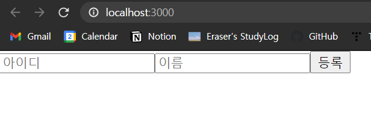

# 12. immer를 사용하여 더 쉽게 불변성 유지하기


 11장까지는 스프레드 연산자(`…`)와 배열의 내장 함수(`filter`, `concat` 등)를 사용해 불변성을 유지하며 객체의 상태를 업데이트하는 방법을 배웠다. 그러나 객체의 구조가 깊어질수록 불변성을 유지하면서 업데이트하기가 어려워진다.

<br>

```javascript
const object = {
    somewhere: {
        deep: {
            inside: 3,
            array: [1, 2, 3, 4]
        },
        bar: 2
    }, 
    foo: 1
};
```

 위와 같은 중첩된 객체를 생성해 보자.


<br>

 스프레드 연산자를 사용해 `object.somewhere.deep.inside`의 값을 바꿔 보자. 다음과 같이 코드를 작성하면 된다. 

```javascript
let nextObject = {
    ...object, // object 복사
    somewhere: { 
        ...object.somewhere, // object.somewhere 복사
        deep: {
            ...object.somewhere.deep, // object.somewhere.deep 복사
            inside: 4 // object의 somewhere.deep.inside의 값을 4로 바꾼다.
        }
    }
};
console.log(nextObject.somewhere.deep.inside); // 4
```

<br>

 `object`의 `somewhere.deep.array`에 `5`를 추가하기 위해서는 다음과 같이 스프레드 연산자와 `concat` 함수를 사용하면 된다.

```javascript
let nextNextObject = {
    ...object,
    somewhere: {
        ...object.somewhere,
        deep: {
            ...object.somewhere.deep,
            array: object.somewhere.deep.array.concat(5)
        }
    }
};
console.log(object.somewhere.deep.array); // [1, 2, 3, 4]
console.log(nextNextObject.somewhere.deep.array); // [1, 2, 3, 4, 5]
```

<br>

 이와 같이 중첩된 객체 속에서 값을 업데이트하기 위해서는 **스프레드 연산자**를 사용해야 한다. **기존에 가지고 있던 다른 값을 유지하면서** 원하는 값을 새로 지정하기 위함이다. 

 리액트 프로젝트에서도 객체의 값을 변경하기 위해서는 이렇게 복잡하게 스프레드 연산자를 이용해야 하는데, 복잡한 상태를 다루고 업데이트하기 위해 계속해서 스프레드 연산자를 이용하는 것은, 매우 번거로울 뿐만 아니라 가독성이 좋지 않은 작업이다.

 이러한 상황에 **immer**라는 라이브러리를 사용한다. 복잡한 구조를 가진 객체에 대해서도 쉽고 짧은 코드만으로 불변성을 유지하면서 상태를 업데이트할 수 있다.

<br> 다음과 같은 흐름으로 실습을 진행하며 immer 사용법을 알아보도록 하자.


<br>

## 12.1. immer를 설치하고 사용법 알아보기


 다음과 같이 리액트 프로젝트를 생성하고, `yarn`을 통해 immer를 설치한다.

```bash
sir95@DESKTOP-HRU70B8 MINGW64 ~/Desktop/react-app
$ yarn create react-app immer-tutorial

sir95@DESKTOP-HRU70B8 MINGW64 ~/Desktop/react-app/immer-tutorial (master)
$ yarn add immer
```

<br>

### 12.1.2. immer 없이 불변성 유지

 immer 라이브러리를 사용하지 않고 불변성을 유지하면서 값을 업데이트하는 컴포넌트를 작성해 보자.


<br>

> *질문*
>
>  왜 두 번째에서 `onSubmit`에서는 `[data, form.name, form.username]`을 주나? `[form]` 주면 안 되는 까닭? -> data로 이미 넘겼기 때문인가?

* `App.js`: 아이디 이름 입력 시 하단 리스트에 추가되고, 리스트 항목을 클릭하면 삭제된다.

  * `onChange` 함수
    * input 에서 아이디, 이름이 입력되는 변화가 일어나면, `form` 세터 함수 호출하여 상태 업데이트.
    * `useCallback` 함수에서 `[form]`을 두 번째 인자로 주었기 때문에, 해당 함수는 `form`의 상태에 의존한다.
  * `onSubmit` 함수
    * `form`이 제출될 때, 디폴트 동작을 방지하고, `info` 객체를 받아 `array`에 불변성을 유지하며 새 항목을 등록한다.
    * `form` 세터 함수를 호출해서 상태를 다시 초기화하고, `nextId` 값을 1 더한다.
    * `useCallback` 함수의 두 번째 인자로 `[data, form.name, form.username]`을 주었기 때문에, 해당 항목들의 상태에 의존한다.

  * `onRemove` 
    * `id`를 인자로 받아 `data`에서 인자로 들어온 `id`와 다른 값만을 남기도록 `data` 상태 업데이트.
    * `[data]`의 상태가 바뀔 때에만 이 함수가 호출된다.
  * 리턴하는 컴포넌트
    * `form` 제출될 때 이벤트: `onSubmit`
    * `form` 안의 양식
      * `username`: 아이디
      * `name`: 이름
      * `button`: `등록` 버튼 클릭 시 `submit` 이벤트 발생.
    * `data` 
      * `data`안  `array` 값을 `map` 함수를 이용해 `<li>` 태그에 반복하여 컴포넌트를 렌더링한다.
      * `key`로 `id`값을 주고, `click` 이벤트 발생 시 `info.id`에 해당하는 리스트를 없앤다.

```jsx
import React, { useRef, useCallback, useState } from "react";

const App = () => {
    const nextId = useRef(1);
    const [form, setForm] = useState({ name: "", username: "" });
    const [data, setData] = useState({
        // data 초기값: array, uselessValue
        array: [],
        uselessValue: null,
    });

    // input 값 수정을 위한 함수
    const onChange = useCallback(
        // 계속 사용하는 함수
        (e) => {
            const { name, value } = e.target;
            setForm({
                ...form, // 이전 상태
                [name]: [value], // 이벤트의 name, value로 바꾼다.
            });
        },
        [form]
    );

    // form 등록을 위한 함수
    const onSubmit = useCallback(
        (e) => {
            e.preventDefault(); // submit 시 default 동작 방지
            const info = {
                id: nextId.current,
                name: form.name,
                username: form.username,
            };

            // array에 새 항목 등록
            setData({
                ...data, // 기존 data object
                array: data.array.concat(info), // 불변성 유지하면서 기존 array에 info 더한 객체 반환.
            });

            // form 초기화
            setForm({
                name: "",
                username: "",
            });
            nextId.current += 1; // 현재 nextId 값에 1 더함.
        },
        [data, form.name, form.username]
    );

    // 항목 삭제
    const onRemove = useCallback(
        (id) => {
            setData({
                ...data,
                array: data.array.filter((info) => info.id !== id), // 현재 id와 같지 않은 것으로
            });
        },
        [data]
    );

    return (
        <div>
            <form onSubmit={onSubmit}>
                {" "}
                {/*submit 이벤트 시*/}
                <input
                    name="username"
                    placeholder="아이디"
                    value={form.username}
                    onChange={onChange}
                />
                <input
                    name="name"
                    placeholder="이름"
                    value={form.name}
                    onChange={onChange}
                />
                <button type="submit">등록</button>
            </form>
            <div>
                <ul>
                    {data.array.map((info) => (
                        <li key={info.id} onClick={() => onRemove(info.id)}>
                            {info.username} ({info.name})
                        </li>
                    ))}
                </ul>
            </div>
        </div>
    );
};

export default App;
```

<br>

 렌더링해보자.

| 초기 화면                                                    |                           입력 시                            | 등록 후                                                      |
| ------------------------------------------------------------ | :----------------------------------------------------------: | ------------------------------------------------------------ |
|  |  |  |

<br>

 위와 같이 스프레드 연산자와 배열 내장함수(`concat`, `filter` 등)를 이용하여 불변성을 유지할 수 있지만, 업데이트해야 하는 상태가 여러 개가 된다면 굉장히 귀찮은 작업이 될 수 있다.

<br>

### 12.1.3. immer 사용법

 이제 위와 같은 작업을 immer를 사용하여 간단하게 처리해 보자. 이 라이브러리를 사용할 때에 있어 핵심은 `불변성을 신경 쓰지 않는 것처럼 코드를 작성하되, 불변성 관리는 제대로 해 주는 것`이다. 단순히 객체 내 깊은 곳에 위치한 값을 바꾸는 것 외에 배열을 처리할 때에도 매우 쉽고 편하다.

<br>

#### produce 사용법

 함수 `produce`를 다음과 같이 사용한다.

```jsx
import produce from 'immer';
const nextState = produce(originalState, draft => {
    // 바꾸고 싶은 값 바꾸기
    draft.somewhere.deep.inside = 5;
})
```

 인자는 다음의 두 가지이다.

* 첫 번째 파라미터: 수정하고 싶은 상태
* 두 번째 파라미터: 첫 번째 파라미터(수정하고 싶은 상태)를 어떻게 업데이트할지 정의하는 함수. 주로 화살표 함수의 형태.

 반환하는 것은, 불변성이 유지된 채 생성된 새로운 상태이다. 즉, **두 번째 파라미터로 전달되는 함수 내부에서 원하는 값을 변경하면**, `produce` 함수가 알아서 불변성을 대신 유지해 주면서 새로운 상태를 생성한다는 것이다.

<br>

 다음의 예시를 보자.


```jsx
import produce from 'immer';

const originalState = [
    {
        id: 1, 
        todo: '불변성 유지하기',
        checked: true,
    },
    {
        id: 2,
        todo: 'immer 익히기',
        checked: false,
    }
];

const nextState = produce(originalState, draft => {

    // id로 항목 찾아 값 바꾸기
    const todo = draft.find(t => t.id === 2); // id가 2인 항목 찾기
    todo.checked = true; // 찾은 항목의 checked 값을 true로 바꾼다.
    // draft[1].checked = true; 와 같다.

    // 새로운 항목 추가
    draft.push({
        id: 3,
        todo: 'immer 적용하기',
        checked: false,
    });

    // id로 항목 찾아 제거하기
    draft.splice(draft.findIndex(t => t.id === 1), 1); 
});
```

<br>

### 12.1.4. App 컴포넌트에 immer 적용하기

 앞에서 만든 `App.js`의 `App` 컴포넌트에 immer 라이브러리를 적용해 코드를 더 깔끔하게 만들어 보자.

 immer 라이브러리를 사용해 컴포넌트의 상태를 작성하고 업데이트할 때에는, 객체 안에 있는 값을 직접 수정하거나, 배열에 직접적으로 변화를 일으키는 `push`, `splice` 등의 함수를 사용해도 된다. 따라서 불변성 유지에 익숙하지 않더라도 자바스크립트에 익숙하면 컴포넌트 상태에 원하는 변화를 쉽게 반영할 수 있다.

<br>

* `App.js`: 전반적으로 상태를 업데이트하는 세터 함수에 produce 함수를 사용한다.

```jsx
import React, { useRef, useCallback, useState } from "react";
import produce from "immer";

const App = () => {
    const nextId = useRef(1);
    const [form, setForm] = useState({ name: "", username: "" });
    const [data, setData] = useState({
        array: [],
        uselessValue: null,
    });

    // input 값 수정을 위한 함수
    const onChange = useCallback(
        (e) => {
            const { name, value } = e.target;
            // 세터 함수에 produce를 넣는다.
            setForm(
                produce(form, (draft) => {
                    draft[name] = value;
                })
            );
        },
        [form]
    );

    // form 등록을 위한 함수
    const onSubmit = useCallback(
        (e) => {
            e.preventDefault();
            const info = {
                id: nextId.current,
                name: form.name,
                username: form.username,
            };

            // array에 새 항목 등록
            setData(
                produce(data, (draft) => {
                    draft.array.push(info);
                })
            );

            // form 초기화
            setForm({
                name: "",
                username: "",
            });
            nextId.current += 1;
        },
        [data, form.name, form.username]
    );

    // 항목 삭제
    const onRemove = useCallback(
        (id) => {
            setData(
                produce(data, (draft) => {
                    draft.array.splice(
                        draft.array.findIndex((info) => info.id === id),
                        1
                    );
                })
            );
        },
        [data]
    );

    return (
        <div>
            <form onSubmit={onSubmit}>
                {" "}
                {/*submit 이벤트 시*/}
                <input
                    name="username"
                    placeholder="아이디"
                    value={form.username}
                    onChange={onChange}
                />
                <input
                    name="name"
                    placeholder="이름"
                    value={form.name}
                    onChange={onChange}
                />
                <button type="submit">등록</button>
            </form>
            <div>
                <ul>
                    {data.array.map((info) => (
                        <li key={info.id} onClick={() => onRemove(info.id)}>
                            {info.username} ({info.name})
                        </li>
                    ))}
                </ul>
            </div>
        </div>
    );
};

export default App;
```

<br>

 렌더링해보자. 이전과 똑같이 작동한다.



<br>

 immer 라이브러리를 사용한다고 무조건 코드가 더 간결해지는 것은 아니다. `onRemove`의 경우, 배열의 내장함수 `filter`를 사용할 때 코드가 더 간결해진다. 굳이 immer 라이브러리를 적용할 필요가 없다. 즉, immer 라이브러리는 불변성을 유지하는 코드가 복잡할 때만 사용해도 충분하다는 의미이다.

<br>

### 12.1.5. useState의 함수형 업데이트와 immer 함께 쓰기

 `produce` 함수의 첫 번째 파라미터가 상태가 아니라 함수 형태라면, 업데이트 함수를 반환한다.

```jsx
const update = produce(draft =? {
    draft.value = 2;
}); // 인자의 `value` 값을 2로 바꾸는 함수를 반환
const originalState = {
    value: 1, 
    foo: 'bar',
};
const nextState = update(originalState);
console.log(nextState); // {value: 2, foo: 'bar'}
```

<br>

 이제 이러한 immer 라이브러리의 속성과 `useState`의 함수형 업데이트를 함께 활용해 코드를 더 깔끔하게 만들어 보자.

* `App.js`: 이전에 `produce` 함수를 사용한 부분에 `originalState` 부분을 없애고, 함수형 업데이트를 활용해 상태를 업데이트할 함수를 반환한다. 파라미터를 함수 형태로 사용하여 코드를 더욱 깔끔하게 만든다.

```jsx
import React, { useRef, useCallback, useState } from "react";
import produce from "immer";

const App = () => {
    const nextId = useRef(1);
    const [form, setForm] = useState({ name: "", username: "" });
    const [data, setData] = useState({
        array: [],
        uselessValue: null,
    });

    // input 값 수정을 위한 함수
    const onChange = useCallback((e) => {
        const { name, value } = e.target;
        // 세터 함수에 produce를 넣는다.
        setForm(
            produce((draft) => {
                draft[name] = value;
            })
        );
    }, []); // 상태 업데이트를 어떻게 할지 정의

    // form 등록을 위한 함수
    const onSubmit = useCallback(
        (e) => {
            e.preventDefault();
            const info = {
                id: nextId.current,
                name: form.name,
                username: form.username,
            };

            // array에 새 항목 등록
            setData(
                produce((draft) => {
                    draft.array.push(info);
                })
            );

            // form 초기화
            setForm({
                name: "",
                username: "",
            });
            nextId.current += 1;
        },
        [data, form.name, form.username] // 여기서 왜 data 사라지나?
    );

    // 항목 삭제
    const onRemove = useCallback((id) => {
        setData(
            produce((draft) => {
                draft.array.splice(
                    draft.array.findIndex((info) => info.id === id),
                    1
                );
            })
        );
    }, []);

    return (
        <div>
            <form onSubmit={onSubmit}>
                {" "}
                {/*submit 이벤트 시*/}
                <input
                    name="username"
                    placeholder="아이디"
                    value={form.username}
                    onChange={onChange}
                />
                <input
                    name="name"
                    placeholder="이름"
                    value={form.name}
                    onChange={onChange}
                />
                <button type="submit">등록</button>
            </form>
            <div>
                <ul>
                    {data.array.map((info) => (
                        <li key={info.id} onClick={() => onRemove(info.id)}>
                            {info.username} ({info.name})
                        </li>
                    ))}
                </ul>
            </div>
        </div>
    );
};

export default App;
```

<br>

 렌더링해보자. 결과는 동일하다.

| 입력 시                                                      | 리스트 항목 클릭 시                                          |
| ------------------------------------------------------------ | ------------------------------------------------------------ |
|  |  |

<br>

## 12.2. 정리


 컴포넌트의 상태 업데이트가 조금 까다로울 때, immer 라이브러리를 사용하면 좋다. 편의를 위한 것이므로 꼭 필요하지는 않지만, 사용한다면 생산성을 크게 높일 수 있다. 만약 immer 라이브러리가 더 불편하게 느껴진다면, 사용하지 않아도 된다.