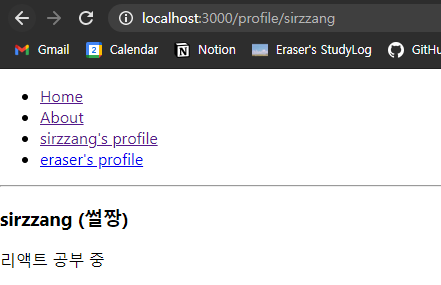

# 13. 리액트 라우터로 SPA 개발하기


## 13.1. SPA란?


 **SPA**(*Single Page Application*)란, **한 개의 페이지로 이루어진 애플리케이션**을 의미한다.


<br>

 전통적인 웹 페이지는 아래 그림처럼 여러 페이지로 이루어져 있다. 


 이러한 구조에서는 사용자가 다른 페이지로 이동할 때마다 새로운 html을 받아 오고, 페이지를 로딩할 때마다 서버에서 리소스를 전달받아 해석한 뒤 화면에 보여 준다. 그리고 사용자에게 보여 주는 화면은 **서버** 측에서 준비한다.

<br>

 그러나 요즘은 웹에서 제공되는 정보가 많기 때문에, 새로운 화면을 보여줄 때마다 서버 측에서 모든 화면을 보여 주고, 준비한다면 성능 상 문제가 발생할 수 있다. 특히 사용자와의 interaction이 자주 발생할수록 위와 같은 구조는 적당하지 않다. 

 따라서 리액트 등의 라이브러리나 프레임워크에서는 뷰 렌더링을 **사용자** 측의 브라우저가 담당하도록 하고, 애플리케이션을 브라우저에 불러와서 실행한 후, 사용자와의 interaction이 발생할 때, **필요한 부분만** 자바스크립트를 사용해 업데이트한다. 만약 새로운 데이터가 필요하다면, 서버 API를 호출하여 필요한 데이터만 새로 불러와 애플리케이션에서 사용할 수도 있다. 아래와 같은 구조이다.


<br>

 이를 SPA 구조라고 한다. 그러나 싱글 페이지라고 해서 화면이 한 종류인 것은 아니다. 서버에서 사용자에게 제공하는 페이지는 한 종류이지만, 해당 페이지에서 로딩되는 자바스크립트와 브라우저 주소 상태에 따라 다양한 화면을 보여줄 수 있다. 이렇게 **다른 주소에 다른 화면을 보여주는 것**을 **라우팅**이라고 한다. 

 리액트 라이브러리 자체에는 라우팅 기능이 내장되어 있지 않다. 대신 브라우저 API를 직접 사용하여 관리하거나, 라이브러리를 사용해 기능을 구현한다. 리액트에서 라우팅 기능을 제공하는 라이브러리로는 다음의 것들이 있다.

* 리액트 라우터(*react-router*)
* 리치 라우터(*reach-router*)
* Next.js

 그 중에서도 가장 역사가 길고 사용 빈도가 높은 **리액트 라우터**를 사용한다. 리액트 라우터는 클라이언트 측에서 이루어지는 라우팅을 간단하게 구현할 수 있도록 한다. 나아가 서버 측에서 렌더링을 할 때에도 라우팅을 도와주는 컴포넌트들을 제공한다.

<br>

### SPA의 단점

 SPA의 경우, **앱 규모가 커질수록 자바스크립트 파일이 커진다**는 단점이 있다. 이를 개선하기 위해 **코드 스플리팅**(*code splitting*)을 사용해 라우트별로 파일을 **나누어** 트래픽과 로딩 속돌르 개선할 수 있다.

 또한, 자바스크립트를 실행하지 않는 일반 크롤러에서는 **페이지의 정보를 제대로 수집하지 못한다**는 잠재적 단점이 있다. 따라서 검색 엔진(*구글, 네이버, 다음 등*)의 검색 결과에 페이지가 나타나지 않을 수도 있다. (검색 엔진이 크롤링하는 모든 페이지에서 자바스크립트를 실행하고 있지 않을 수 있기 때문이다.)

 마지막으로 자바스크립트 파일이 로딩되어 실행되는 짧은 시간 동안 **흰 페이지가 나타날 수 있다**는 단점이 있다.

 이러한 문제점들은 이후 서버 측에서의 렌더링(*server-side rendering*)을 통해 해결할 수 있다.

<br>

## 13.2. 프로젝트 준비 및 기본적인 사용법


<br>

### 13.2.1. 프로젝트 생성 및 라이브러리 설치

 새로운 리액트 프로젝트와 리액트 라우터 라이브러리를 설치한다.

``` bash
$ yarn create react-app router-tutorial
$ cd router-tutorial
$ yarn add react-router-dom
```

<br>

### 13.2.2. 프로젝트에 라우터 적용

 프로젝트에 리액트 라우터를 적용할 때에는 `src/Index.js` 파일에서 `react-router-dom`에 내장되어 있는 `BrowserRouter`라는 컴포넌트를 사용해 렌더링할 컴포넌트를 감싸면 된다. 해당 컴포넌트의 기능은 다음과 같다.

* 웹 애플리케이션에 HTML5의 History API를 이용해 페이지 새로고침 없이 주소를 변경한다.
* 현재 주소에 관련된 정보를 `props`로 쉽게 조회하거나 사용할 수 있게 해 준다.

<br>

* `src/Index.js`

> *질문*: `<StrictMode>`로 감싸져 있었는데 어떻게 해결해야 하나? 일단은 그냥 저기 지웠는데.

```jsx
import React from 'react';
import ReactDOM from 'react-dom';
import {BrowserRouter} from 'react-router-dom'; // BrowserRouter 임포트
import './index.css';
import App from './App';
import reportWebVitals from './reportWebVitals';

ReactDOM.render(
  <BrowserRouter> {/* BrowserRouter로 감싸기 */}
    <App />
  </BrowserRouter>,
  document.getElementById('root')
);

// If you want to start measuring performance in your app, pass a function
// to log results (for example: reportWebVitals(console.log))
// or send to an analytics endpoint. Learn more: https://bit.ly/CRA-vitals
reportWebVitals();

```

<br>

### 13.2.3. 페이지 만들기

 라우트로 사용할 페이지 컴포넌트를 만든다. 먼저 사용자가 웹 사이트에 들어왔을 때 맨 먼저 보여 줄 Home 컴포넌트와, 웹 사이트를 소개할 About 컴포넌트를 만들어 보자.

<br>

* `src/Home.js`

```jsx
import React from 'react';

const Home = () => {
    return (
        <div>
            <h1>홈</h1>
            <p>Home, 그 페이지는 가장 먼저 보여지는 페이지.</p>
        </div>
    );
};

export default Home;
```

<br>

* `src/About.js`

```jsx
import React from 'react';

const About = () => {
    return (
        <div>
            <h1>소개</h1>
            <p>이 프로젝트는 리액트 라우터 기초를 실습해 보는 예제입니다.</p>            
        </div>
    );
};

export default About;
```

<br>

### 13.2.4. Route 컴포넌트로 특정 주소에 컴포넌트 연결

 `13.2.3`에서 페이지로 사용할 모든 컴포넌트를 완성했다. 이제 `Route` 컴포넌트를 사용해 사용자의 경로에 따라 다른 컴포넌트를 렌더링해 보자. `Route` 컴포넌트를 사용하면 **어떤 규칙을 가진 경로에, 어떤 컴포넌트를 보여 줄지** 정의할 수 있다.

<br>

 다음과 같이 `Route` 컴포넌트에 경로와 보여줄 컴포넌트를 props로 넘기면 된다.

```jsx
<Route path='주소규칙' component={보여 줄 컴포넌트} />
```

<br>

 `App` 컴포넌트에서 `Home` 혹은 `About` 컴포넌트를 보여주도록 설정해 보자.

* `src/App.js`

```jsx
import React from 'react';
import {Route} from 'react-router-dom';
import About from './About';
import Home from './Home';

const App = () => {
  return (
    <div>
      <Route path='/' component={Home} /> {/* root 경로에서 Home 컴포넌트 렌더링 */}
      <Route path='/about' component={About} /> {/* about 경로에서 About 컴포넌트 렌더링 */}      
    </div>
  );
};

export default App;
```

 이제 렌더링해보자.

| Home                                                         | About                                                        |
| ------------------------------------------------------------ | ------------------------------------------------------------ |
|  |  |

<br>

 잘 렌더링되나, `/about` 경로로 들어갔을 때 `Home`과 `About` 컴포넌트가 모두 렌더링된다. 이는, `/about` 경로가 `/` 규칙에도 일치하기 때문에 발생하는 문제이다. 따라서, `Home`을 렌더링하기 위한 `Route` 컴포넌트에, `exact`라는 props를 `true`로 설정해 준다.

* `src/App.js`

```jsx
import React from 'react';
import {Route} from 'react-router-dom';
import About from './About';
import Home from './Home';

const App = () => {
  return (
    <div>
      <Route path='/' component={Home} exact={true} /> 
          {/* root 경로에서 Home 컴포넌트 렌더링, 정확하게 '/'일 때만 Home 렌더링.*/}
      <Route path='/about' component={About} /> 
          {/* about 경로에서 About 컴포넌트 렌더링 */}      
    </div>
  );
};

export default App;
```

 이제 렌더링해보자.

| Home                                                         | About                                                        |
| ------------------------------------------------------------ | ------------------------------------------------------------ |
|  |  |

<br>

### 13.2.5. Link 컴포넌트로 다른 주소 이동


 `Link` 컴포넌트는 **클릭 시 다른 주소로 이동시켜 주는 컴포넌트**이다. 일반 웹 애플리케이션에서 페이지를 전환할 때는 `a` 태그를 사용한다. 리액트 라우터에서는 `a` 태그를 직접 사용하면 안 된다. 페이지를 전환하는 과정에서 새로운 페이지를 불러오기 때문에, **애플리케이션이 들고 있던 상태를 모두 날려버리기 때문**이다. 결과적으로, 렌더링된 컴포넌트들이 모두 사라지고 처음부터 렌더링해야 한다.

 그렇기 때문에 `Link` 컴포넌트를 사용한다. 이 컴포넌트를 사용하면, 페이지를 새로 불러오지 않고, **애플리케이션을 그대로 유지한 상태에서 페이지의 주소만 변경**한다. 이 과정에서 [HTML5 History API](https://developer.mozilla.org/ko/docs/Web/API/History_API)를 사용한다. 이 컴포넌트 자체는 `a` 태그로 이루어져 있지만, **페이지 전환을 방지하는 기능**이 내장되어 있다.

<br>

 다음과 같이 `Link` 컴포넌트에 이동할 주소를 props로 넘기면 된다.

```jsx
<Link to='주소'>내용</Link>
```

<br>

 이제 `App` 컴포넌트에서 `/`, `/about` 경로로 이동하는 `Link` 컴포넌트를 만들어 보자.

* `src/App.js`

```jsx
import React from 'react';
import {Route, Link} from 'react-router-dom';
import About from './About';
import Home from './Home';

const App = () => {
  return (
    <div>
      <ul>
        <li>
          <Link to='/'>Home</Link>
        </li>
        <li>
          <Link to='/about'>About</Link>
        </li>
      </ul>
      <hr /> {/* 구분선 */}
      <Route path='/' component={Home} exact={true} /> {/* root 경로에서 Home 컴포넌트 렌더링, 정확하게 '/'일 때만 Home 렌더링.*/}
      <Route path='/about' component={About} /> {/* about 경로에서 About 컴포넌트 렌더링 */}      
    </div>
  );
};

export default App;
```

<br>

 이제 렌더링해보자.


 페이지 상단에 링크가 생겼다. 링크를 클릭해서 원하는 주소로 잘 연결되는지 확인해 보자.


| Home 클릭                                                    | About 클릭                                                   |
| ------------------------------------------------------------ | ------------------------------------------------------------ |
|  |  |

<br>

## 13.3. Route 하나에 여러 경로 설정

 최신 버전의 리액트 라우터(v5)부터는 `Route` 하나에 여러 개의 경로(path)를 설정할 수 있게 되었다. 이전 버전에서는 여러 개의 path에 같은 컴포넌트를 보여주고 싶다면 다음과 같이 설정해야 했다.

* 특정 컴포넌트를 보여주고 싶은 path에 대한 `Route` 컴포넌트를 모두 설정한다.
* 해당 `Route` 컴포넌트들에 모두 보여주고 싶은 component를 넘긴다.


<br>

 이제 `Route` 컴포넌트를 두 번 사용하지 않고, 경로(*path*) props를 **배열로 설정**해 주면, 여러 경로에서 같은 컴포넌트를 보여줄 수 있다.

* `src/App.js`

```jsx
import React from 'react';
import {Route, Link} from 'react-router-dom';
import About from './About';
import Home from './Home';

const App = () => {
  return (
    <div>
      <Route path='/' component={Home} exact={true} />
      <Route path={['/about', '/info', '/hi']} component={About} /> 
      {/* /about, /info, /hi 경로에서 About 컴포넌트 렌더링 */}      
    </div>
  );
};

export default App;
```

 렌더링한 뒤, `info`, `hi`, `about` 경로에서 모두 `About` 컴포넌트가 렌더링되는지 확인해 보자.

| /info                                                        | /about                                                       | /hi                                                          |
| ------------------------------------------------------------ | ------------------------------------------------------------ | ------------------------------------------------------------ |
|  |  |  |

<br>

## 13.4. URL 파라미터와 쿼리

 페이지 주소를 정의할 때, 유동적인 값을 전달해야 할 때가 있다. 이를 파라미터와 쿼리로 나눌 수 있다. 어떤 상황에서 무엇을 쓸지에 대해 정해져 있는 규칙은 없으나, 일반적으로 **파라미터**는 **특정 ID 혹은 이름을 사용하여 조회할 때** 사용하고, **쿼리**는 **키워드를 검색하거나 페이지에 필요한 옵션을 전달할 때** 사용한다.

* 파라미터 예시: `/profiles/sirzzang`
* 쿼리 예시: `/about?eraser=true`

<br>

### 13.4.1. URL 파라미터

 이제 뒷 부분에 유동적인 `username`을 넣어 주기 위해, `Profile` 페이지에서 파라미터를 사용하는 기능을 구현해 보자. 유동적인 값을 `props`로 받아 와서 조회하는 방법을 사용한다.

<br>

* `src/Profile.js`

  > *질문* : `{data}`? 왜?

  * `match.params` 값 참조
    * `Route`로 사용되는 컴포넌트에서 `match`라는 객체를 받아 온다.
    * `match` 객체 안에는 현재 컴포넌트가 렌더링되는 규칙에 대한 정보가 들어 있다.

```jsx
import React from 'react';

// data 정의
const data = {
    sirzzang: {
        name: '썰짱',
        description: '리액트 공부 중'
    },
    eraser: {
        name: '이레이저',
        description: '연어 먹고 싶음'
    }
};

const Profile = ({match}) => {
    const {username} = match.params; // match.params 값을 참조해 `username`으로 할당.
    const profile = data[username];
    if (!profile) {
        return <div>존재하지 않는 사용자입니다.</div>
    }
    return (
        <div>
            <h3>
                {username} ({profile.name})
            </h3>
            <p>{profile.description}</p>
        </div>
    );
};

export default Profile;
```

<br>

 이제 `App` 컴포넌트에서 `Profile` 컴포넌트를 위한 `Route`를 정의한다.

* `src/App.js`
  * `path` 규칙: `/profiles/:username`
    * `match.params` 객체 안에서 `username` 값을 통해 `username` 값을 조회한다.
    * `username`을 URL 파라미터로 받아 그 값을 조회하는 것이다.
  * `Route` 상단에 각 프로필 페이지로 이동하는 링크를 추가한다.

```jsx
import React from 'react';
import {Route, Link} from 'react-router-dom';
import About from './About';
import Home from './Home';
import Profile from './Profile';

const App = () => {
  return (
    <div>
      <ul>
        <li>
          <Link to='/'>Home</Link>
        </li>
        <li>
          <Link to='/about'>About</Link>
        </li>
        <li>
          <Link to='/profile/sirzzang'>sirzzang's profile</Link>
        </li>
        <li>
          <Link to='/profile/eraser'>eraser's profile</Link>
        </li>
      </ul>
      <hr />
      <Route path='/' component={Home} exact={true} />
      <Route path={['/about', '/info', '/hi']} component={About} /> 
      <Route path='/profile/:username' component={Profile}/>   
    </div>
  );
};

export default App;
```

<br>

렌더링해보자.

| 초기 화면                                                    | eraser's profile                                             | sirzzang's profile                                           |
| ------------------------------------------------------------ | ------------------------------------------------------------ | ------------------------------------------------------------ |
|  |  |  |

<br>

### 13.4.2. URL 쿼리


 쿼리는 `location` 객체의 `search` 값에서 받아 올 수 있다.

* `location` 객체
  * `Route`로 사용된 컴포넌트에게 props로 전달된다. 
  * 웹 애플리케이션의 현재 주소에 대한 정보를 가지고 있다.


<br>

 URL 쿼리를 알기 위해서는 `location` 객체의 `search` 값을 확인한다. `search` 값은 문자열이기 대문에, **문자열을 객체로 변환**하기 위해 **qs** 라이브러리를 사용한다. 

```bash
$ yarn add qs
```

<br>

 