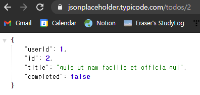
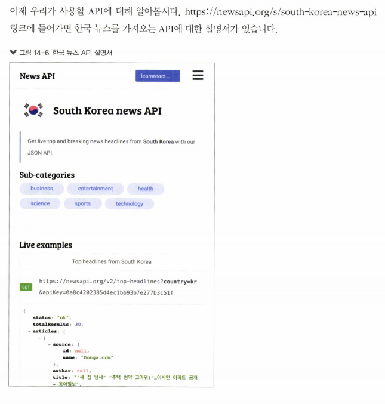
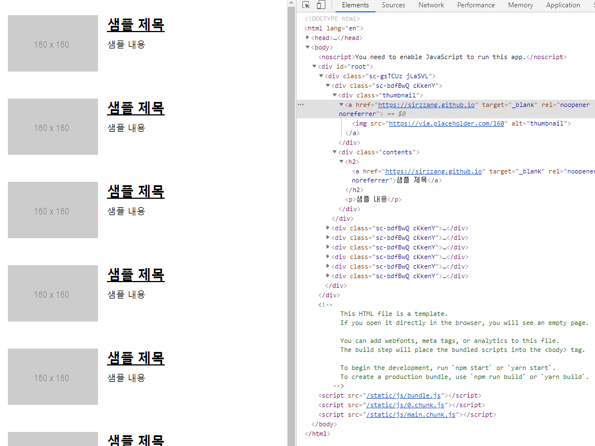

# 14. 외부 API를 연동하여 뉴스 뷰어 만들기


 카테고리별로 최신 뉴스 목록을 보여 주는 뉴스 뷰어 프로젝트를 만든다.

* *https://newsapi.org*에서 API를 사용해 뉴스 데이터를 받아 온다.
* 9장에서 배운 styled-components를 활용해 프로젝트를 스타일링한다.


<br>

## 14.1. 비동기 작업의 이해

 웹 애플리케이션에서 즉시 처리하는 작업이 아니라, 응답을 받을 때까지 기다렸다가 전달받은 응답 데이터를 처리하는 것과 같이, **처리할 때 시간이 걸리는 작업**을 **비동기 작업**이라고 한다. 


* 동기적 작업: 요청이 끝날 때까지 기다리는 동안 중지 상태가 되어, 요청이 끝나야 그 다음 예정된 작업을 할 수 있다.
* 비동기적 작업: 요청 처리 시 멈추지 않기 때문에, 동시에 여러 요청을 처리하거나, 기다리는 과정에서 다른 함수를 호출하는 것이 가능하다.

<br>

 작업을 비동기적으로 처리할 때의 예시는 다음과 같다.

* 서버 API 호출
* 특정 작업 예약

<br>

 특히 특정 작업을 예약할 때에는 `setTimeout` 함수를 사용한다. 아래의 예시 코드는 3초(*ms* 단위이므로 인자로 3000을 넘긴다) 후에 `printMe` 함수를 호출한다.


 `setTimeout`이 사용되는 시점에 코드가 3초 동안 멈추는 것이 아니다. 일단 **위에서부터 아래까지 전부 다 호출되고, 3초 후에 지정한 함수**(`printMe`)**가 호출**된다.

<br>

### 14.1.1. 콜백 함수

 자바스크립트에서 비동기 작업을 할 때, 콜백 함수를 인자로 전달하여 사용한다. 

<br>

* 파라미터 값이 주어지면, 1초 뒤에 10을 더해서 반환
  * `setTimeout`에서의 콜백함수: 화살표 함수.
  * `increase`에서 인자로 주어진 `callback` 함수가 있다.
    * `increase`의 `callback` 인자로 주어진 함수: 파라미터를 받아서 콘솔에 출력.
    * 해당 함수에 `result` 파라미터를 주고, 그 `result` 파라미터가 10이 더해진 숫자이므로,
    * 10이 출력된다.

```javascript
function increase(number, callback) {
    setTimeout(() => {
        const result = number + 10;
        if (callback) {
            callback(result);
        }
    }, 1000);
}

increase(0, result => {
    console.log(result);
});
```

<br>

* 여러 번 순차적으로 처리하고 싶을 대는, 콜백 함수를 중첩하여 구현할 수 있다. ~~다만, 가독성이 좋지 않아 **콜백 지옥**이라고 불리므로, 지양하자.~~

```javascript
function increase(number, callback) {
    setTimeout(() => {
        const result = number + 10;
        if (callback) {
            callback(result);
        }
    }, 1000);
}

console.log('작업 시작')
increase(0, result => {
    console.log(result);
    increase(result, result => {
        console.log(result);
        increase(result, result => {
            console.log(result, result => {
                console.log(result);
                console.log('작업 완료');
            });
        });
    });
});
```


<br>

 ### 14.1.2. Promise

 ES6부터 ~~콜백 지옥 같은 코드가 나오지 않도록~~ 도입된 기능이다. 앞에서 구현한 코드를 `promise`를 ㅏ사용해 바꿔 보자.

 여러 작업을 연달아 처리하기 위해 함수를 여러 번 중첩하지 않고, `.then`을 사용하여 다음 작업을 설정한다.

> *참고* : `new` 키워드 
>
>  내장 자료형 혹은 사용자 정의 객체 인스턴스 생성.

<br>

```javascript
function increase(number) {
    const promise = new Promise((resolve, reject) => {
        // resolve는 성공, reject는 실패
        setTimeout(() => {
            const result = number + 10; // 10을 더하는데
            if (result > 50) {
                // 50보다 크면 에러
                const e = new Error('너무 큰 숫자입니다.');
                return reject(e); 
            }
            resolve(result); // 너무 큰 숫자가 아니라면 number + 10 후 성공 처리
        }, 1000);
    });
    return promise;
}
```

<br>

 이제 아래와 같이 코드를 작성해 보자. 에러가 나지 않는다.


 에러를 발생시켜 보자.


<br>

### 14.1.3. async/await


 `Promise`를 더 쉽게 사용할 수 있도록 하는 ES8 문법이다. 함수 앞 부분에 `async` 키워드를 추가하고, 해당 함수 내부에서 `Promise`  앞부분에 `await` 키워드를 사용한다.

 `Promise`가 끝날 때까지 기다리고, 결과 값을 특정 변수에 담을 수 있다.

<br>

> *질문* : 아예 이럴 거면 저 안에 await 부분도 함수로 만들어서 할 수 없나? 저렇게 다 일일이 몇 번씩 기다리라고 쳐줘야 할까?

```javascript
function increase(number) {
    const promise = new Promise((resolve, reject) => {
        // resolve는 성공, reject는 실패
        setTimeout(() => {
            const result = number + 10;
            if (result > 50) {
                // 50보다 큰 숫자일 경우 에러 발생
                const e = new Error('너무 큰 숫자입니다');
                return reject(e);
            }
            resolve(result); // 아닐 경우 number에 10 더한 후 성공 처리
        }, 1000)
    });
    return promise;
}

async function runTasks() {
    try {
        // try/catch 구문을 사용해 에러 처리
        let result = await increase(0); // 0을 넘기고 기다린 후
        console.log(result); // 콘솔에 출력
        result = await increase(result);
        console.log(result);
        result = await increase(result);
        console.log(result);
        result = await increase(result);
        console.log(result);
        result = await increase(result);
        console.log(result);
        result = await increase(result);
        console.log(result);
        result = await increase(result);
        console.log(result);
        result = await increase(result);
        console.log(result);
    } catch (e) {
        console.log('에러 발생', e);
    }
}
```

<br>

## 14.2. axios로 API 호출해서 데이터 받아 오기


 axios는 자바스크립트 HTTP 클라이언트로, HTTP 요청을 `Promise` 기반으로 처리한다.

<br>

 라이브러리를 설치하고, `prettier` 설정을 진행하자.

```bash
$ yarn create react-app news-viewer
$ cd news-viewer
$ yarn add axios
```

```json
// .prettierrc
{
    "singleQuote": true,
    "semi": true,
    "useTabs": false,
    "tabWidth": 4,
    "trailingComma": "all",
    "printWidth": 80
}
```

 자동 불러오기 기능을 사용하기 위해, 최상위 폴더에 configuration 파일을 만들자.

```json
// jsconfig.json
{
    "compilerOptions": {
        "target": "es6"
    }
}
```

<br>

 `불러오기` 버튼을 누르면 [JSONPlaceholder](https://jsonplaceholder.typicode/com/)에서 제공하는 가짜 API를 호출하고, 이에 대한 응답을 컴포넌트 상태에 넣어 보여주는 코드를 작성하자.

> *참고*
>
> 
>
> 

<br>

* `src/App.js`
  * `axios.get` 
    * 파라미터로 전달된 주소에 `GET` 요청.
    * 요청 결과는 `.then`으로 비동기적으로 확인.

```jsx
import React, {useState} from 'react';
import axios from 'axios';

const App = () => {
  const [data, setData] = useState(null);
  const onClick = () => {
    axios.get('https://jsonplaceholder.typicode.com/todos/1').then(response => {
      setData(response.data); // response 받아 와서 response의 데이터로 상태 업데이트
    });
  };
  return (
    <div>
      <button onClick={onClick}>불러오기</button>
      {/*data가 있을 때에만 렌더링하도록 설정*/}
      {data && <textarea rows={7} value={JSON.stringify(data, null, 4)} readOnly={true} />} {/*tab width 변경*/}
    </div>   
  );
};

export default App;
```

렌더링한 후, `불러오기` 버튼을 눌러 보자. `request` 객체를 확인해 보기 위해 콘솔 창에 출력했다.


<br>

 위의 코드를 `async`를 사용하여 바꿔 보자. 화살표 함수에 `async/await`를 적용할 때는, `async () => {}`와 같은 문법 형식으로 적용한다.

* `src/App.js`

```jsx
import React, {useState} from 'react';
import axios from 'axios';

const App = () => {
  const [data, setData] = useState(null);
  const onClick = async () => {
    try {
      const response = await axios.get(
        'https://jsonplaceholder.typicode.com/todos/1',
      );
      setData(response.data);
    } catch (e) {
      console.log(e);
    }
  };

  return (
    <div>
      <div>
        <button onClick={onClick}>불러오기</button>
      </div>
      {data && <textarea rows={7} value={JSON.stringify(data, null, 4)} readOnly={true} />}
    </div>
  );
};

export default App;
```

 렌더링해 보자.


<br>

## 14.3. newsapi API 키 발급


  발급받은 API 키는 API 요청 시 API 주소의 쿼리 파라미터로 넣는다.

<br>



 사용할 API 주소는 전체 뉴스인지인지, 특정 카테고리 뉴스인지에 따라 달라진다.


<br>

 이제 전체 뉴스를 불러오는 코드를 작성하자.

* `src/App.js`

```jsx
import React, {useState} from 'react';
import axios from 'axios';

const App = () => {
  const [data, setData] = useState(null);
  const onClick = async () => {
    try {
      const response = await axios.get(
        'http://newsapi.org/v2/top-headlines?country=kr&apiKey=134e1c67e9ae4d5eb3c30442ca434521', // 변경
      );
      setData(response.data);
    } catch (e) {
      console.log(e);
    }
  };

  return (
    <div>
      <div>
        <button onClick={onClick}>불러오기</button>
      </div>
      {data && <textarea rows={7} value={JSON.stringify(data, null, 4)} readOnly={true} />}
    </div>
  );
};

export default App;
```

 렌더링 해보자. 데이터가 화면에 나타난다.


<br>

## 14.4. 뉴스 뷰어 UI 만들기

 이제 데이터를 화면에 예쁘게 보여주자. `styled-components`를 사용해 뉴스 정보를 보여 줄 컴포넌트를 만든다. 해당 라이브러리를 설치하고, 다음과 같이 디렉토리와 파일을 생성하자.

```bash
$ yarn add styled-components
```


<br>

 뉴스 데이터에 어떤 필드가 있는지를 먼저 확인하자.

 

 각 뉴스 데이터가 지니고 있는 정보가 JSON 객체로 되어 있다. 그 중에서도 렌더링할 컴포넌트에는 다음의 필드들만 나타낼 것이다.

* title: 뉴스 제목.
* description: 뉴스 내용.
* url: 뉴스 url.
* urlToImage: 뉴스 이미지.

<br>

* `src/components/NewsItem.js`
  * 각 뉴스 정보를 보여 주는 컴포넌트  `NewsItem`을 만든다.
  * `article` 객체를 컴포넌트에서 `props`로 통째로 받아 와서 사용한다.
  * style을 적용한다.

```jsx
import React from 'react';
import styled from 'styled-components';

const NewsItemBlock = styled.div`
    display:flex;
    .thumbnail {
        margin-right: 1rem;
        img {
            display: block;
            width: 160px;
            height: 100px;
            object-fit: cover;
        }
    }
    .contents {
        h2 {
            margin: 0;
            a {
                color: black;
            }
        }
        p {
            margin: 0;
            line-height: 1.5;
            margin-top: 0.5rem;
            white-space: normal;
        }
    }
    & + & {
        margin-top: 3rem;
    }
    `;

const NewsItem = ({ article }) => {
    const {title, description, url, urlToImage} = article; // props로 받아 온 article 객체에서!
    return (
        <NewsItemBlock>
            {urlToImage && ( // 뉴스 이미지 있으면 렌더링
                <div className='thumbnail'>
                    {/*각 태그 속성 무슨 의미인지?*/} 
                    <a href={url} target='_blank' rel='noopener noreferrer'> 
                        
                    </a>
                </div>
            )}
            <div className='contents'> {/*뉴스 컨텐츠 렌더링*/} 
                <h2>
                    <a href={url} target='_blank' rel='noopener noreferrer'>
                        {title}  {/*뉴스 제목*/}
                    </a>
                </h2>
                <p>{description}</p> {/*뉴스 내용*/}
            </div>
        </NewsItemBlock>
    );
};

export default NewsItem;
```

<br>

 

* `src/components/NewsList.js`

 API를 요청하고, 뉴스 데이터가 들어 있는 배열을 컴포넌트 배열로 변환하여 렌더링하는 컴포넌트 `NewsList`를 만든다.

 나중에는 이 컴포넌트에서 API를 요청하는데, 아직 데이터를 불러오지 않고 있으므로, `sampleArticle`이라는 객체에 예시 데이터를 넣어서, 각 컴포넌트에 전달할 것이다. 가짜 내용이 보이게 하는 것이다.

```jsx
import React from 'react';
import styled from 'styled-components';
import NewsItem from './NewsItem';

const NewsListBlock = styled.div`
    box-sizing: border-box;
    padding-bottom: 3rem;
    width: 768px;
    margin: 0 auto;
    margin-top: 2rem;
    @media screen and (max-width: 768px) {
        width: 100%;
        padding-left: 1rem;
        padding-right: 1rem;
    }
`;

// 가짜 뉴스 객체
const sampleArticle = {
    title: '샘플 제목',
    description: '샘플 내용',
    url: 'https://sirzzang.github.io',
    urlToImage: 'https://via.placeholder.com/160'
};

const NewsList = () => {
    return (
        <NewsListBlock>
            <NewsItem article={sampleArticle} />
            <NewsItem article={sampleArticle} /> 
            <NewsItem article={sampleArticle} /> 
            <NewsItem article={sampleArticle} /> 
            <NewsItem article={sampleArticle} /> 
            <NewsItem article={sampleArticle} /> 
            <NewsItem article={sampleArticle} /> 
        </NewsListBlock>
    );
};

export default NewsList;
```

<br>

 이제 렌더링하자.

* `src/App.js`

```jsx
import React from 'react';
import NewsList from './components/NewsList';

const App = () => {
  return <NewsList />;
};

export default App;
```




<br>

## 14.5. 데이터 연동하기


 컴포넌트들이 잘 나타나는 것을 확인했으면, 이제 뉴스 데이터를 연동해 보자.

 `NewsList` 컴포넌트에서 API를 호출하면 된다. 컴포넌트가 처음 렌더링되어 화면에 보이는 시점에 API를 요청한다. `useEffect` 함수를 사용한다. 

* `src/components/NewsList.js`

  * `useEffect`

    > *질문* 
    >
    > 1. 함수 내부에 `async` 붙는다는 것의 의미? 클린업 함수?
    >
    > 2. articles 값이 설정되지 않았을 때 = fetch가 안 된 건가?

    * `useEffect`에 등록할 함수는 `async`를 붙이면 안 된다. 
    * `useEffect`는 뒷정리 함수를 반환해야 하기 때문에, 해당 hooks 안에서 `async/await` 기능을 사용하고 싶다면, 함수 내부에 `async` 키워드가 붙은 또 다른 함수를 만들어서 사용해야 한다.

  * `loading` : API 요청이 대기 중인지 아닌지 판별할 상태. 대기 중이라면 `true`, 끝나면 `false`가 된다.

  * 렌더링할 컴포넌트

    * 뉴스 데이터 배열을 컴포넌트 배열로 변환.
    * `articles` 값이 있는지 조회해야 함. 아직 데이터가 없을 때에는 `null`이고, 이 경우 `map` 함수가 작동하지 않는다. 렌더링 과정에서 오류가 발생한다.


```jsx
import React, {useState, useEffect} from 'react';
import styled from 'styled-components';
import NewsItem from './NewsItem';
import axios from 'axios';

const NewsListBlock = styled.div`
    box-sizing: border-box;
    padding-bottom: 3rem;
    width: 768px;
    margin: 0 auto;
    margin-top: 2rem;
    @media screen and (max-wiwdth: 768px) {
        width: 100%,
        padding-left: 1rem;
        padding-right: 1rem;
    }
`;

const NewsList = () => {
    const [articles, setArticles] = useState(null);
    const [loading, setLoading] = useState(false);

    useEffect(() => {
        // async 기능 사용하기 위해 함수 따로 선언
        const fetchData = async () => {
            setLoading(true); // data 추출하는 중에는 loading 상태를 true로 설정.
            try {
                const response = await axios.get(
                    'http://newsapi.org/v2/top-headlines?country=kr&apiKey=134e1c67e9ae4d5eb3c30442ca434521',
                );
                setArticles(response.data.articles);
            } catch (e) { // 에러 발생 시
                console.log(e);
            }
            setLoading(false); // data 추출 완료 후 loading 상태 false로 설정.
        };
        fetchData(); // async 사용하기 위해 cleanup 함수 반환
    }, []);

    // 대기 중일 때
    if (loading) {
        return <NewsListBlock>대기 중</NewsListBlock>
    }
    // 아직 articles 값이 설정되지 않았을 때
    if (!articles) {
        return null;
    }
    // 대기 중도 아니고, articles 값도 있을 때 렌더링할 컴포넌트
    return (
        <NewsListBlock>
            {articles.map(article => (
                <NewsItem key={article.url} article={article} /> {/*key를 url로 설정*/}
            ))}
        </NewsListBlock>

        );
};

export default NewsList;
```


 렌더링 해보자.


<br>

 `articles`가 없는지 검사하는 부분을 빼 보자. 렌더링 과정에서 데이터가 `null`이어서 애플리케이션이 제대로 나타나지 않고 흰 페이지만 보인다.


<br>

## 14.6. 카테고리 기능 구현하기


