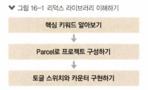
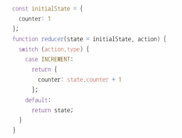
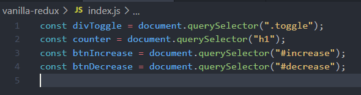

# 16. 리덕스 라이브러리 이해하기


 **리덕스**는 리액트에서 가장 많이 사용되는 **상태 관리 라이브러리**이다. 다음과 같은 장점이 있다.

* 상태 업데이트 로직을 다른 파일로 분리시켜서 효율적으로 상태를 관리할 수 있다.
* (*기존 Context API와 마찬가지로*) 컴포넌트끼리 똑같은 상태를 공유해야 할 때, 여러 컴포넌트를 거치지 않아도 손쉽게 상태값을 전달하거나 업데이트할 수 있다.
* 그 외에, 편한 개발자 도구를 지원하고, 미들웨어 기능을 제공하기 때문에 비동기 작업을 효율적으로 관리할 수도 있다.

 단순히 전역 상태 관리를 목적으로 한다면, Context API를 사용하는 것만으로도 충분하다. 하지만 리덕스는 코드의 유지 보수성, 작업 효율 증대 측면에서 더 좋기 때문에, 프로젝트의 규모가 클 때에는 리덕스를 사용하는 편이 좋다. 

<br>



<br>

## 16.1. 개념 미리 정의하기


  리덕스에서 사용하게 될 개념을 먼저 알아보자.

<br>

### 16.1.1. 액션


 **액션**이란, state에 변화가 필요할 때 발생하는 것이다. **객체**로 표현되며, 다음과 같은 형식으로 이루어져 있다.


 `type` 필드가 반드시 있어야 한다. `type` 필드의 값이 액션의 이름이 된다. 그 외에 들어 있는 값들은 상태 업데이트 시 참고해야 할 값이며, 마음대로 작성해도 된다. 예시는 다음과 같다.


<br>

### 16.1.2. 액션 생성 함수

**액션 생성 함수**란, ~~*(말 그대로)*~~ **액션 객체를 만들어 주는 함수**이다. 다음과 같이 작성한다.

|                          일반 함수                           |                         화살표 함수                          |
| :----------------------------------------------------------: | :----------------------------------------------------------: |
|  |  |

  변화를 일으킬 때마다 액션 객체를 만들어야 하는데, 번거로움을 방지하고, 실수로 정보를 놓치는 일을 막기 위해 필요하다.

<br>

### 16.1.3. 리듀서

 **리듀서**(*reducer*)는 **변화를 일으키는 함수**이다. 액션을 만들어서 발생시키면, 리듀서는 **파라미터**로 **현재 상태**와 **액션 객체**를 전달 받아, **두 값으로 부터 만든 새로운 상태**를 반환한다.




<br>

### 16.1.4. 스토어

 프로젝트에 리덕스를 적용하기 위해 **스토어**를 만든다. 한 개의 프로젝트는 한 개의 스토어만 가질 수 있다. 스토어 안에는 현재 애플리케이션의 상태와 리듀서가 들어 있으며, 그 외에도 몇 가지 중요한 내장 함수를 지닌다.

<br>

#### 디스패치

 **디스패치**(*dispatch*)는 스토어의 내장 함수 중 하나로, **액션을 발생시키는 것**이라고 이해하면 된다. `dispatch(action)`과 같은 형태로, *액션 객체*를 **파라미터**로 넣어서 호출한다. 호출되면 스토어는 리듀서 함수를 실행하고, 새로운 상태를 만들어 준다.

<br>

#### 구독

 **구독**(*subscribe*)도 스토어의 내장 함수 중 하나로, *리스너 함수*를 **파라미터**로 넣어서 호출한다. 액션이 디스패치되어 상태가 업데이트될 때마다, 파라미터인 리스너 함수가 호출된다.


<br>

## 16.2. 리액트 없이 쓰는 리덕스


 리덕스는 리액트에 종속되는 라이브러리가 아니다. 즉, 다른 UI 라이브러리/프레임워크와 함께 사용할 수 있다. (*angular-redux, ember redux* - Vue에서는 리덕스와 유사한 vuex를 사용한다고.)

 여기서는 바닐라 자바스크립트 환경에서 리덕스를 사용해 보자.

<br>

### 16.2.1. 프로젝트 생성

 Parcel이라는 도구를 사용하여 웹 애플리케이션 프로젝트를 만든다.

```bash
sir95@DESKTOP-HRU70B8 MINGW64 ~/Desktop/react-app
$ yarn global add parcel-bundler # parcel-bundler 설치
sir95@DESKTOP-HRU70B8 MINGW64 ~/Desktop/react-app
$ mkdir vanilla-redux # vanilla-redux 프로젝트 생성
sir95@DESKTOP-HRU70B8 MINGW64 ~/Desktop/react-app/vanilla-redux       
$ yarn init -y # package.json 생성
sir95@DESKTOP-HRU70B8 MINGW64 ~/Desktop/react-app/vanilla-redux       
$ yarn add redux # 리덕스 모듈 설치
```

<br>

 `index.html`, `index.js` 파일을 만들자.

* `vanilla-redux/index.html`

```html
<html>
    <body>
        <div> 바닐라 자바스크립트 </div>
        <script src='./index.js'></script>
    </body>
</html>
```


<br>

* `vanilla-redux/index.js`

```javascript
console.log('Hello, I"m Eraser.');
```


<br>

 개발용 서버를 실행해서 결과를 확인해 보자.

```bash
$ parcel index.html # 개발서버 주소 http://localhost:1234/
```


<br>

### 16.2.2. 간단한 UI 구성

 간단하게 스타일 파일을 작성해 적용해 보자.

<br>

* `vanilla-redux/index.css`

  * `border-radius` : 테두리 경계 꼭짓점을 둥글게.

    

  * `box-sizing` : 너비와 높이 계산 방법을 지정.

    * `content-box`: 안의 내용이 있고, 테두리와 여백은 더해짐.

    * `border-box`: 테두리 포함한 크기 지정.

      

```css
.toggle {
    border: 2px solid black;
    width: 64px;
    height: 64px;
    border-radius: 32px;
    box-sizing: border-box;
}

.toggle.active {
    background: yellow;
}
```


<br>

* `vanilla-redux/index.html`
  * `link`: css 스타일 시트 파일 연결
    * `rel` : 현재문서와 연결할 문서의 관계 표시.
      * `stylesheet` : 스타일 시트로 연결.
      * `alternate`: 문서의 대안 버전(프린트, 번역 사이트 등)으로 연결.
      * `author`: 저작자로 연결.
      * `help`: 도움말로 연결.
      * `license`: 저작권 정보로 연결.
      * `search`: 검색 도구로 연결.
    * `href`: 연결할 곳의 주소.
    * `type`: 연결할 문서의 MIME 유형. `href` 속성이 설정될 때에만 사용.
      * MIME: 전자메일 전송을 위한 인터넷 표준 -> 웹에서의 내용 유형.
      * `text/css`: css 파일.
      * `text/javascript`: js 파일.
      * `application/xml`: xml 파일.
  * `body` 영역
    * `div`: toggle CSS 클래스 적용.
    * `increase`, `decrease` 버튼 요소.

```html
<html>
    <head>
        <link rel='stylesheet' type='text/css' href='index.css' />
    </head>
    <body>
        <div class='toggle'></div> <!--toggle css 클래스 적용-->
        <hr />
        <h1>0</h1>
        <button id='increase'>+1</button>
        <button id='decrease'>-1</button>
        <script src='./index.js'></script>
    </body>
</html>
```


<br>

 결과를 확인해 보자.


<br>

### 16.2.3. DOM 레퍼런스 만들기

 바닐라 자바스크립트로 프로젝트를 진행하기 때문에, UI 관리 시 별도의 라이브러리를 사용하지 않는다. 따라서 **DOM을 직접 수정**해 주어야 한다. 따라서 자바스크립트 파일 상단에 DOM 노드를 가리키는 값을 선언하자.

<br>

* `vanilla-redux/index.js`

```javascript
const divToggle = document.querySelector('.toggle'); // class 선택자로 toggle 요소
const counter = document.querySelector('h1'); // h1 태그 요소 선택
const btnIncrease = document.querySelector('#increase'); // id 선택자로 increase 버튼 요소 선택
const btnDecrease = document.querySelector('#decrease'); // id 선택자로 decrease 버튼 요소 선택
```



<br>

### 16.2.4. 액션 타입과 액션 생성 함수 정의

 프로젝트의 상태에 변화를 일으킬 때 **액션**이 일어난다. 이 액션에 이름을 정의해 주자. 다음의 규칙이 있다.

* 문자열 형태로, 대문자로 작성한다.
* 고유한 이름이어야 한다. 이름이 중복되면, 의도치 않은 결과가 발생할 수 있다.

 그리고 액션 이름을 사용하여 액션 객체를 만드는 액션 생성 함수를 만든다. `type` 값을 반드시 갖고 있어야 하며, 그 외에 참고하고 싶은 값을 마음대로 넣는다.

<br>

* `vanilla-redux/index.js`

```javascript
// DOM 요소 레퍼런스
const divToggle = document.querySelector(".toggle");       
const counter = document.querySelector("h1");             
const btnIncrease = document.querySelector("#increase");   
const btnDecrease = document.querySelector("#decrease");  

// 액션 이름
const TOGGLE_SWITCH = 'TOGGLE_SWITCH';
const INCREASE = 'INCREASE';
const DECREASE = 'DECREASE';

// 액션 생성 함수(액션 객체 만듦)
const toggleSwitch = () => ({type: TOGGLE_SWITCH});
const increase = () => ({type: INCREASE, difference});
const decrease = () => ({type: DECREASE});
```


<br>

### 16.2.5. 초깃값 설정

 프로젝트에서 사용할 초깃값을 자유롭게(숫자/문자/객체 모두 가능) 정의하자.

* `vanilla-redux/index.js`
  * `document` : 자바스크립트에서 DOM을 제어.
  * `querySelector` : 인자로 받은 selector로 element 반환.

```javascript
// DOM 요소 레퍼런스
const divToggle = document.querySelector(".toggle");       
const counter = document.querySelector("h1");             
const btnIncrease = document.querySelector("#increase");   
const btnDecrease = document.querySelector("#decrease");  

// 액션 이름
const TOGGLE_SWITCH = 'TOGGLE_SWITCH';
const INCREASE = 'INCREASE';
const DECREASE = 'DECREASE';

// 액션 생성 함수(액션 객체 만듦)
const toggleSwitch = () => ({type: TOGGLE_SWITCH});
const increase = () => ({type: INCREASE, difference});
const decrease = () => ({type: DECREASE});

// 초깃값 정의
const initialState = {
    toggle: false,
    counter: 0
};
```


<br>

### 16.2.6. 리듀서 함수 정의

 변화를 일으킬 **리듀서 함수**를 정의하자. 파라미터로 `state`, `action`을 전달 받는다.

* `vanilla-redux/index.js`
  * 처음 호출될 때: `state`가 `undefined`이므로, 함수 파라미터에 기본값으로 `initialState` 설정.
  * 불변성 유지하면서 데이터에 변화를 일으키기 위해 spread 연산자 사용.
    *  구조가 복잡해질 수록 spread 연산자 사용이 번거로워지기 때문에, 리덕스에서는 상태를 최대한 깊지 않게 만드는 것이 좋다.
    * 객체가 복잡해지거나, 배열을 함께 다루어야 하는 경우 immer 라이브러리를 함께 사용하면 좋다.

```javascript
// DOM 요소 레퍼런스
const divToggle = document.querySelector(".toggle");
const counter = document.querySelector("h1");
const btnIncrease = document.querySelector("#increase");
const btnDecrease = document.querySelector("#decrease");

// 액션 이름
const TOGGLE_SWITCH = "TOGGLE_SWITCH";
const INCREASE = "INCREASE";
const DECREASE = "DECREASE";

// 액션 생성 함수(액션 객체 만듦)
const toggleSwitch = () => ({ type: TOGGLE_SWITCH });
const increase = () => ({ type: INCREASE, difference });
const decrease = () => ({ type: DECREASE });

// 초깃값 정의
const initialState = {
    toggle: false,
    counter: 0,
};

// 리듀서 함수
function reducer(state = initialState, action) {
    // action.type에 따라 다른 작업 처리
    switch (action.type) {
        case TOGGLE_SWITCH:
            return {
                ...state, // 불변성 유지
                toggle: !state.toggle, // toggle 상태 변경
            };
        case INCREASE:
            return {
                ...state,
                counter: state.counter + action.difference, // 현재 상태에 difference 더함
            };
        case DECREASE:
            return {
                ...state,
                counter: state.counter - 1,
            };
        default:
            return state;
    }
}

```


<br>

### 16.2.7. 스토어 만들기

 리덕스에서 `createStore` 함수를 불러와 사용한다. 이 함수의 파라미터로 리듀서 함수를 넣어 준다.

```javascript
import { createStore } from "redux";

// DOM 요소 레퍼런스
const divToggle = document.querySelector(".toggle");
const counter = document.querySelector("h1");
const btnIncrease = document.querySelector("#increase");
const btnDecrease = document.querySelector("#decrease");

// 액션 이름
const TOGGLE_SWITCH = "TOGGLE_SWITCH";
const INCREASE = "INCREASE";
const DECREASE = "DECREASE";

// 액션 생성 함수(액션 객체 만듦)
const toggleSwitch = () => ({ type: TOGGLE_SWITCH });
const increase = () => ({ type: INCREASE, difference });
const decrease = () => ({ type: DECREASE });

// 초깃값 정의
const initialState = {
    toggle: false,
    counter: 0,
};

// 리듀서 함수
function reducer(state = initialState, action) {
    // action.type에 따라 다른 작업 처리
    switch (action.type) {
        case TOGGLE_SWITCH:
            return {
                ...state, // 불변성 유지
                toggle: !state.toggle, // toggle 상태 변경
            };
        case INCREASE:
            return {
                ...state,
                counter: state.counter + action.difference, // 현재 상태에 difference 더함
            };
        case DECREASE:
            return {
                ...state,
                counter: state.counter - 1,
            };
        default:
            return state;
    }
}

// 스토어 생성
const store = createStore(reducer);

```


<br>

### 16.2.8. render 함수 만들기

 상태가 업데이트될 때마다 호출될 함수이다. 리액트와 달리, **이미 html을 사용하여 만들어진 UI의 속성**을 상태에 따라 변경해 준다.

> *질문* : 이거 내가 이해한 방식 맞는지?
>
> 

<br>


* `vanilla-redux/index.js`

  * `classList` : 클래스 이름 조작. 

    * `add`, `remove`

      > *참고* : 그냥 toggle 하면 안 되나?
      >
      > ```javascript
      >     const state = store.getState(); // 현재 상태를 불러 온다.
      >     // 토글 업데이트 처리
      >     /*
      >     if (state.toggle) {
      >         divToggle.classList.add('active');
      >     } else {
      >         divToggle.classList.remove('active');
      >     }
      >     */
      >    divToggle.classList.toggle('active');
      > ```
      >
      >  이렇게 해도 되긴 하는데, 처음에 상태가 `toggle active`로 설정되어 있다.
      >
      > 
      
      <br>

```javascript
import { createStore } from "redux";

// DOM 요소 레퍼런스
const divToggle = document.querySelector(".toggle");
const counter = document.querySelector("h1");
const btnIncrease = document.querySelector("#increase");
const btnDecrease = document.querySelector("#decrease");

// 액션 이름
const TOGGLE_SWITCH = "TOGGLE_SWITCH";
const INCREASE = "INCREASE";
const DECREASE = "DECREASE";

// 액션 생성 함수(액션 객체 만듦)
const toggleSwitch = () => ({ type: TOGGLE_SWITCH });
const increase = () => ({ type: INCREASE, difference });
const decrease = () => ({ type: DECREASE });

// 초깃값 정의
const initialState = {
    toggle: false,
    counter: 0,
};

// 리듀서 함수
function reducer(state = initialState, action) {
    // action.type에 따라 다른 작업 처리
    switch (action.type) {
        case TOGGLE_SWITCH:
            return {
                ...state, // 불변성 유지
                toggle: !state.toggle, // toggle 상태 변경
            };
        case INCREASE:
            return {
                ...state,
                counter: state.counter + action.difference, // 현재 상태에 difference 더함
            };
        case DECREASE:
            return {
                ...state,
                counter: state.counter - 1,
            };
        default:
            return state;
    }
}

// 스토어 생성
const store = createStore(reducer);

// html에서 만들어진 UI 속성을 상태에 따라 변경
const render = () => {
    const state = store.getState(); // 프로젝트 스토어에서 현재 상태 부러 옴.
    // 토글 처리
    if (state.toggle) {
        divToggle.classList.add("active");
    } else {
        divToggle.classList.remove("active");
    }
    // 카운터 처리
    counter.innerText = state.counter; // 직접 DOM의 text 변경
};

render();
```

<br>

 ### 16.2.9. 구독하기

 스토어의 상태가 바뀔 때마다 `render` 함수가 호출되도록 처리한다. 스토어의 내장 함수 `subscribe`를 이용한다.


 참고로, 지금은 `subscribe` 함수를 직접 사용하지만, 나중에 리액트 프로젝트에서 리덕스를 사용할 때는 이 함수를 직접 사용하지 않는다. `react-redux`라는 라이브러리가 이 작업을 직접 해 준다.

<br>

* `vanilla-redux/index.js`

```javascript
import { createStore } from "redux";

// DOM 요소 레퍼런스
const divToggle = document.querySelector(".toggle");
const counter = document.querySelector("h1");
const btnIncrease = document.querySelector("#increase");
const btnDecrease = document.querySelector("#decrease");

// 액션 이름
const TOGGLE_SWITCH = "TOGGLE_SWITCH";
const INCREASE = "INCREASE";
const DECREASE = "DECREASE";

// 액션 생성 함수(액션 객체 만듦)
const toggleSwitch = () => ({ type: TOGGLE_SWITCH });
const increase = () => ({ type: INCREASE, difference });
const decrease = () => ({ type: DECREASE });

// 초깃값 정의
const initialState = {
    toggle: false,
    counter: 0,
};

// 리듀서 함수
function reducer(state = initialState, action) {
    // action.type에 따라 다른 작업 처리
    switch (action.type) {
        case TOGGLE_SWITCH:
            return {
                ...state, // 불변성 유지
                toggle: !state.toggle, // toggle 상태 변경
            };
        case INCREASE:
            return {
                ...state,
                counter: state.counter + action.difference, // 현재 상태에 difference 더함
            };
        case DECREASE:
            return {
                ...state,
                counter: state.counter - 1,
            };
        default:
            return state;
    }
}

// 스토어 생성
const store = createStore(reducer);

// html에서 만들어진 UI 속성을 상태에 따라 변경
const render = () => {
    const state = store.getState(); // 프로젝트 스토어에서 현재 상태 부러 옴.
    // 토글 처리
    if (state.toggle) {
        divToggle.classList.add("active");
    } else {
        divToggle.classList.remove("active");
    }
    // 카운터 처리
    counter.innerText = state.counter; // 직접 DOM의 text 변경
};

render();

// 구독
store.subscribe(render);
```

<br>

### 16.2.10. 액션 발생시키기

 이제 **디스패치**를 통해 액션을 발생시키자. 스토어 내장함수 `dispatch`를 사용하며, 파라미터로 액션 객체를 넣어 준다.

<br>

* `vanilla-redux/index.js`
  * 각 DOM 요소(toggle, increase, decrease)에 클릭 이벤트를 설정한다.
  * 이벤트 함수 내부에 `dispatch`를 사용하여 액션을 스토어에 전달한다.

```javascript
import {createStore} from 'redux';

// DOM 레퍼런스
const divToggle = document.querySelector('.toggle');
const counter = document.querySelector('h1');
const btnIncrease = document.querySelector('#increase');
const btnDecrease = document.querySelector('#decrease');

// 액션 타입 및 액션 생성 함수
const TOGGLE_SWITCH = 'TOGGLE_SWITCH';
const INCREASE = 'INCREASE';
const DECREASE = 'DECREASE';

const toggleSwitch = () => ({type: TOGGLE_SWITCH});
const increase = difference => ({type: INCREASE, difference});
const decrease = () => ({type: DECREASE});

// 프로젝트 state 초깃값 설정
const initialState = {
    toggle: false,
    counter: 0
};

// 리듀서 함수 정의
function reducer(state = initialState, action) {
    // action.type에 따라 다른 작업 처리
    switch (action.type) {
        case TOGGLE_SWITCH:
            return {
                ...state, // state의 불변성 유지
                toggle: !state.toggle // toggle 상태 변경
            };
        case INCREASE:
            return {
                ...state,
                counter: state.counter + action.difference // counter 더해줌
            };
        case DECREASE:
            return {
                ...state,
                counter: state.counter - 1
            };
        default: // 아무 것도 하지 않을 경우 state 그대로 return
            return state; 
    }

} 

// store 생성
const store = createStore(reducer);

// render 함수: 상태 업데이트마다 호출
const render = () => {
    const state = store.getState(); // 현재 상태를 불러 온다.
    // 토글 업데이트 처리
    if (state.toggle) {
        divToggle.classList.add('active');
    } else {
        divToggle.classList.remove('active');
    }
    // 카운터 처리
    counter.innerText = state.counter;
};

render();

// subscribe: 구독
store.subscribe(render);

// dispatch: 액션 발생
divToggle.onclick = () => {
    store.dispatch(toggleSwitch());
};
btnIncrease.onclick = () => {
    store.dispatch(increase(1));
};
btnDecrease.onclick = () => {
    store.dispatch(decrease());
};
```

<br>

 확인해 보자.

| 토글 div 클릭 X                                              | 토글 div 클릭                                                |
| ------------------------------------------------------------ | ------------------------------------------------------------ |
|  |  |

| +1 버튼 클릭                                                 | -1 버튼 클릭                                                 |
| ------------------------------------------------------------ | ------------------------------------------------------------ |
|  |  |

<br>

## 16.3. 리덕스의 세 가지 규칙

 

### 16.3.1. 단일 스토어

 하나의 애플리케이션 안에는 하나의 스토어만 들어 있다. 여러 개의 스토어를 사용하는 것이 완전히 불가능하지는 않지만, 상태 관리가 복잡해질 수 있으므로 권장하지는 않는다.

<br>

### 16.3.2. 읽기 전용 상태

 리덕스에서 상태는 읽기 전용이기 때문에, 상태를 업데이트할 때는 불변성을 유지하는 방향으로 진행해야 한다. 리덕스에서는 얕은 비교 검사를 통해 데이터 변경을 감지함으로써 좋은 성능을 유지한다.

<br>

### 16.3.3. 리듀서는 순수한 함수

 리듀서는 순수한 함수이다. 따라서 다음의 조건을 만족해야 한다.

* 파라미터로 이전 상태와 액션 객체를 받는다.
* 파라미터 외의 값에 의존하지 않는다.
* 이전 상태는 절대로 건드리지 않고, 변화를 준 새로운 상태 객체를 만들어서 반환한다.
* 똑같은 파라미터로 호출되었을 경우, 언제나 똑같은 값을 반환해야 한다.

 예컨대, 리듀서 함수 내부에서 랜덤 값을 만들거나, 현재 시간을 가져오거나, 네트워크 요청을 한다면, 파라미터가 같아도 다른 결과가 나올 수 있기 때문에, 리듀서 함수 바깥에서 처리해 주어야 한다.

<br>

## 16.4. 정리

 다음 장에서는 리액트 프로젝트에서 리덕스를 사용하는 방법을 알아 본다. `react-redux` 라이브러리를 이용하여 스토어의 상태가 업데이트될 때마다 컴포넌트를 리렌더링한다.