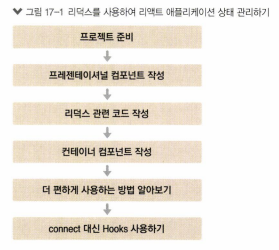
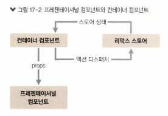
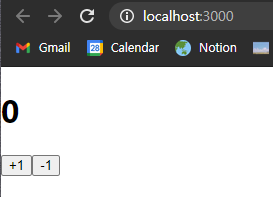
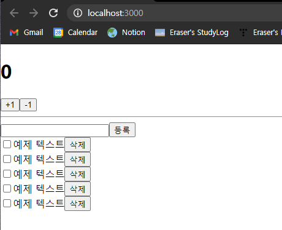
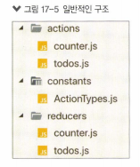
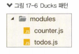

# 17. 리덕스를 사용하여 리액트 애플리케이션 상태 관리하기


 이제 리액트 프로젝트에서 리덕스를 사용하여 상태를 관리해 보자. 상태 업데이트에 관한 로직을 따로 분리하고, 코드를 유지 보수하는 데에 도움이 된다.

 16장에서와 달리, 리액트 애플리케이션에서 리덕스를 사용할 때에는 react-redux 라이브러리에서 제공하는 유틸 함수인 `connect`와 컴포넌트 `Provider`를 이용해 리덕스 관련 작업을 처리한다.



<br>

## 17.1. 작업 환경 설정

```bash
$ yarn create react-app react-redux-tutorial
$ cd react-redux-tutorial
$ yarn add redux react-redux
```

<br>

## 17.2. UI 준비하기

 리액트 프로젝트에서 리덕스를 사용할 때는 **프레젠테이셔널 컴포넌트**와 **컨테이너 컴포넌트**를 분리한다. 



* 프레젠테이셔널 컴포넌트: 상태 관리가 이루어지지 않고, `props`를 받아 와서 화면에 UI를 보여주기만 하는 컴포넌트.
* 컨테이너 컴포넌트: 리덕스와 연동되어 있는 컴포넌트로, 리덕스로부터 상태를 받아 오기도 하고, 리덕스 스토어에 액션을 디스패치하기도 한다.

<br>

 이번 실습에서는 프레젠테이셔널 컴포넌트(UI 관련)를 `src/components` 경로에, 컨테이너 컴포넌트(리덕스 연동)를 `src/contatiners` 컴포넌트에 작성해 본다.

<br>


### 17.2.1. 카운터 컴포넌트 생성

* `src/componetns/Counter.js`

```jsx
import React from 'react';

const Counter = ( {number, onIncrease, onDecrease }) => {
    return (
        <div> {/*상위 태그로 감싸기*/}
            <h1>{number}</h1>
            <div>
                <button onClick={onIncrease}>+1</button>
                <button onClick={onDecrease}>-1</button>
            </div>
        </div>
    );
};

export default Counter;
```

<br>

 이제 렌더링해보자.

* `App.js`

```jsx
import React from 'react';
import Counter from './components/Counter';

const App = () => {
  return (
    <div>
      <Counter number={0} /> {/* props: number*/}      
    </div>
  );
};

export default App;
```



<br>

## 17.2. Todos 컴포넌트 만들기

 할 일을 추가하고, 체크하고(아마도 onToggle?), 삭제할(아마도 onRemove?) 수 있는 할 일 목록 컴포넌트를 만들어 보자.

<br>

* `src/components/Todos.js`
  * `Todos` 컴포넌트와 `TodoItem` 컴포넌트 두 개를 하나의 파일에 선언 *=> 취향에 따라 두 개로 분리해서 파일에 각각의 파일에 작성해도 된다*
  * 컴포넌트들이 받아 올 `props`가 있다. 나중에 사용한다.

```jsx
import React from 'react';

const TodoItem = ({todo, onToggle, onRemove }) => {
    return (
        <div>
            <input type='checkbox' />
            <span>예제 텍스트</span>
            <button>삭제</button>
        </div>
    );
};

const Todos = ({
    input, // 인풋에 입력되는 텍스트
    todos,  // 할 일 목록이 들어 있는 객체
    onChangeInput, 
    onInsert, 
    onToggle, 
    onRemove, 
}) => {
    const onSubmit = e => {
        e.preventDefault();
    };
    return (
        <div>
            <form onSubmit={onSubmit}>
                <input />
                <button type='submit'>등록</button>
            </form>
            <div>
                <TodoItem />
                <TodoItem />
                <TodoItem />
                <TodoItem />
                <TodoItem />
            </div>
        </div>
    );
};

export default Todos;
```

<br>

 이제 렌더링해보자.

* `App.js`
  * Counter 컴포넌트 아래에 렌더링한다.
  * `hr` 태그를 사용해 구분선을 그린다.

```jsx
import React from 'react';
import Counter from './components/Counter';
import Todos from './components/Todos';

const App = () => {
  return (
    <div>
      <Counter number={0} /> {/* props: number*/}
      <hr />
      <Todos />      
    </div>
  );
};

export default App;
```



<br>

## 17.3. 리덕스 관련 코드 작성하기


 16장에서 살펴 본 리덕스 기본 구조를 떠올려 보면 된다. 리덕스를 사용할 때는 액션 타입, 액션 생성 함수, 리듀서 코드를 작성해야 한다. 이 코드들을 각각 다른 파일에 작성해도 되고, 기능별로 묶어서 하나의 파일에 작성해도 된다.

<br>

* 일반적인 구조



`actions`, `constants`, `reducers`라는 세 개의 폴더를 만들고 그 안에 기능별로 파일을 하나씩 만드는 방식이다. 리덕스 공식 문서에서 사용되는 가장 기본적인 방식으로, 코드를 종류에 따라 다른 파일에 정리할 수 있어서 편리하다. 그러나 새로운 액션을 만들 때마다 세 종류의 파일을 모두 수정해야 하기 때문에 불편한 점도 있다.

<br>

* Ducks 패턴



 일반적인 구조에 불편함을 느낀 개발자들이 자주 사용하는 패턴이다. 액션 타입, 액션 생성 함수, 리듀서 함수를 기능별로 파일 하나에 몰아서 다 작성하는 방식이다. 

<br>

 이번 실습에서는 두 번째 방식으로 코드를 작성한다.

<br>

### 17.3.1. counter 모듈 작성하기

 `modules` 폴더를 생성하고, 그 아래에 `counter` 컴포넌트를 담은 파일을 작성하자.

<br>

* `moduels/counter.js`

  > *참고* : `export` vs. `export default`
  >
  > * `export` 
  >   * 여러 개 내보낼 수 있음.
  >   * 불러오는 방식: `import {[함수명]} from ~`
  >
  > * `export default` 
  >   * 단 한 개만 내보낼 수 있음.
  >   * 불러오는 방식: `import [함수명] from ~`

  * 액션 타입 정의: `모듈 이름/액션 이름`
    * 액션 이름: 대문자
    * 모듈 이름: 액션 이름 충돌 방지
  * 액션 생성 함수 정의
    * 16장에서와 마찬가지로 액션 생성 함수를 정의
    *  `export` 키워드: 추후 다른 파일에서 불러와 사용하기 위함
  * 초기 state 정의
    * `number` : 초깃값 0
  * 리듀서 함수 정의
    * 현재 상태 참조하여 새로운 객체 생성 후 반환
    * `export default` 키워드: 리듀서를 내보내 다른 파일에서 불러올 수 있게 함

```jsx
// 액션 타입 정의
const INCREASE = 'counter/INCREASE';
const DECREASE = 'counter/DECREASE';

// 액션 생성 함수
export const increase = () => ({type: INCREASE});
export const decrease = () => ({type: DECREASE});

// 초기 state
const initialState = {
    number: 0
};

// 리듀서 함수
function counter(state = initialState, action) {
    switch (action.type) {
        case INCREASE:
            return {
                number: state.number + 1
            };
        case DECREASE:
            return {
                number: state.number - 1
            };
        default:
            return state;
    }
}
```

<br>

### 17.3.2. todos 모듈 작성하기

 `counter` 모듈과 달리, 액션 생성 함수에 파라미터가 필요하다. 전달받은 파라미터는 액션 객체 안에 추가 필드로 들어가게 된다.

<br>

* `modules/todos.js`
  * 액션 타입 정의
  * 액션 생성 함수 정의: 파라미터가 필요하고, 액션 객체 안에 추가 필드로 들어가게 된다.
    *  `changeInput`
    * `id`
      * todo 객체가 가지게 될 고윳값.
      * 초기 상태 생성 시 미리 `todo` 객체에 2개 넣을 것이므로, 3으로 설정.
    * `insert`
      * 파라미터 외에 사전에 선언된 `id` 값에도 의존.
      * 호출될 때마다 `id` 값에 1씩 더함.
    * 

```jsx
// 액션 타입 정의
const CHANGE_INPUT = 'todos/CHANGE_INPUT'; // input값 변경할 액션
const INSERT = 'todos/INSERT'; // 새로운 todo 등록할 액션
const TOGGLE = 'todos/TOGGLE'; // todo를 체크/체크 해제할 액션
const REMOVE = 'todos/REMOVE'; // todo를 제거할 액션

// input 액션 생성 함수
export const changeInput = input => ({
    type: CHANGE_INPUT,
    input // input 값
});

// insert 액션 생성 함수
let id = 3; // insert 호출될 때마다 1씩 더해질 id
export const insert = text => ({
    type: INSERT,
    todo: {
        id: id++,
        text,
        done: false // 초기 완료 상태는 false
    }
});

// toggle 액션 생성 함수
export const toggle = id => ({
    type: TOGGLE,
    id
});

// remove 액션 생성 함수
export const remove = id => ({
    type: REMOVE,
    id
});
```

